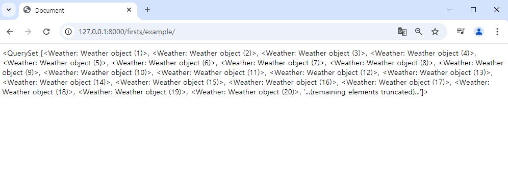

## 프로젝트

### 장고에서 데이터 사이언스 활용하기
- Data science
- 1. 문제정의
- 2. 데이터 수집
- (open api, 다운로드)
- 3. 데이터 전처리(결측치 처리, 형변환)
- 4. 데이터 분석
- 5. 결과 공유 및 해석(시각화)


### DB를 활용한 웹 페이지 구현


### 목표: 장고에서 데이터 사이언스 패키지 사용하기

- matplotlib
- NumPy
- Pandas\

-주피터 노트북 정리한거.,..? pjt찾아보기??


### 장고에서 데이터 사인언스 패키지를 사용하기 위해 알아야 할 내용
- 데이터 사이언스 3종 패키지 사용 방법
- 장고 기본 사용 방법
  - 웹페이지 구성(template)
  - 데이터 전달(View-> Template)
- 파이썬 ByteslO 패키지(곧, 학습예정)


1. 기본 그래프 출력하기
- 가상환경은 왜 설정할까??
  : 프로젝트마다, 별도의 파이썬 환경을 관리하기 위해서.
```
python -m venv venv

source venv/Scripts/activate

pip install -r requirements.txt

django-admin startproject pjt04
((파일이 안으로 들어가게 하기위해, 맨뒤에 .을 안 붙이고 한다.))

python manage.py startapp apps

cd pjt04/


프로젝트 앱을 만들었는데, 
이름 바꾸기 말고, 삭제(rm -rf apps)하고
수정시에 걍 새로 만들어 버리기-> 설정 꼬이는거 주의
python manage.py startapp apps
python manage.py startapp firsts
```

------------

urls.py -> views.py ->  templates
순으로 구현하기.


url은 두가지가 있다
프로젝트 의 urls.py
앱의 urls.py

1. 프로젝트의 urls.py보기.
  1. 다 from, import해주기 힘들테니깐, include를 써서 한다. 
  2. 앱의 urls.py를 만들고, 프로젝트의 urls.py를 가지고와서 필요한 부분만 쓴다.
  3. 


```
def index(request):
    x = [1, 2, 3, 4, 5]
    y = [1, 2, 3, 4, 5]

    plt.plot(x, y)  # 그래프 그리기

    plt.title('Test Graph')
    plt.ylabel('y label')
    plt.xlabel('x label')

    plt.show()  # 예전 출력 방식
    # context = {
    #     'plt': plt
    # }
    # plt는 라이브러리라서 context와 같은 방식으로 넘겨도 소용이 없다.

    # 1. 그려진 객체를 반환받아서 넘기는 방법-> 이런방법 maplolit에 없음
    # 2. 이미지로 저장 -> 간단하지만, 용량이 감당안됨.
    # 3. 버퍼(임시 저장 공간)를 활용 -> view에서 template으로 이미지 전달하기


    return render(request, "firsts/index.html")
```


[2]

[views.py] 

import io import BytesIO
import base64

io : 입출력 연산을 위한 Python 표준 라이브러리

BytesIO: 메모리 내에서 이진 데이터를 파일처럼 다룰 수 있는 버퍼를 제공함.

base64 인코딩 할 때 사용
: 텍스트와 이진데이터를 변환 할 수 있는 모듈

```
# 버퍼에 저장하기 위해, 
    #1. 비어있는 버퍼 생성
    buffer = BytesIO()
    # 2. 버퍼에 그래프를 저장
    plt.savefig(buffer, format = 'png')

    # 이진 데이터를 파일처럼 꺼내써야 하므로, 
    # 3. 버퍼의 내용을 base64를 활용하여 인코딩
    # - 이미지 데이터가 들어있다. (경로를 포함하고 있다. )
    image_base64 = base64.b64encode(buffer.getvalue()).decode('utf-8').replace('\n', '')
    # print(image_base64)
    buffer.close()


    context = {
        #저장된 이미지의 경로를 전달
        'chart_image': f'data:image/png;base64,{image_base64}'
    }

```


### CSV파일 활용하기
- 날짜 별 데이터를 DB에 저장합니다. 

data에 test_data.csv를 활용할 거다.

models.py  에서  class만들기

```
from django.db import models

# Create your models here.

# 데이터를 보고 분석하여, 제약조건을 반드시 파악하고 아래 코드를 작성
class Weather(models.Model):
    date = models.DateField() #연도-월-일형식의 날짜 데이터. 결측치x
    temp_avg_f = models.IntegerField() # 정수형, 결측치x

    # sqlite3는 리스트 필드가 없다.
    # 문자열로 저장하고, 나중에 활용할때 콤마로 분리.
    events = models.CharField(max_length = 255, blank = True, null = True)
    # 결측치 있고, 1개 이상일 수 있다. .. 비, 구름, 천둥,,->리스트?

    
```

urls.py에 path('example/', views.example)

views.py 만들기


# 데이터 출력해보자
[앱(firsts)의 views.py에서,]
```
    weathers = Weather.objects.all()
    context = {
        'weathers': weathers,
    }

    # data 폴터를 여러가지 앱안에서 쓸때, base쪽인 pjt04에 넣어주면 되고,
    # 지금은 firsts라는 앱안에서 만 쓰므로, firsts안에 넣어주면 된다.

    return render(request, 'firsts/example.html', context)

```
-> templates\firsts에 다가 example.html만들어주고
{{ weathers }}라고 body에 적으면, 




[프로젝트 할때, 리드미가 가장 중요]
주제
어려운점
해결과정: 데이터 출력 등~~
: 코드 부분 기록
과제세부 사항
+ 스크린샷

->> 최종 관통 프로젝트에 도움이 된다.

: 오늘까지는 영화, 금융 다해봐라
영화는 다 복습니다. 