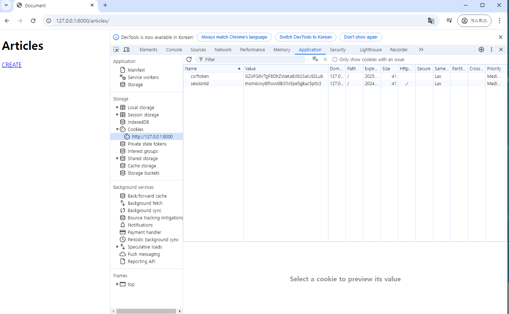

# Django 08 Authentication System 01

## 쿠키 & 세션
  - HTTP
  - 쿠키
  - 세션

## Djnago Authentication System

## Custom User model
  - user model대체하기

## Login
## Logout

## Template with Authentication data

## 참고
  ### 쿠키의 수명
  ### 쿠키와 보안
  ### 쿠키와 개인정보 보호
  ### Django 에서의 세션 관리
  ### Authentication Form 내부 코드
  ### AbstractUser class
  ### User 모델 대체하기 Tip
----


# Django 08 Authentication System 01

## 쿠키 & 세션
: 우리가 웹페이지를 둘러볼때, 우리는 서버와 서로 연결되어 있는 상태가 아니다.

  ### HTTP: HTML문서와 같은 리소스들을 가져올 수 있도록 해주는 규약
  웹에서 이루어지는 모든 데이터 교환의 기초

  - HTTP의 특징
 1. 비연결 지향 connectionless
 : 서버는 요청에 대한 응답을 보낸 후 연결을 끊음

 2. 1번 특징에 따라, 무상태 stateless
 : 연결을 끊는 순간 클라이언트와 서버간의 통신이 끝나며, 상태정보가 유지되지 않음.

-> 상태가 없다는 것은.. 
  - 장바구니에 담은 상품을 유지할 수 없음
  - 로그인 상태를 유지할 수 없음.

-> 위와 같이 상태가 연결되어있지 않은데, 
어떻게 연결 된 것 처럼 할 수 있을까??>
->> 그 기술이 바로, 쿠키!!!!


  ### 쿠키
  : 서버가 사용자의 웹 브라우저에 전송하는 작은 데이터 조각. ex) 쿠키 및 캐시, 쿠키허용

  : 서버가 제공하여 클라이언트 측에서 저장되는 작은 데이터 파편
  : 사용자 인증, 추적, 상태 유지 등에 사용되는 저장 방식.

 - 쿠키 동작 예시
 1. 브라우저가 웹 서버에 웹 페이지를 요청
 2. 웹 서버는 요청된 페이지와 함께 쿠키를 포함한 응답을 브라우저에게 전송
 3. 브라우저는 받은 쿠키를 저장소에 저장
  쿠키 속성(만료시간, 도메인, 주소 등)도 함께 저장됨.
 4. 이후 브라우저가 같은 웹 서버에 웹 페이지를 요청할때, 저장된 쿠키 중 해당 요청에 적용 가능한 쿠키를 포함하여 함께 전송.
 5. 웹서버는 받은 쿠키 정보를 확인하고,
 5. 웹 서버는 요청에 대한 응답을 보내며, 

 ex)쿠키를 사용한 장바구니의 예시
 -> 쿠0싸이트에서 삼다수를 장바구니에 담아보자.
 ?? 담았다가 메인 페이지를 돌아가더라도, 장바구니에 삼다수가 담겨 있다.
 ->> 개발자 도구 - Network 탭 - cartView.pang- Headers :: Set cookie 

 ->> 개발자 도구 - Application 탭  - 왼쪽에 쿠키. 오른쪽 쿠키조각들.
 : 같은 사이트를 요청할때, 다음 에도 같은 쿠키를 가져온다. ( 사용자가 생수를 담았다는 사실이 담긴 쿠키. )


 ->>> 서버와 클라이언트는 연결되어있지 않기 때문에, 매 요청마다 무식한 방식으로 계속해서 상태 요청을 보내고 있다.
 ->>> 로그인도 이와 똑같이 요청된다.


 - 캐시 삭제(위 페이지 쿠키스 안의 카트~~ 오른쪽 마우스-> clear누르면)후 새로고침하면 , 장바구니가 비어있음.

  - 쿠키 작동원리와 활용
  1. 쿠키 저장 방식
  : 브라우저(클라이언트)는 쿠키를 KEY-VALUE의 데이터 형식으로 저장
  : 쿠키에는 이름, 값 외에도 만료시간, 도메인, 경로 등의 추가 속성이 포함됨 
  (핵심값은, name, value)
  2. 쿠키 전송 과정
  : 서버는 HTTP 응답헤더의 Set-Cookie필드를 통해 클라이언트에게 쿠키를 전송
  : 브라우저는 받은 쿠키를 저장해 두었다가, 동일한 서버에 재요청시 HTTP 요청 Header 의 Cookie 필드에 저장된 쿠키를 함께 전송
  3. 쿠키의 주요 용도
  -
  -
  - 상태 정보를 기억시켜 주는 역할
  ->** 서버에게 나로그인 된 사용자야! 라는 인증정보가 담긴 쿠키를 매 요청마다 계속 보내는 것. 

  - 쿠키 사용 목적
  1. 세션관리(Session management)**-> 여기 초첨맞춰서 로그인 기능 관련 작업함.
   - 로그인, 아이디 자동완성, 공지 하루 안 보기, 팝업 체크, 장바구니 등의 정보 관리
  2. 개인화(Percionalization)
  3. 트래킹(Tracking)
    -
    : 광고기능에서 많이 사용됨. 추천하는 제품
      -> 이런 것들이 싫으면, 개인 쿠키 허용하지 않기.


  ### 세션
  ( 쿠키중에서도 상태를 유지하는 형식을 세션이라 꼬집어 부름,.)
  : 서버 측에서 생성되어 클라이언트와 서버간의 상태를 유지
  : 상태 정보를 저장하는 데이터 저장 방식
    -> 쿠키에 세션 데이터를 저장하여 매 요청시마다 세션 데이터를 함께 보냄.
    1. 클라이언트가 로그인 요청 후, 인증에 성공하면 서버가 session 데이터를 생성후 저장
    2. 생성된 ssesion데이터에 인증할 수 잇는 session id를 발급.
    3. 발급한 session id 를 클라이언트에게 응답(데이터는 )


    >쿠키 & 세션
    1.서버 측에서는 세션데이터를 생성 후
    2.저장하고
    이 데이터에 접근할 수 있는 3.세션 ID를 생성

    4.이 ID를 클라이언트 측으로 전달하고,
    5.클라이언트는 쿠키에 이 ID를 저장.

    이후 클라이언트가 같은 서버에 재요청 시마다
    저장해 두었던 쿠키도 요청(쿠키에 session id가 들어있음)과 함께 전송

    ->>예를 들어 로그인 상태 유지를 위해 로그인 되어있다는 사실을 입증하는 데이터를 매요청마다 계속해서 보내는 것.

  
 - 쿠키와 세션의 목적: 클라이언트와 서버간의 상태정보를 유지하고, 사용자를 식별하기 위해 사용
  ; 쿠키와 세션은 기간이있다.
  ; ex) SWEA: session 의 기간이 짧아, 로그아웃이 되어버림.


## Djnago Authentication System
 : 사용자 인증과 관련된 기능을 모아 놓은 시스템.
 Authentication(인증): 사용자가 자신이 누구인지 확인하는것(신원확인)// 권한은 인증된 사용자가 어떤 것을 할 수 있는지에 대한 나중의 이야기이다.

[1. 사전준비]
  - articles: 이 앱은 게시판 기능
  -> accounts 앱을 만듬.
    : 생성 및 등록
    : auth와 관련된 경로나 키워드들이 장고 내부적으로 accounts라는 이름으로 사용하고 잇기 때문에 되도록 'accounts'로 지정하는 것을 권장.
```
python -m venv venv
source venv/Scripts/activate
pip install -r requirements.txt

accounts앱만들기-> settings.py에 등록하기

urls.py 분리하여 만들기

```

[2. Custom User model]
: admin이 만들어지고 있다= user를 관리하는 것이있다.
->User Model을 잘쓰고 잇는데, custom하겠다
->왜? 기존 User Model이 한계가 있어서.
  : 우리는 지금까지 별도의 User클래스 정의없이 내장된 auth 앱에 작성된 User 클래스를 사용했음.

  : Django 의 기본 User모델은 username, password 등 제공되는 필드가 매우 제한적.
  
  :추가적인 사용자 정보가 필요하다면~~~~

  -> 이user정보는 settings.py에 보면, 내장된 auth앱을 볼 수 있다.

  INSTALLED_APPS= [
  'django.contrib.auth',
  ...]

  ; -> 살펴보면, AbstracterUser을 잘 상속받아서 쓰고 있음.

  ; 그럼 우리도, AbstracterUser를 상속받고 우리가
  만들어 보자.

  - User Modes 대체의 필요성
  :프로젝트의 특정 요구사항에 맞춰 사용자 모델을 확장할 수 있음
  :예를 들어 이메일을 username으로 사용하거나, 다른 추가 필드를 포함시킬 수 있음.


```
@@@@@@@@@@@@@실습시작
### accounts app의 models.py

from django.contrib.auth.models import AbstractUser

# 커스텀 User모델을 대체하기 위한 클래스 작성
class User(AbstractUser):
  pass

```

settting.py에 수정전에 가지는 기본 값은
'auth.User'라고 되어있다.
근데 우리는 이거 안쓸꺼다.

```
## settings.py에 auth user은 기본값으로 되어있으므로,
작성되어 있지 않음.

AUTH_USER_MODEL = 'accounts.User'

## account >  admin.py에 등록해야함.

from django.contrib import admin
from django.contrib.auth.admin import UserAdmin
from .models import User

# Register your models here.
admin.site.register(User, UserAdmin)

```

AUTH_USER_MODEL
: Django 프로젝트의 User를 나타내는 데 
사용하는 모델을 지정하는 속성
->> # 주의 : 프로젝트 중간에 AUTH_USER_MODEL을 변경 할 수 없음.

 - 프로젝트를 시작하며 반드시 User모델을 대체해야한다.
  : 장고는 새 프로젝트를 시작하는 경우, 비록 기본 User모델이 충분하더라도, 커스텀
  : 


## Custom User model
  ### user model대체하기


[[2]]

```
articles의 원래 있던 설계도 지우기
python manage.py makemigrations
-> 두개 앱 모두  설계도가 만들어짐
python manage.py migrate

```

## Login
: 로그인은 Session를 Create하는 과정
(로그인을 만들기 위해 필요한 view함수는 2개이다.)
(2개가 1개로 합쳐짐.)
-> new와 create를 합침

-> GET 로그인 페이지
-> POST 인증/로그인 진행
->> 이거 두개를 하나로 만들겠다. 


AuthenticationForm()->> 로그인 폼이다. 모델폼이아니고,
그냥 form 이다. 
: 로그인 인증에 사용할 데이터를 입력 받는 built-in form
( 회원가입에서 쓰는 게 modelform )

[[3]]

```
python manage.py createsuperuser


## accounts > urls.py
path('login/', views.login, name = 'login'), 

## accounts > views.py
def login 

## login.html 파일 만들기

```

 login(request, user)
 : AuthenticationForm을 통해 인증된 사용자를 로그인 하는 함수.
 (로그인이란? 세션 데이터 생성)
 : 유저 객체를 얻어 내려면?
  get_user() 
  : AuthenticationForm 의 인스턴스 메서드
   ->> 유효성 검사를 통과했을 경우( is_valid이후)에만 동작함= 로그인 한 사용자 객체를 반환함.

  Authentication(인증)
  : 사용자가 자신이 누구인지 확인하는 것
  (신원확인)

```
-> 서버를 켜서 로그인을 시도해보자!!
: 성공적으로 로그인이 된다면, 메인 페이지로 redirect될거다.
-> 개발자 도구를 켜서 쿠키에 장고가 우리에게 session id를 줬다면, 로그인에 성공한 것이다. 
 -> application
 ->유효기간 확인해 보니, 2주정도의 기간을 줌.

```




session id는 단순히 키일뿐,
-> 이 열쇠로 열어서, 내가 누구인지를 말하는 암호화된 데이터는 어디에 있는가?->> 서버에 있다. 

-> 데이터 베이스에 연결을 해주자.

-> 여러개 중에서 django_session에 있다. 
- 그중 session key가 열쇠의 value와 동일한 값이다.
- session data가 우리가 만든 admin 에 대한 인증 데이터 이다. 
: 근데 이걸 암호화, 푸는 과정등은 우리가 관여한 것이없다. 우리는 짜라는 것 view그런거만 잘하면, 알아서 해준다. 

-----
-----

Create로 이동을 해보면, create페이지로 요청할때, 또다시 매번 장고로 부터 받은 세션아이디를 매요청마다
말하고 보내고 있는거다.

- 세션 데이터 확인


로그인 링크 작성: 메인 페이지에 로그인 페이지로 갈 수 있는 링크 작성
```
##articles > index.html 

url로 로그인 버튼을 만들어주기.

```


## Logout(request): 로그아웃은 세션데이터를 지우는Delete 일.
1. DB에서 현재요청에 대한 Session Data를 삭제
2. 클라이언트의 쿠키에 대해서도 Session id 를 삭제

  - 로그아웃 로직 작성
    : 로그아웃 진행 및 세션 데이터 삭제 확인


```
# accounts > urls.py 에서 path로 logout만들기

# accounts > views.py에서 def logout만들기
 logout함수는 logout페이지로 만들필요 없음.
  따라서 redirect만 해주면됨.

  + 로그아웃은 get요청인 경우에는 하면 안되므로.
  if request.method == 'POST':
    auth_logout(request)
  return redirect('articles:index')
  로 해야하지만, 지금은 그냥 제꺄두고 나중에 하도록함.
# index.html에서 
form 으로 logout만들어 주기.

>>> 
```
```

  <a href="">LOGIN</a>

  <form action="" method = POST>
    
    <input type="submit" value = "LOGOUT">


## index.html에서 왜 login 은 a태그이고, logout은 form태그인가?
 GET요청을 보내서, login 페이지를 달라고 하는 요청이다
 logout은 페이지를 달라고 하는 것이 아니다. 정말로 바로 로그아웃 시켜줘라고 요청하는 것이다. 그래서 POST요청이고, POST인 이유는 조회가 아니라서 이다. 
 데이터 베이스에 있는 세션 데이터를 지우는 행위이다. 

```

이후 http://127.0.0.1:8000/articles/에서 로그아웃 버튼을 누른후
개발자 도구(검사)를 확인하면, 지워진 것을 볼 수 있다. 

그리고 DB에서 django_session을 보면, 없는 것을 알수 있다. 

다시로그인 하면 새로운 세션아이디와 키로 다시만들게 되는 거다,.


## Template with Authentication data
-> 지금 어려운 것은, 템플릿에서 유저가 로그인 됫는지, 안됫는지 출력하기가
어렵다는 것-> 새션아이디 값을 일일이 확인하는 것은 귀찮음.
그래서 아래의 방법이 있음.

### 템플릿과 인증 데이터

- Template with Authentication data
 : 템플릿에서 인증 관련 데이터를 출력하는 방법

  ```
  articles> index.html에서 
  body 의 맨위에 p태그로 
  <P>안녕하세요 {{ user.username }}</P> 
  라고 작성해준다. 

  이 page에서는 user객체를 context로 넘겨준적이 없어서 안 될 것으로 보인다.
  그런데, 로그인을 하면, 로그인한 유저의 admin이라는 user.username이 출력된다.
  이것은 장고가 미리준비한 context 데이터가 존재하기 때문

 
  왜냐면, settings.py에 django.contrib.auth.context_processors.auth라고 미리 작성되어 있기 때문. 

  장고가 언제어디에서나 user네임을 출력할 수 있도록 만들어 놓았다. 
 

  ```
 - 현재 로그인 되어있는 유저 정보 출력하기
   user라는 context 데이터를 사용할 수 있는 이유는?
    -> django가 미리 준비한 context 데이터가 존재하기 때문(context processors)

  - context processors
  : 템플릿이 렌더링 될 때 호출 가능한 컨텍스트 데이터 목록
  : 작성된 컨텐스트 데이터는 기본적으로 템플릿에서 사용 가능한 변수로 포함됨
  -> django에서 자주 사용하는 데이터 목록을 미리 템플릿에 로드해 둔것.


  ## 참고

  ### 쿠키의 수명

 - 쿠키 종류변 Lifetime(수명)
 1. Session cookie 
    - 현재 세션(current session)이 종료되면 삭제됨.
    - 브라우저 종료와 함께 세션이 삭제됨.

  2. Persistent cookies 
    - Expires 속성에 지정된 날짜 혹으 Max-Age속성에
    지정된 기간이 지나면 삭제됨.

  ### 쿠키와 보안

  - 쿠키의 보안 장치
    - 제한된 정보: 쿠키에는 보통 중요하지 않은 정보만 저장(사용자ID나 세션 번호 같은것)
    - 암호화: 중요한 정보는 서버에서 암호화해서 쿠키에 저장
    - 만료시간: 쿠키에는 만료시간을 설정시간이 지나면 자동으로 삭제
    - 도메인 제한: 쿠키는 특정 웹사이트에서만 사용할 수 있도록 설정할 수 있음.

    ### 쿠키와 개인정보 보호
    - 많은 국가에서 쿠키 사용에 대한 사용자 동의를 요구하는 법규를 시행
    - 웹 사이트는 쿠키 정책을 명시하고, 필요한 경우 사용자의 동의를 얻어야 함.

    ### Django 에서의 세션 관리
    - 세션 in Django
      - Django는 'database-backend sessions' 저장방식을 기본 값으로 사용
      - session정보는 DB의 django_session테이블에 저장
      - Django 는 요청안에 특정 session id를 포함하는 쿠키를 사용해서 각각의 브라우저와 시이트가 연결된 session데이터를 알아냄
      - Django는 우리가 session 메커니즘(복잡한 동작원리)에 대부분을 생각하지 않게 끔 많은 도움을 줌.

    ### Authentication Form 내부 코드
    : 깃허브 참고자료 있음, 

    : 이것은 모델폼이 아니라, 그냥 폼을 상속받음.

    : 안에 인스턴스 메서드인 get_user을 사용 했었다. 4

    ### AbstractUser class
    : 관리자 권한과 함께 완전한 기능을 가지고 있는 
    User model을 구현하는 추상 기본 클래스

    : 파이썬 기본 문법과 조금 관련됨
      : Abstract base classes (추상 기본 클래스)
        : 몇 가지 공통 정보를 여러 다른 모델에 넣을때 사용하는 클래스
        : 데이터 베이스 테이블을 만드는데 사용되지 않으며, 대신 다른 모델의 기본 클래스로 사용되는 경우, 해당 필드의 하위 클래스의 필드에 추가 됨.

        : 파이썬 참고문서: Abstract Base Classes  

    ### User 모델 대체하기 Tip
    : User모델을 대체하는 순서를 숙지하기 어려울 경우, 해당 공식문서를 보며 순서대로 징행하는 것을 권장