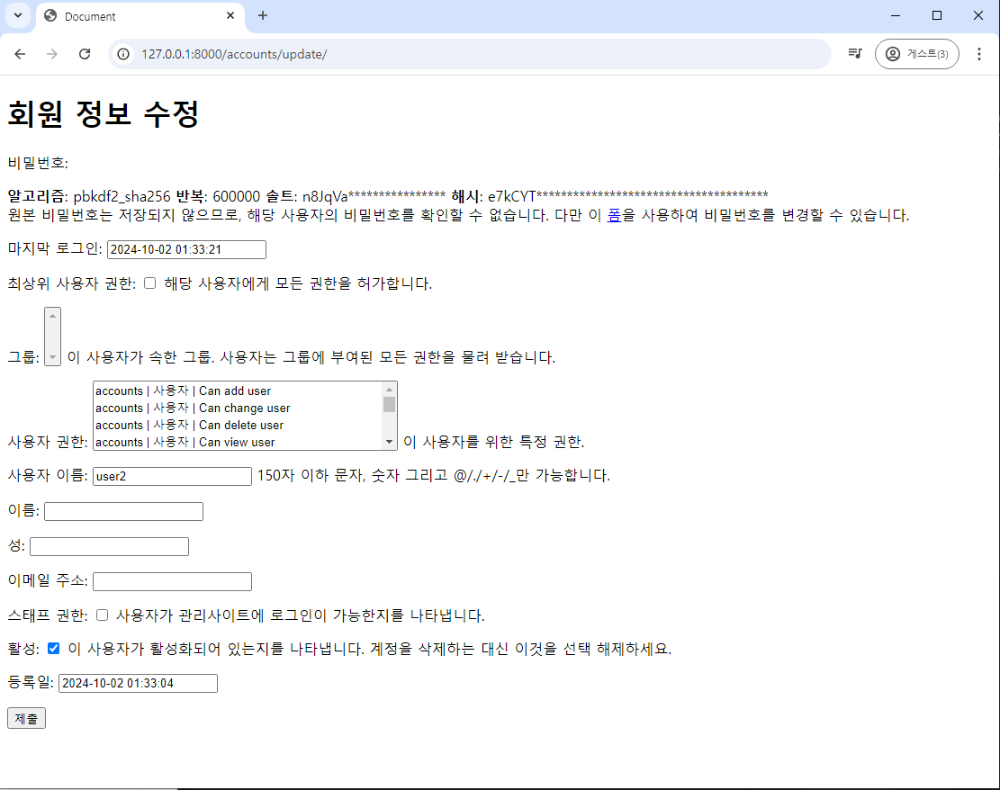

# Django 09 Authentication

## 회원가입

## 회원탈퇴

## 회원정보수정

## 비밀번호 변경
### 세션 무효화 방지

## 로그인 사용자에 대한 접근 제한
### is_authenticated 속성
### login_required 데코레이터

## 참고
### is_authenticated코드
### 회원가입 후 자동 로그인
### 회원 탈퇴 개선
### PasswordChangeForm 인자 순서
### Auth built-in form 코드


----


## 회원가입
- UserCreationForm()
회원가입시 사용자 입력 데이터를 받는 built-in ModelForm
=> 모델폼이다.
//로그인은 저장이 아니라 세션인증및 만드는 거라서 그냥 폼이었다. 


```
1. 회원가입기능구현

2. settings.py에서 
Language code 를 'ko-kr'로 바꾸면 언어가 바뀐다. -> 이거하나로 출력되는 에러 메시지 까지 바뀐다. 

3. 회원가입 아이디 비번 입력후 제출시에,
Manager isn't available; 'auth.User' has been swapped for 'accounts.User'
라는 에러가 뜬다.
 
 models.py에 class User(AbstractUser)
과 관련됨


그런데,  articles > forms.py에서
from django import forms
from .models import Article


class ArticleForm(forms.ModelForm):
    class Meta:
        model = Article
        fields = '__all__'

중에, model = Article가 과거의 User클래스를
바라보도록 되어있다.
```

- 커스텀 유저 모델을 사용하려면 다시 작성해야하는 Form
  UserCreationForm
  UserChangeForm
  : 두 Form모두 class Meta: model = User가 작성된 Form 이기 때문에 재작성이 필요함.

```
## accounts 앱에 forms.py를 만들고,
from django.contrib.auth.forms import UserCreationForm, UserChangeForm

#djangos는 User모델을 직접참조하는 것을 권장하지 않는다.(유지보수힘들기때문)
# from .models import User

# 그래서 장고는 유저모델을 간접적으로 참고할 수 있는 방법을 제공함.
from django.contrib.auth import get_user_model
# (현재 활성화된 유저 객체를 리턴함. 자동으로. 그래서 대체되거나 이름이 바껴도 대응가능)

class CustomUserCreationForm(UserCreationForm):
    class Meta(UserCreationForm.Meta):
        model = get_user_model()

class CustomUserChangeForm(UserChangeForm):
    class Meta(UserChangeForm.Meta):
        model =  get_user_model()
```
- get_user_model()
현재 프로젝트에서 활성화된 사용자 모델(active user model) 을 반환하는 함수 

- User모델을 직접 참조하지 않는 이유
: get_user_model()을 사용해 User모델을 참조하면, 커스텀 User모델을  자동으로 반환해주기때문
: django는 필수적으로 User 클래스를 직접 참조하는 대신 get_user_model()을 사용해 참조해야 한다고 강조하고 있음
-> User model 참조에 대한 자세한 내용은 추후 모델 관계에서 다룰 예정.

- 회원가입 로직 완성.
```
accounts > views.py에서

UserCreationForm import부분 지우기(안쓰기 때문)


from .forms import CustomUserChangeForm, CustomUserCreationForm한다음, 


form = CustomUserCreationForm으로 회원가입 부분 코드 변경해주기
        form = CustomUserCreationForm(request.POST)

        form = CustomUserCreationForm()


```


## 회원탈퇴
: delete가 상대적으로 간단
:User 객체를  Delete하는 과정( 로그아웃과 유사. )

```
## accounts > urls.py

path('delete', views.delete, name= 'delete'),


## accounts > views.py
def delete(request):
    # User모델에서 누가 회원탈퇴를 요청한건지 검색해야함.
    # 하지만 
    # 누가 요청한 건지 User모델에서 검색할 필요가 없다. 왜냐면, 유저객체는 위의 request에 이미 들어있음.
    
    # request.User가 이 뷰함수에 요청을 보내는 유저정보이다.
    # 그래서 굳이 검색을 할 필요가 없다. 어차피 회원탈퇴는
    # 내가 할 것이므로 그 정보만 알면 된다. 
    
    # 굳이 객체에 담아서 쓴다면 이하 두줄로 쓴다.
    # user = request.User
    # user.delete()

    request.user.delete() # 탈퇴함
    return redirect('articles:index') # 탈퇴하고 나서 사용자를 메인페이지로 보내자

## 메인페이지에 탈퇴버튼, 회원가입 a태그 만들기
 ## articles > index.html
    이하 회원가입(회원가입 페이지를 달라고 하는 것이므로
  a태그로 만듬) & 탈퇴 
  <a href="">회원가입</a>

   회원탈퇴는 form태그이다.
  왜냐면, post요청을 보내야 해서. 
  <form action="" method = 'POST'>
    
    <input type="submit" value = '회원탈퇴'>

  </form>

```
-> 이후 회원탈퇴 버튼을 웹에서 누르면,
사용자가 없기에 자동으로 로그아웃도 된다. 

## 회원정보수정
: User객체를 Update 하는 과정

: 사용하는  모델폼은
UserChangeForm()
:회원정보 수정 시 사용자 입력 데이터를 받는
built-in ModelForm-> 아까 우리가 미리 custom해놨다!!

```
## accounts > urls.py 


## accounts > views.py
def upadte(request):
  if request

## templates > update.html만들기

```
웹으로 가서 
회원가입 다시하고 -> 로그인 -> http://127.0.0.1:8000/accounts/update/주소쳐서 들어가서(아직버튼을 안만듬^^)


 -> 일반 사용자인데 , 모든 권한으 다줘서 ㅠㅠ

UserChangeForm 사용 시 문제점
: User모델의 모든 정보들(field)까지 모두 출력됨.
: 일반 사용자들이 접근해서는 안되는 정보는 출력하지 않도록 해야함
-> CustomUserChangeForm에서 출력 필드를 다시 조정하기
```
## accounts > forms.py

class CustomUserChangeForm(UserChangeForm):
    class Meta(UserChangeForm.Meta):
        model =  get_user_model()
        # 이하 수정하는 내용
        model = 

-> 장고유저모델이라고 검색해서 
첫번째 공식문서를 보자.

-보여줄 필드를 선택하는 것이 가려야할 필드가 많아서
빠를듯.

```
```
accounts > views.py

def update(request):
    if request.method == 'POST':
        form = CustomUserChangeForm(request.POST, instance=request.user)
        if form.is_valid():
            form.save()
            return redirect('articles:index')

    else:
        #instance= : 수정할 때 과거 정보 가져오는 부분.
        form = CustomUserChangeForm(instance=request.user)
    context = {
        'form': form, 
    }
    return render(request, 'accounts/update.html', context)
```

```
index.html에 회원정보 수정 버튼을 만들자


```


## 비밀번호 변경
: 인증된 사용자의 Session데이터를 Update하는 과정

: PasswordChangeForm()
     : 비밀번호 변경시 사용자 입력 데이터를 받는 built-in Form
     (모델폼 아님.)


- 비밀번호 변경 페이지 작성
: django는 비밀번호 변경 페이지를 회원정보 수정 form

: project 에서 주소를 쓸  수 있다. 

```
##crud > urls.py

path('<user_pk>/password/', )

##accounts > views.py

def change_password(request)

## templates/accounts에  change_password.html만들기


```
-> 웹에서 비밀번호 변경을 하고 나면, 자동으로 로그아웃이 된다.
바뀐 내용으로 요청을 보내니, 로그아웃을 시켜주는 것.


### 세션 무효화 방지
: 기존에 가진 키가 무효화 된것을 방지하고자함

update_session_auth_hash(request, user)
: 암호 변경 시 세션 무효화를 막아주는 함수
-> 암호가 변경되면 새로운 password의 Session Data로 기존 session을 자동으로 갱신

```
accounts의 views.py에 
from django.contrib.auth import update_session_auth_hash

user = form.save()
update_session_auth_hash(request, user)
```


## 인증된 사용자에 대한 접근 제한

- 로그인 사용자에 대해 접근을 제한하는 2가지 방법
 1. is_authenticated 속성 -> T/F
 2. login_required 데코레이터
 : 기존의 함수의 구조는 유지하면서, 꾸며주는 것이 @(데코레이터)


### is_authenticated 속성
 : 사용자가 인증 되었는지 여부를 알 수 있는 User model 의 속성
 -> 모든 User인스턴스에 대해 항상 True(로그인한 유저면 항상 True) 인 읽기 전용 속성
 -> 비인증 사용자에 대해서는 항상False


->> 적용해보자!!
```
##articles/index.html
if request.user.is_authenticated
else
endif

```

index.html에서 로그인 사용자에게 보여줄 기능과,
로그인하지 않은 사용자에게 보여줄 기능별로 
위치를 이동시키기


- 인증된 사용자라면, 로그인/회원가입 로직을 수행할 수 없도록 하기
```
## accounts > views.py에서 
def login(request)

def signup(request) 
안에서 각각 인증됬는지를 확인하는 것을 만들어 주기.
:
    if request.user.is_suthenticated:
    # 속성값이라서 호출하면 안됨.
        return redirect('articles:index')

```


### login_required 데코레이터

: 인증된 사용자에 대해서만 view함수를 실행시키는 데코레이터
-> 비인증 사용자의 경우 /accounts/login/ 주소로 redirect시킴

 - login_requierd적용하기
  - 1.  인증된 사용자만 게시글을 작성/수정/삭제 할 수 있도록 수정
 articles에서 비인증 사용자들은 create, delete, update하면 안되므로, 
@login_required를 각각 def위에 다 적어주기
-> 인증 됬는지를 확인하고, 안됫으면 로그인 페이지로 redirect시킴.

  - 2. 인증된 사용자만 로그아웃/탈퇴/수정/비밀번호 변경 할 수 있도록 수정
  accounts > views.py
  def 로그아웃, 계정삭제, 계정수정, 비밀번호 변경 함수들 위에 
  모두 @login_required를 써준다. 

```
## articles > views.py에 들어가서
from django.contrib.auth.decorators import login_required
하고 각 함수 위에 필요한 부분에 다 @login_required적어주자.

```


## 참고

### is_authenticated코드
: 메서드가 아닌 속성 값임을 주의
: 참고 사이트 ~~항상 true이다.

데코레이터 주소는 
/accounts/login/이지만,

path('accounts/', include('accounts.urls'))
또는
path('accounts/', include('ssafy.urls'))

라고 되어있으면 문제가 없는데, 

path('ssafy/', include('ssafy.urls'))
라고 되어있으면,

crud 의 settings.py에서 데코레이터 주소를 변경할 수 있다. 

```
구글에서 
how to change login required decorator url

공식문서인
Using the Django authentication system을보면, 
오른쪽에 목차에 The login_required decorator

->> settings.py의 LOGIN_URL~~

```

```
## settings.py에서

LOGIN_URL = 'ssafy/login/'이라고 써주기만 하면 된다. 

```
->> 공식문서를 좀더 디테일하게 읽어라.
->> 대부분 문제는 해결할 수 있다.


### 회원가입 후 자동 로그인
-> 회원가입이 끝난 후에 로그인 함수를 호출하면 된다.

```
##accounts/views.py

user = form.save()
auth_login(request, user)

```


### 회원 탈퇴 개선
: 탈퇴 시에 찜찜.. session id는 탈퇴를 해도 남는다.
탈퇴는 유저 객체를 지우는 거다.
(세션을 지우는 것은 로그아웃이다.
물론 로그아웃이 되면 사라지긴 하고, 남는건 영원히 남는 것은 아니다.)

=>>하지만 깔끔하게 session id를 지우고자 한다면, 

- 탈퇴 와 함께 기존 사용자의 Session Data 삭제 방법
  ;; "1.탈퇴 후에 2.로그아웃 순서로!"
  (로그아웃을 먼제해버리면, request.user가 안된다.!!!)

### PasswordChangeForm 인자 순서
: PasswordChangeForm 이 다른 Form 과 달리 user 객체를 첫번째 인자로 받는 이유
: 부모 클래스인 SetPasswordForm 의 생성자 함수 구성을 따르기 때문.

### Auth built-in form 코드
: 장고 깃허브에서 확인해보기
UserCreationForm()
UserChangeForm()
PasswordChangeForm()

