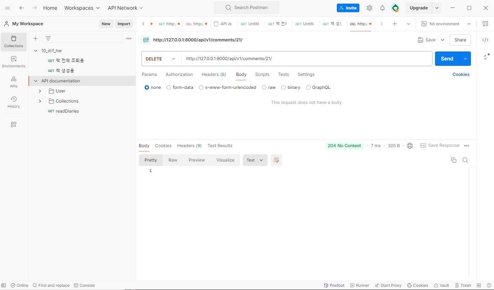
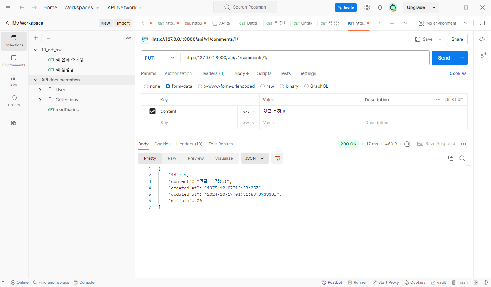
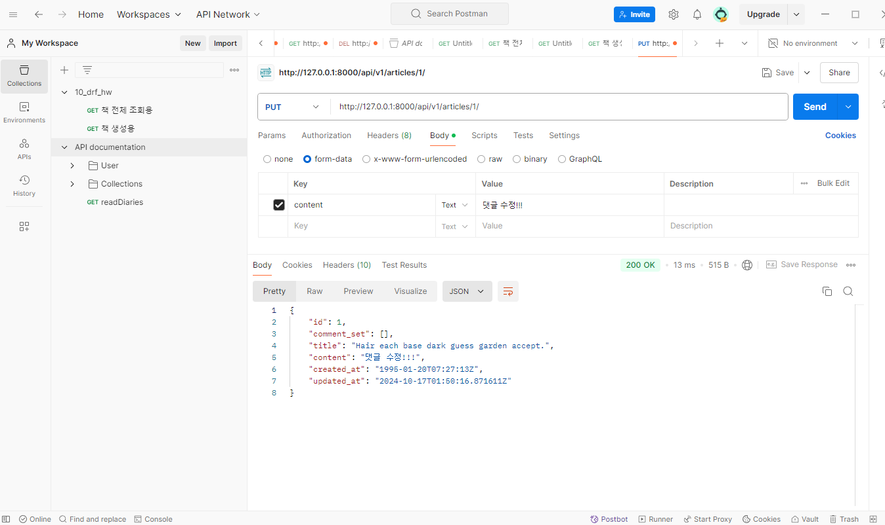
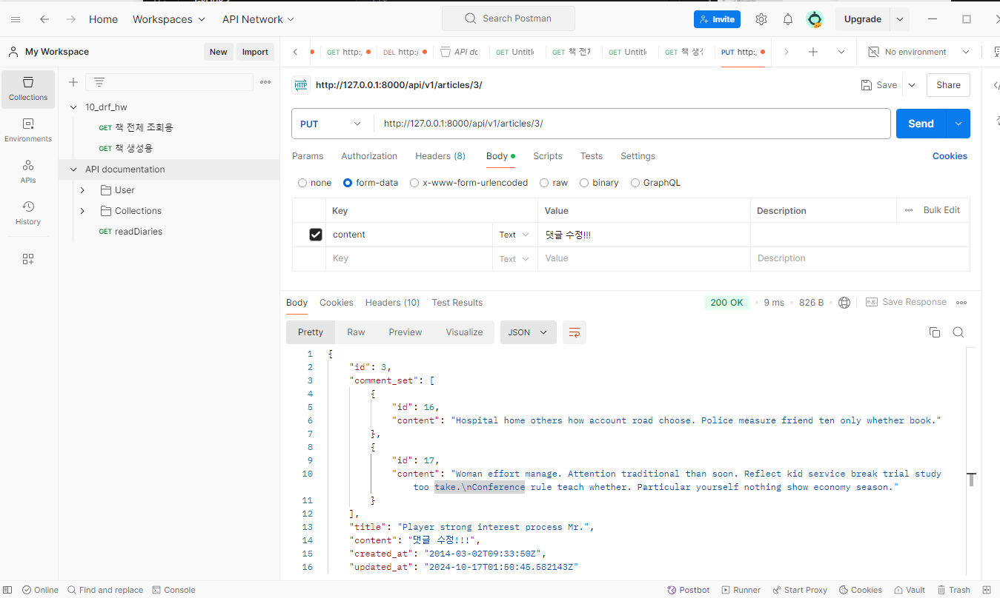
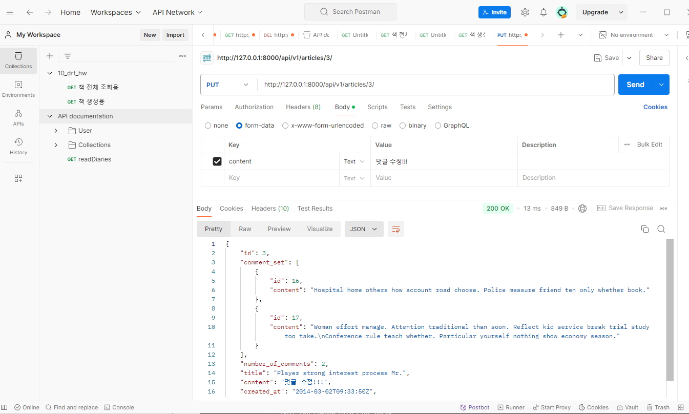
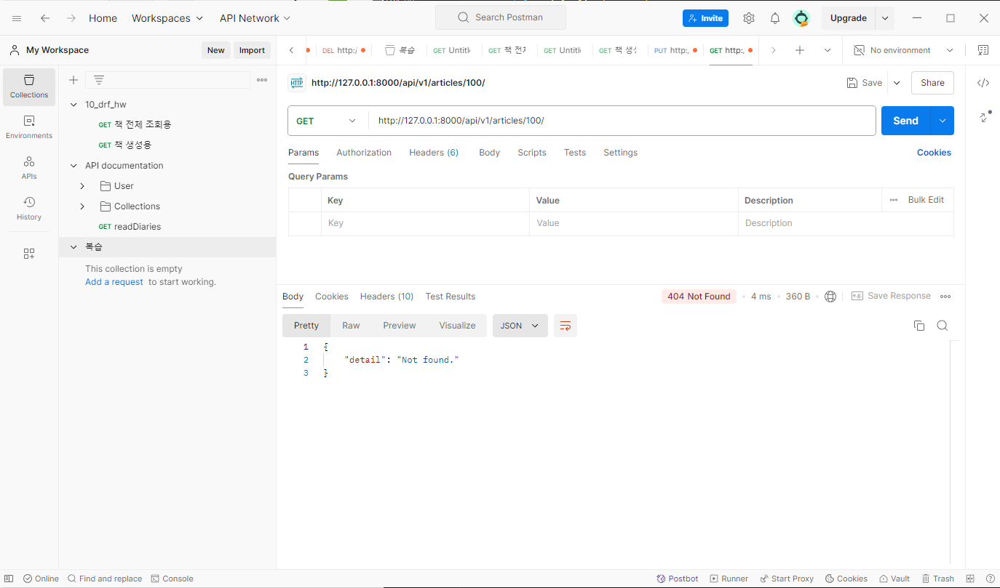
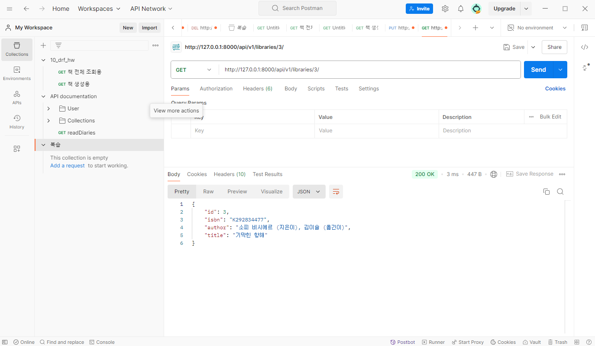
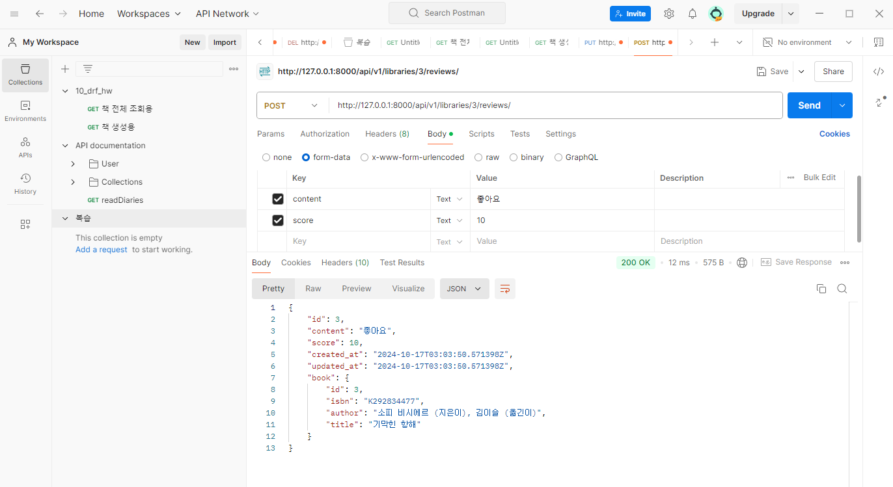

# 장고11 DRF 02
## DFS with N:1 Relation
### 사전준비
### GET method
### POST method
### DELETE & PUT method

## 역참조 데이터 구성
### 단일 게시글 + 댓글 목록
### 단일 게시글 + 댓글 갯수
### 읽기 전용 필드

## API문서화
### 문서화 활용

## 참고
### 올바르게 404 응답하기
### 복잡한 ORM활용

--------------------------


## DFS with N:1 Relation

- URL 및 HTTP request method 구성

URL | GET | POST | PUT | DELETE
comments/ 댓글목록조회 

comments/1/ 단일댓글조회 단일댓글 수정 단일댓글 삭제

articles/1/comments/ 댓글 생성


### 사전준비

### GET method

1. serializers.py만들기
```

class CommentSerializer(serializers.ModelSerializer):
    class Meta:
        model = Comment
        fields = '__all__'
```

2. urls.py 수정하기
```
    path('comments/', views.comment_list),

```
3. views.py작성하기
```
@api_view(['GET'])
def comment_list(request):
    # 댓글 전체 조회
    comments = Comment.objects.all()
    # 댓글 목록 커리셋을 직렬화 진행
    serializer = CommentSerializer(comments, many=True)
    return Response(serializer.data)
```

### POST method
: 댓글의 생성

1.  urls.py
2. views.py


### 읽기 전용 필드
- read_only_fields
: 데이터를 전송받은 시점에 유효성 검사에서 제외시키고,
데이터 조회시에는 출력하는 필드.

-> 상태코드 400 응답 확인
-> CommentSerializer 에서 외래키에 해당하는 
article field또한 사용자로부터 입력 받도록 설정되어 있기 때문에, 서버 측에서는 누락되었다고 판단한것. 

### DELETE & PUT method
1. urls.py는 작성할 필요가 없다.
그냥 예전에 쓴거 공유하면된다.

2. views.py
```
    elif request.method == 'DELETE':
        comment.delete()
        return Response(status=status.HTTP_204_NO_CONTENT)
    
    elif request.method == 'PUT':
        serializer = CommentSerializer(comment, data=request.data)
        if serializer.is_valid(raise_exception=True):
            serializer.save()   # 수정할때 외래키 안넣어줘도됨 article=article
            # 왜냐면, 이미 얘는 외래키가 들어가 있는 댓글에 대해서 수정하고 있다. 
            # 수정의 대상도아니다. 댓글은 수정할때 내용만 수정하면됨.
            return Response(serializer.data)


```





### 댓글의 응답데이터 
'article' :20 하고 끝나버리는 부분이 마음에 안듬.-> 결과를 재구성 해보자.

- 기존의 필드를 오버라이드(덮어쓰다. 뒤엎다)해야함. 

- serializer.py
```
# 여기서 부터 추가


class CommentSerializer(serializers.ModelSerializer):
    # 우리는 값에대한 결과를 custom 하고 싶다. 게시글에 대한 결과를 바꿔주는건 
    # articleserializer가 필요하다. 근데 title 만 출력하고 싶다고 함.
    # 그래서 위에서 만들어 놓은 것을 그대로 쓰기 보다는, 그냥 여기서 필요한 것 을 만들고 사용할 거다.
    class ArticleTitleSerializer(serializers.ModelSerializer):
        class Meta:
            model = Article
            fields = ('title', )
    # 기존  article 데이터 값을 override진행함.
    # 그런데 기존 필드를 override하게 되면, Meta클래서의 read_only_fields를 
    # 사용할 수 없음. 
    # 그래서 (read_only=True)라는 속성을 밑에 넣어줌.= 모델 serializer에 read_only값을 재설정 해줘야 함.
    article = ArticleTitleSerializer(read_only=True)

```

: 1:N관계에서 N쪽에서 외래키를 커스텀한거다.

## 역참조 데이터 구성
1에는 N의 정보가 없다. 

- 단일 게시글 조회시 댓글 목록 까지 가져오고 싶다. 

### 단일 게시글 + 댓글 목록
```
class ArticleSerializer(serializers.ModelSerializer):
    class CommentDetailSerializer(serializers.ModelSerializer):
        class Meta:
            model = Comment
            fields = ('id', 'content')
    # comment_set 역참조 데이터르 오버라이드
    comment_set = CommentDetailSerializer(read_only=True, many=True)

    class Meta:
        model = Article
        fields = '__all__'
```





-> 역참조 매니저의 이름은 어떻게 바꿧더라?
-> related_name 모델에서.

```
models.py

?? 하다가 말음.
```


### 단일 게시글 + 댓글 갯수
: 댓글의 갯수는 우리가 계산해야함.

serializer에서 IntegerField를 가져와서 새로운 필드를 생성해야한다.
comment_count
(실습시 number_of_comments로 사용)
```
    # 댓글 개수 제공을 위한 새로운 필드 생성
    number_of_comments = serializers.IntegerField(source='comment_set.count', read_only=True)

```


- source argument
: 필드를 채우는데 사용할 속성의 이름
: 점 표기법을 사용하여 속성을 탐색할 수 있음.


- 주의 : 읽기 전용 필드 지정 이슈
: 특정 필드를 override 혹은 추가한 경우, read_only_fields는 동작하지 않음.
-> 이런 경우 새로운 필드에 read_only키워드 인자로 작성해야함.

### 읽기전용필드
: 왜작성할까?
- 사용자에게 입력으로 받지 않지만, 제공은 해야하는 경우
- 새로운 필드 값을 만들어 제공해야 하는 경우

- 특징 및 주의 사항
  - 유효성 검사에서 제외됨
  - 단, 유효성 검사에서 제외된다고해서 생성에서만 사용하진 않음.


### 역참조 데이터 구성
- read_only_fields
  : 기존 외래 키 필드 값을 그대로 응답 데이터에 제공하기 위해 지정하는 경우

- read_only 
  : 기존 외래 키 필드 값의 결과를 다른 값으로 덮어쓰는 경우
  : 새로운 응답 데이터 값을 제공하는 경우


## API문서화

- 이미 만들어 둔 api서버를 문서로 추출해서 제공을 하는 방법
: 라이브러리 설치하고, 라이브러리에서 하라는데로 하면 됨.

- OpenAPI Specification(OAS)
: RESTful API를 설명하고 시각화하는 표준화된 방법
-> API에 대한 세부사항을 기술할 수 있는 공식 표준.

: OAS기반 API에 대한 문서를 생성하는데 도움을 주는 오픈소스 프레임 워크
(Swagger, Redoc)

- drf-spectacular 라이브러리
: DRF위한 OpenAPI 3.0 구조 생성을 도와주는 라이브러리

(설치 및 등록)
pip install drf-spectacular

(installed_apps에 적어주기)

https://drf-spectacular.readthedocs.io/en/latest/readme.html#installation

참고해서 할것.

### 문서화 활용

- *** 영화 프로젝트를 하게되면
TMDB api 사이트들어가봐라

- 네이버 지도 api
: 요금이 든다.

- 이런 문서를 왜 만들까?
: 설계 우선 접근법
: API설계하고, 명세를 작성한 후, 
이를 기반으로 코드를 작성한다.

## 참고

### 올바르게 404 응답하기
: 404: Not found
일단 4--은 클라이언트 잘못
-> 없는 게시글을 조회하면, 아직까지는 500이 뜨는 에러로 반환됨.

```
@api_view(['GET', 'DELETE', 'PUT'])
def article_detail(request, article_pk):
    article = Article.objects.get(pk=article_pk)

-> 여기서 get메서드의 에러임.

```
- 
1. get은 조회한 객체가 없을때
DOESNOTEXSIST 예외를 발생

2. 조회한 객체가 2개 이상일때 
MultiPle... 예외 발생

서버는 예외가 발생하면 코드가 중단,,(500)

->> 이러면 안되 try except 해줘야함.


- Django shortcuts functions
  - render()
  - redirect()
  - get_object_or_404()
  - get_list_or_404()


  - get_object_or_404()
  : 모델 manager object~~
```
from django.shortcuts import get_object_or_404

  @api_view(['GET', 'DELETE', 'PUT'])
def article_detail(request, article_pk):
    # article = Article.objects.get(pk=article_pk)
    article = get_object_or_404(Article, pk=article_pk)
```



- 
```
from django.shortcuts import get_object_or_404, get_list_or_404

@api_view(['GET', 'POST'])
def article_list(request):
    if request.method == 'GET':
        # articles = Article.objects.all()
        articles = get_list_or_404(Article)
```

- 왜 사용해야 할까?
: 올바른 응답코드를 줘야하기 때문!!


### 복잡한 ORM활용
-> 최종 프로젝트, drf사용시에 참고!!
- 복잡한 쿼리나 로직은 View함수에서 진행

- Serializer는 기본적인 데이터 변환 담당
: Serializer만으로는 복잡한 query를 처리하기 어려움

### 복습 



```
class ReviewSerializer(serializers.ModelSerializer):
    class Meta:
        model = Review
        # 이하 exclude가 아닌걸 배웠지만, 한번 해보자!!
        # exclude =('book', )
        fields= '__all__'
        read_only_fields=('book',)
        depth = 1
```
