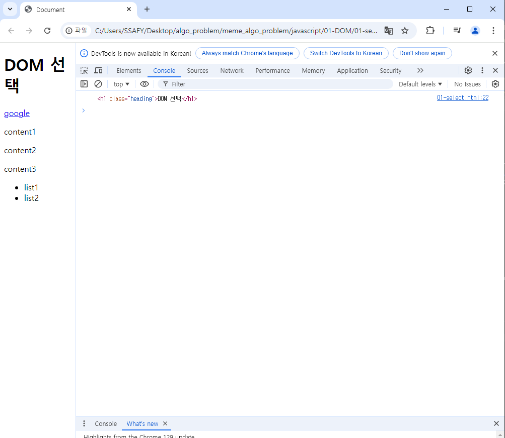

# 자바스크립트 1 DOM
## History of javaScript
### 웹 브라우저와 JavaScript
### ECMAScript

## 변수
### 변수 작성 규칙
### 변수 선언 키워드

## DOM
### document 객체

## DOM선택
### 선택 메서드

## DOM 조작
### 속성 조작
### HTML 콘텐츠 조작
### DOM 요소 조작
### style 조작

## 참고
### DOM 속성확인 Tip
### 용어 정리
### 세미콜론
### var
### 호이스팅

----------------------


## History of javaScript
: 자바스크립트가 왜 지금의 모습을 가지게 되었을까?

### 웹 브라우저와 JavaScript
: 둘의 관계는?

: 웹의 탄생 1990
- 팀 버든 리 경이 WWW, 하이퍼텍스트 시스템 고안하여 개발
- URI, HTTP 최초 설계 및 구현
- 초기의 웹은 정적인 텍스트 페이지 만을 지원

- 웹 브라우저의 대중화(1993)
  - Netscrape사는 웹의 동적인 기능을 만들기 위한 프로젝트를 시작

- JavaScript의 탄생(1995)
  - 당시 Netscape소속 개발자 Brendan Eich는 웹의 동적 기능 개발일라는 회사의 요구사항을 넘어 스크립트 언어 Mocha를 개발
  - 이후 LiveScript로 이름을 변경했으나, 당시 가장 인기있던 프로그래밍 언어인 Java의 명성에 기대보고자 JavaScript로 이름을 변경

- JavaScript파편화(1996)
  - 마이크로 소프트가 자체 웹 브라우저인 인터넷 익스플로러 3.0에 JavaScript와 유사한 Jscript를 만듬.
  - .... 마이크로 소프트가 이김.
  - firefox를 설립함.

- 1차 브라우저 전쟁의 영향
  - JavaScript의 파편화를 막기위해 Netscape사는 ECMA재단에 웹 표준 제작을 요청
  - 웹표준의 중요성을 인식하는 계기가 됨.

- 2차 브라우저 전쟁(2004- 2017)
  - 웹 표준이 정의도었지만, 당시

- Chrome브라우저의 등장.
  - 구글의 크롬이 등장
  - 3년 반만에 성공

- Chrome이 우위를 점하게 된 이유
  - 빠른 성능등... 가장 중요햇던 역할은 바로, "적극적인 웹 표준 준수"

  - 호환성
  - 개발자도구

- 2차 브라우저 전쟁의 영향
  - 크롬이 웹표준을 준수하고 새로운 웹 기술을 적극적으로 함으로써, 그런 영향이 퍼져나감.


### ECMAScript
: ECMAAScript: Ecma International 이 정의하고 있는 표준화된 스크립트 프로그래밍 언어 명세
-> 스크립트 언어가 준수해야 하는 규칙, 세부사항등을 제공

- ECMAScript와 JavaScript
  : JavaScript는 ECMAScript의 표준을 구현한 구체적인 프로그래밍 언어
  : ECMAScript의 명세를 기반으로 하여 웹 브라우저나 Node.js와 같은 환경에서 실행됨
  -> ECMAScript는 JavaScript의 표준이며, JavaScript는 ECMAScript표준을 따르는 구체적인 프로그래밍 언어
  ->

- ECMAScript의 역사
  - ECMAScript 5(ES5)에서 안정성과 생산성을 크게 높임(2009)
  - ECMAScript 2015(ES6)에서 객체지향 프로그래밍 언어로써 많은 발전을 이루어, 역사상 가장 중요한 버전으로 평가됨(2015)

- JavaScript 의 현재
  - 현재는 Chrome, Firefox, Safari, Microsifr Edge등 다양한 웹 브라우저가 경쟁하고 있으며


## 변수
: 자바 스크립트의 변수부분만 보자!
: ECMAScript  2015(ES6)이후의 명제를 따름
: 권장 스타일 가이드
  - 들여쓰기는 2칸
  - 문자열은 작은 따옴표
### 변수 작성 규칙
  식별자 작성규칙
    - 반드시 문자, 달러 또는 밑줄로 시작
    - 대소문자를 구분
    - 예약어 사용 불가
      - for, if, function 등
  식별자 Naming case
    - 카멜 케이스
      : 변수, 객체, 함수에 사용

    - 파스칼 케이스
       : 클래스, 생성자에 사용
  
    - 대문자 스네이크 케이스
      : 상수에 사용

### 변수 선언 키워드
  3가지
  1. let
   : 블록 스코프를 갖는 지역변수를 선언
   : 재할당 불가능
   : 재선언 불가능
   : ES6에서 추가


  2. const(상수의 약자)
   : 블록 스코프를 갖는 지역변수를 선언
   : 재할당 가능
   : 재선언 불가능
   : ES6에서 추가
   (선언할때 반드시 초기값이 필요함.)
   
  3. var(취소선)

  - let과 const는 블록 스코프이다
    : if, for, 함수 등의 '중괄호({}) 내부'를 가리킴

    (console.log(x)는 프린트라고 보면된다. )

    : 블록 스코트를 가지는 변수는 블록 바깥에서 접근 불가능

```
실습
02-basic-syntax
01-variables.html

  <script>
    // let
    let number = 10

    // 재할당 가능
    // number = 20

    // 재선언 불가능
    // let number = 10

    // let은 선언시 초기값이 없다면, undefined 가 초기화시 할당된다.
    let ssafy
    console.log(ssafy)


    // const 는 반드시 초기값이 필요하다.
    const numberTwo = 10
    
    // 페이지 켜는 단축키 Alt + b
    // 재할당 불가능
    // numberTwo = 20
    // 기본적으로 자바스크립트는 브라우저에서 구동이됨.
    // 자바스크립트에서의 프린트는 콘솔에 출력하자는 의미이다.
    // console.log(numberTwo)
    
    // 재선언 불가능
    const numberTwo = 20
    
```
어떤 변수 선언 키워드를 사용해야 할까?
: const를 기본으로 사용
: 필요한 경우에만 let으로 전환
  - 재할당이 필요한 경우
  - let을 사용하는 것은 해당 변수가

- const를 기본으로 사용해야 하는 이유
  - 코드의 의도 명확하
    - 해당 변수가 재할당 되지 않을 것임을 명확히 표현
    - 개발자들에게 변수의 용도와 동작을 더 쉽게 이해할 수 있게 해줌
  - 버그 예방
    - 의도치 않은 변수 값 변경으로 인한 버그를 예방
    - 큰 규모의 프로젝트나 팀 작업에서 중요


## DOM
  - 웹 브라우저에서의 JavaScript : 웹 페이지의 동적인 기능을 구현


  - JavaScript실행환경 종류
    - 1. HTML script태그
    - 2. js 확장자 파일
    - 3. 브라우저 Consle
  
```
실습

hello.js

## index.html
console.log('hello world')


// 
// 방법1 index.html 만들고, body 쪽에 script태그 만들고,
// 방법2: 그냥 웹의 콘솔창에서 바로쓰는 것.
//  우리는 주로 1번. 문서를 만든고 조작하고, 안에서 자바스크립트를 
// 실행해 볼것이다. 

```
- 문서 구조
  - Document structure : HTML 문서는 상자들이 중첩된 형태로 볼 수 있음.
  - 브라우저가 문서를 표현하기 위해 사용하는 데이터 구조는 우측 이미지와 같은 모양을 가짐
  - 각 상자는 객체이며, 개발자는 이 객체와 상호작용하여 어떤 HTML태그를 나타내는지, 어떤 콘텐츠가 포함되어있는지 등을 알아 낼 수 있음.
  - 이 표현을 Document Object Mode, 또는 줄여서 DOM이라고 부름.

- DOM 
  :웹 페이지를 구조화된 객체로 제공하여 프로그래밍 언어가 페이지 구조에 접근할 수 있는 방법을 제공
  -> 문서 구조, 스타일, 내용 등을 변경할 수 있도록 함.

- DOM API
  : 다른 프로그래밍 언어가 웹 페이지에 접근 및 조작 할 수 있도록
  페이지 요소들을 객체 형태로 제공하며 이에따른 메서드 또한 제공

### document 객체
: 웹 페이지를 나타내는 DOM트리의 최상위 객체
->HTML문서의 모든 콘텐츠에 접근하고 조작할 수 있는 진입점
(웹에서 console에 documet.이라고 치면 그 뒤에 이로서 할 수 있는 모든것들이 보여진다. )

: DOM에서 모든 요소, 속성, 텍스트는 하나의 객체
: 모두 document 객체의 하위 객체로 구성됨.

: document 객체 예시
  - HTML의 <title>변경하기
  

- DOM tree
  : HTML 태그를 나타내는 elements 의 문서의 구조를 결정
  : 이들은 다시 자식 node를 가질 수 있음(ex. document.body)
    -> 객체 간 상속 구조가 존재

- DOM 핵심
  : 문서의 요소들을 객체로 제공하여 다른 프로그래밍 언어에서 
  접근하고 조작할 수 잇는 방법을 제공하는 API


## DOM선택
: 조작을 하기전에 선택이 이루어져야함.
: 선택 후 조작.

- DOM조작 시 기억해야 할 것
  : 웹페이지를 동적으로 만들기 == 웹페이지를 조작하기

  : 조작순서
  1. 조작하고자 하는 요소를 선택(또는 탐색)
  2. 선택된 요소의 콘텐츠 또는 속성을 조작


### 선택 메서드
1. 단일 선택 
   요소 한개 선택
   document.querySelector()
2. 
   요소 여러개 선택
   document.querySelectorAll()


- document.querySelector(selector)
: 인자로 선택자(selector)가 문자로 들어간다(CSS때 배웠다.)
  - 제공한 선택자와 일치하는 element 한개  선택
  - 제공한 선택자를 만족하는 첫번째 element 객체를 반환(없다면 null 반환)

- document.querySelectorAll()
  - 제공한 선택자와 일치하는 여러 element를 선택
  - 제공한 선택자를 만족하는 NodeList를 반환
  - 

```
01-01 실습

    console.log(document.querySelector('.heading'))


    console.log(document.querySelector('.content'))


    console.log(document.querySelectorAll('.content'))


    console.log(document.querySelectorAll('ul >li'))


리스트 두개를 선택하려면 경로로 하면된다. 

```

## DOM 조작
: 선택 이후의 조작 4가지
1. 속성(attribute)조작
  - 클래스 속성 조작
  - 일반 속성 조작
2. HTML 콘텐츠 조작
3. DOM 요소 조작
4. 스타일 조작


### 속성 조작
1. 클래스 속성조작
   class List 
   - 1. classList 메서드
     - element.classList.add()
     - element.classList.remove()
     - element.classList.toggle()
  
```
01-02

   // 속성 요소 조작

    // 1. 클래스 속성 조작
    // h1요소 를 선택
    const h1Tag = document.querySelector('.heading')
    // h1 요소의 클래스 목록 확인
    console.log(h1Tag.classList)


```
2. 일반 속성 조작
  - Element.getAttribute()

  - 

  - 
```
// 2. 일반 속성 조작: 무조건 선택 후 조작
    // a 요소 선택
    const aTag = document.querySelector('a')
    console.log(aTag.getAttribute('href'))

    // a 요소의 href 속성 값을 naver로 변경
    aTag.setAttribute('href', 'https://www.naver.com')
    console.log(aTag.getAttribute('href'))

    // a요소의 href 속성 값 삭제
    aTag.removeAttribute('href')
    console.log(aTag.getAttribute('href'))
```


### HTML 콘텐츠 조작
: textContent 

```
03
    // HTML 콘텐츠 조작
    //  DOM조작이라는 저부분을 바꿔보자.//
    // h1 요소 선택
    const h1Tag = document.querySelector('.heading')
    console.log(h1Tag.textContent)

    
```


```
    // HTML 콘텐츠 조작
    //  DOM조작이라는 저부분을 바꿔보자.//
    // h1 요소 선택
    const h1Tag = document.querySelector('.heading')
    console.log(h1Tag.textContent)


    // h1요소의 콘텐츠 값을 변경
    h1Tag.textContent = '내용수정'

    
```


### DOM 요소 조작  
: 자바스크립ㅇ트 자체가 태그를 만들수 잇고 ,,,'

뭐,,, 어째든 만든다음에 업데이트 하는 걸로 보자.

:document.createElement(tagName)
:Nodea

- DOM 요소 조작 메서드
  document.createElement(tagName)


```
01-04

    <p>DOM 요소 조작</p>
  </div>

  <script>
    // 생성
    const h1Tag = document.createElement('h1')
    console.log(h1Tag)
    // 이하 내용채우기
    h1Tag.textContent = '제목'
    console.log(h1Tag)
    

:아직 문서에 추가하지 않아서 DOM요소 조작밑에 뭔 내용이 나오지 않는다. 

   // 추가
    const divTag = document.querySelector('div')
    divTag.appendChild(h1Tag)
    console.log(divTag)
    

    // 삭제
    const pTag = document.querySelector('p')
    divTag.removeChild(pTag)

=> 태그 자체를 생성하고 추가하고 삭제할 수 있다.
(완전히 레이어 자체를 다 구성할 수 있다.)

```

### style 조작
: css도 당연히 자바스크립트가 조작할 수 있다. 

: style property : 해당 요소의 모든 style 속성 목록을 포함하는 속성 

```
실습 
01- 05
    // p태그 선택해보기
    const pTag = document.querySelector('p')

    console.log(pTag.style)

-> css에서 엄청나게 많은 속성들. 키로 접근해서 value를 얻어내는 것.
-> 스타일이 굉장히 많다. 
-> color로 시작하는 굉장히 많은 것들 중 하나이다. 


```
=> 이것은 자바스크립트의 메인 역할 X. 그냥 한가지 역할 일뿐.

## 참고
01- 04


### DOM 속성확인 Tip
: 개발자 도구-Elements-Properties 
: 선택한 해당 요소의 모든 DOM 속성 확인 가능
: 웹의 아랫쪽에 작은 탭들에 p안에 Properties를 누르면 자바스크립트에서 쓸수 잇는 속성들이 나온다.  

### 용어 정리
- Node 
  : DOM의 기본 구성 단위
  : DOM트리의 각 부분은 Node라는 객체로 표현됨
    - Document Node => HTML 문서 전체를 나타내는 노드
    - Element Node => HTML요소를 나타내는 노드( 예를 들어 <p>)
    - Text Node => HTML 텍스트( Element Node 내의 택스트 컨텐츠를 나타냄 )
    - Attribute Node => HTML요소의 속성을 나타내는 노드
- NodeList
  - DOM 메서드를 사용해 선택한 Node 의 목록
  - 배열과 유사한 구조를 가짐
  -  index 로만 각 항목에 접근 가능
  -  javaScript의 배열 메서드 사용가능
  -  querySelectorAll()에 의해 반환되는 Node
- Element
  - Node의 하위 유형
  - Element  는 DOM트리에서 HTML요소를 나타내는 특별한 유형의 Node
  - 예를 들어, <p>, <div>, <span>, <body>등의 HTML 태그들이 Element 노드를 생성
  - Node의 속성과 메서드를 모두 가지고 잇으며, 추가적으로 요소 특화된 기능(예: className, innerHTML, id 등)을 가지고 있음.
  - > 모든  Element는 Node이지만, 모든 Node가 Element인것은 아님.

- Parsing : 구문 분석, 해석
 : 브라우저ㅓ가 문자열을 해석하여 DOM Treee로 만드는 과정

### 세미콜론(semicolon)
: 자바스크립트는 문장 마지막에 세미콜론(';')을 선택적으로 사용 가능
: 세미 콜론이 없으면 ASI에 의해 자동으로 세미콜론이 삽입됨
  - ASI(Automatic Semicolon Insertion, 자동 세미콜론 삽입 규칙)
: JavaScript를 만든 Brendan Eich 또한 세미콜론 작성을 반대


### var
- 재할당가능, 재선언가능, 함수스코프를 가짐( 함수가 아니면 전역변수 이다. )
- 호이스팅 되는 특성으로 인해 예기치 못한 문제 발생 가능
    : 선언하기 전 사용할 수 있음.
- 변수 선언 시 var, const, let 키워드 중 하나를 사용하지 않으면, 자동으로 var로 선언됨

### 함수 스코프: 함수의 중괄호 내부를 가리킴
: 함수 스코프를 가지는 변수는 함수 바깥에서 접근 불가능.


### 호이스팅
```
실습 02- 99hoisting
    console.log(name) // undefined => 선언 이전에 참조
    var name = '홍길동' // 선언
    => 출력하고 변수를 선언함.. 파이썬이라면 당연히 변수 못찾음.에러남.
    -> 여기는 선언과 초기화가 동시에 일어남. undefined. 에러가 안남. 


    // 위 코드를 암묵적으로 아래와 같이 이해함
    var name // undefined 로 초기화
    console.log(name)
    var name = '홍길동'

let, const는 선언 / 초기화 할당-> 이렇게 3개로 나눠져 있음, 
하지만, 초기화가 미리진행되지는 않는다. 
```

-TDZ : TDZ존이 있어서, 

- 레거시는 남겨두고 +알파로 권장함. (var뿐만아니라, 과거의 버그들을 못지운다. )
  ES6이전에 자바스크립트로 구현되고 있는 수많은 프로그램들 때문에, 
  var를 지우지 못한다. 

- 자바스크립트는 문서를 훑으면서, 변수들의 선언을 먼저 끌어올린다.
- 그러고, 그 다음에 또 코드가 진행이 된다. 


-----------------
# 설명
자바스크립트도 객체 지향형이다. 

 ul: 객체 이고,, 속성을 가지고 있다.(id등)


- 빠르기는 id를 적어서 찾는게 빠르다. 근데 우리가 하는건 선택자를 하는거라
  좀 오래걸림. 하지만, 무의미 하다!


- 자바스크립트의 수많은 에러들.... 
  그에 관련된 사이트


