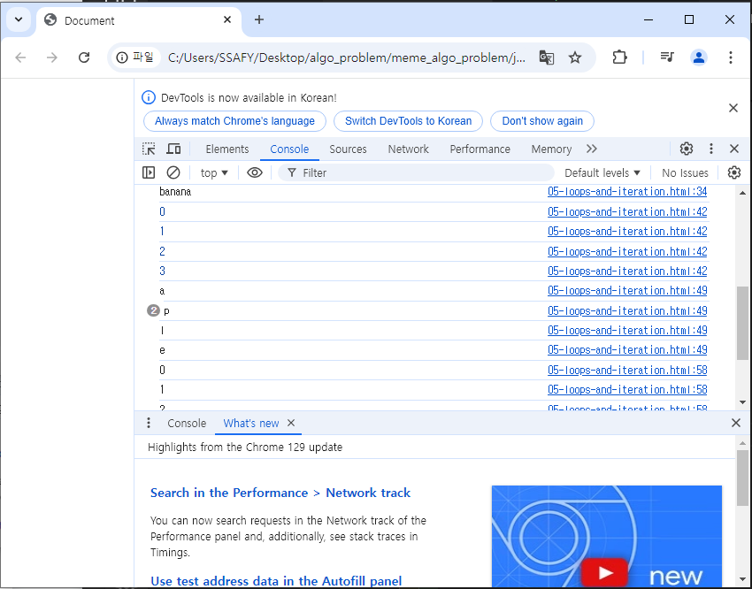

# 자바스크립트 02
## 데이터 타입
### 원시 자료형

## 연산자

## 조건문

## 반복문
### for .. in
### for ... of
### for ... in 과 for ... of

## 참고
### NaN 예시
### null & undefined

------------------

## 데이터 타입
- 원시자료형
  : Number, String, Boolean, null, undefined
  : 변수에 갑이 직접 저장되는 자료형(불견, 값이 복사)

- 참조 자료형
  : Objects=자료형으로셔의 객체 하나만 존재하는데, 객체안에( Object(:데이터 타입의 객체), Array, Function이라는 3가지 자료형이 존재한다. )
  : 객체에 주소가 저장되는 자료형() 가변, 주소가 복사)

### 원시 자료형
예시: 변수가 할당될때 값이 복사, 변수간에 서로영향을 미치지 않음.
 
 원본을 바꾸지 않는다.


참조자료형 예시: 객체를 생성하면, 객체의 메모리 주소를 변수에 할당
변수간에 서로 영향을 미침

- 원시 자료형의 종류
- Number, String, Boolean, null, undefined

- Number:정수또는 실수형을 표현하는 자료형
  : NaN 연산의 결과로 부터 나누는것으로,. 숫자/문자= NaN으로 나온다. 즉, 숫자가 아니다라는 뜻.

- String: 텍스트를 표현
  : + 연산자를 사용해 문자열 끼리 결합. 뺄셈, 곱셈, 나눗셈 불가능

  : Template literals(템플릿 리터럴)
  - 내장된 표현식을 허용하는 문자열 작성 방식
  - Backtick(``)을 이용하며, 여러줄에 걸쳐 문자열을 정의 할 수도 있고, 자바스크립트의 변수를 문자열 안에 바로 연결 할 수 있음.

- 자바 스크립트에서 값이 없음을 표현하는 null 과 undefined
  - null: 프로그래머가 의도적으로 값이 없음을 표현할때
  - undefined:  

- Boolean: true, false(소문자)
  : 조건문 또는 반복문에서  Boolean 이 아닌 데이터 타입을 자동 형변환 규칙에 따라 'true' 또는 'false'

  : 자동 형변환 조건

  데이터 타입
  undefined
  null

## 연산자
- 할당 연산자
  : 오른쪽에 있는 피연산자를 
  : 단축연산자 지원

- 증가 연산자('++')
  : 할당, 이후에 x에 +1을 함.

  : 더하고 할당

- 감소연산자
  : 피연산자를 감소시키고, 

  : 예시 99증감연산자의 예시

- 비교연산자

- 동등 연산자(==) ->암묵적으로 변환해 버리기에 이것은 추천하지 않는 방법
  :두 연산자가 같은 것으로 평가되는지 비교 후boolean
  : 비교를 할때, 한쪽을 암묵적 변환을 시도한다. 그후 같으면 같은거다.

  : [1] == 1
  동등연산자로는 ture가 나온다. 객체와 원시자료형을 비교할때, 객체를 원시자료형으로 바꿔서 비교해 버린다.. 이것도 true이다. 
  왼쪽 오른쪽은 중요하지않고, 배부적 규칙이 있다
    - 문자열, 숫자비교는 문자열-> 숫자
    - 정수, 불리언 -> 불리언을 숫자로 바꾼다,


- 일치 연산자(===): 엄격한 비교
  : 두 피연산자의 값과 타입이 모두 같은 경우, true를 반환
  : 같은 객체를 
  : 엄격한 비교가 이루어지며, 암묵적 타입 변환이 발생하지 않음.

- 논리연산자
  - and
  - or
  - not 
  - 단축 평가 지원
  

## 조건문
  - if : 조건 표현식
```
실습 02-03
<!DOCTYPE html>
<html lang="en">

<head>
  <meta charset="UTF-8">
  <meta name="viewport" content="width=device-width, initial-scale=1.0">
  <title>Document</title>
</head>

<body>
  <script>
    const name = 'customer'

    if (nama === 'admin'){
      console.log('관리자님 안녕')

    } else if(name === 'customer') {
      console.log('고객님 안녕')
    } else{
      console.log(`반갑습니다. ${name}님`)
    }

  </script>
</body>

</html>

```
- 삼항 연산자
  - condition
  - expression1
  - expression2

- 삼항연산자 예시
  : 간단한 조건부 로직을 간결하게 표현할때 유용
  -> 복잡한 로직이나 대다수의 경우에는 가독성이 떨어질 수 있으므로,.
  적절한 상황에서만 사용할 것.

## 반복문
- while, for, for ...in , for ... of

- while: 조건문이 참이면 문장을 계속해서 수행
```
실습 05
    // while
    let i = 0

    while (i<6) {
      console.log(i)
      i+=1
    }


```

- for :특정한 조건이 거짓으로 판별될때까지 반복
  : 초기문, 조건문, 증가문
```
실습 05 


```
### for .. in
: 객체(딕셔너리형태의 {키:값}으로 되어있는 객체. oop에서의 객체가 아님)
의 열거 가능한 속성(property)에 대해 반복;; 객체는 순서가 없다. 그래서 열거라 표현함.
```
실습05 에 for .. in 
    // for...in
    const object = {
      a: 'apple',
      b: 'banana'
    }

    for (const property in object){
      console.log(property)
      console.log(object[property])

    }


```

### for ... of
: 반복 가능한 객체(oop에서의 객체)(배열,문자열 등)에 대해 반복

```
실습
    // for...of
    const numbers = [0, 1, 2, 3]

    for (const number of numbers) {
      console.log(number)
    }

    const myStr = 'apple'


    //  문자열도 반복 가능한 객체이다.
    const myStr = 'apple'

    for (const char of myStr){
      console.log(char)
    }


```

### for ... in 과 for ... of
: 배열을 for ... in 으로 반복하였더니, a b c 가 나오지 않고, 0 1 2 가 나옴.
for ... in:: 객체(딕셔너리형태의 {키:값}으로 되어있는 객체. oop에서의 객체가 아님)
의 열거 가능한 속성
=>배열이 키값형태가 아닌데... 왜 속성이 있지?? 
    const numbers = [0, 1, 2, 3]
도 내부적으로 는
  {
    0: 0,
    1: 1,

  }
-> 이런 식으로 생겻다. 내부적으로는 순서가 부여되어서 생긴 것이다. 
그래서 앞에 잇는 0, 1인 속성값이 출력되는 것이다. 


- for ... of
  :반복가능한 객체에서 쓴다. 반복가능하다는 것은 순서가 존재한다는 것.
  - Array
    a 는 엄연히 0번째에 존재하는 것.
  - Object 는 순서가 없어서, 반복가능하지 않음.
    즉. dictionary도 순서가 없음. 그래서 for ... of가 오류가 뜬다.

  - for .. in은 객체(Object) 전용
  - for ... of은 Array(배열), 혹은 문자열 처럼 반복가능한 객체들 
         => : 배열을 for ... in 으로 반복하였더니, a b c 가 나오지 않고, 0 1 2 가 나옴. => 에러는 안나서 쓸수는 있지만, 권장하지 않음.

- 배열 반복과 for ... in 
  : 객체 관점에서의 배열의 인덱스는 "상수 이름을 가진 열거 가능한 속성"
  : for ... in 은 상수가 아닌 이름과 속성을 포함한 열거가능한 모든 속성을 반환
  => 배열에서는 for문, for ... of를 사용**** 중요함.
  : 객체 관점에서 배열의 인덱스는 정수 이름을 가진 속성이기때문에 인덱스가 출력됨( 순서 보장 X )

  - 반복문 사용 시 const 사용 여부
    - for 문: for 문에서 const를 사용하면 안되는 이유: 재할당이 되어버림;
      반복을 돌면서 i++하는데 증가를 하면서 재할당이 되어버리므로
      쓰면안됨.  

    - for ... in, for ...of 
      : 재할당이 아니라, 매 반복마다 다른 속성 이름이 변수에 지정되는 것이므로.
      const를 사용해도 에러가 발생하지 않음
      : 단, const특징에 따라, 블록 내부에서 변수를 수정할 수 없음.
      : const 만 써야하니? 아니! 반복문 안에서 변수의 값을 바꿔야하면 let을 쓰면 된다. 
      ```
            // for...of
      const numbers = [0, 1, 2, 3]

      for (const number of numbers) {
        console.log(number)
        number의 값을 변경하는 시도 안된다. 엄연히 const number 이기 때문이다. 
        let a = number + 10 =-> 이거는 핈기실수 . 안되는거 아님.
      }
      ```
- 반복문 종합
- 키워드 특징 스코프

## 참고
### NaN 예시
1. 숫자로서 읽을 수 없음(Number(undefined))
2. 결과가 허수인 수학 계산식(Math.sqrt(-1))
3. 피연산자가 NaN (7** NaN)
4. 정의 할 수 없는 계산식(0*Infinity)
5. 문자열을 포함하면서 덧셈이 아닌 계산식('가'/ 3)

### null & undefined
: 값이 없음에 대한 표현이 null과 undefined 2가지인 이유(결국은 설계이슈이다.)
1. 역사적 맥락 => 초기버전의 설계 이슈
   -JavaScript가 

2. null 타입이 "object"인 이유 => 이것도 초기버전의 설계이슈
   - 
   - 

3. ECMAScript의 표준화
   -
   -
   - 표준화에 실패함... 일치연산자로 보면 서로 다르다... 
