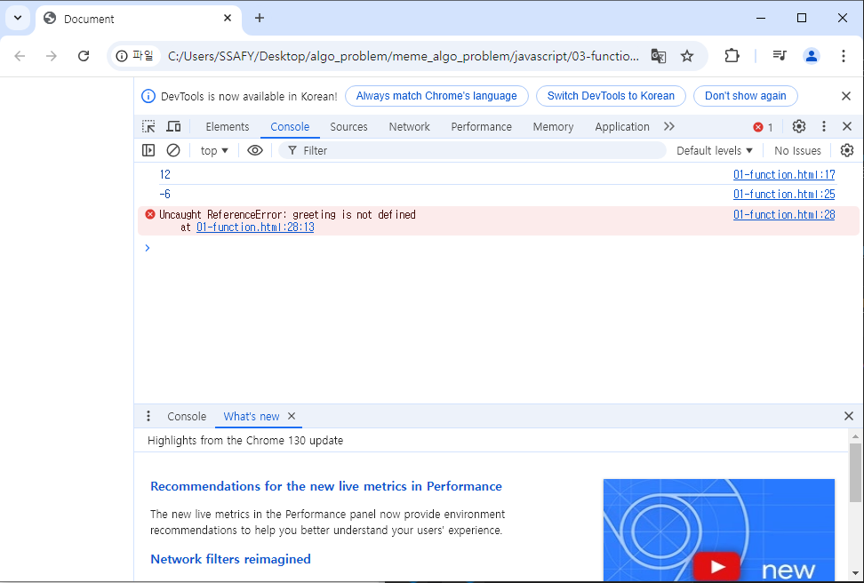
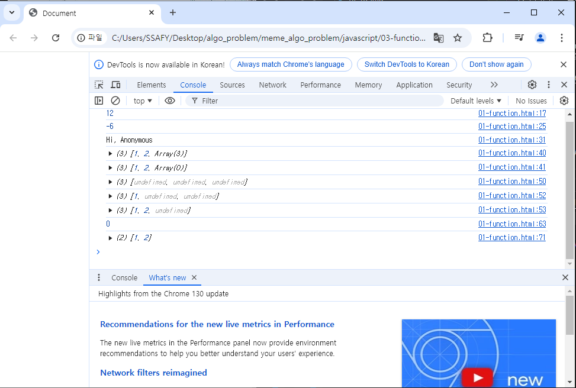

# 자바 스크립트 03
# 참조자료형 01

## 함수
### 함수 정의
### 매개 변수
### Spread syntax
### 화살표 함수 표현식

## 참고
### 화살표 함수 심화

----------------------------


## 함수
- Function :참조자료형에 속하며, 모든 함수는 Function object

- 데이터 타입 중 참조자료형(Objects(Object, Array, Function)중 마지막 Function)
  
- 참조자료형: 객체 주소가 저장되는 자료형
  (가변, 주소가 변경되는 형태로 )

### 함수 정의

- 함수의 구조 
  - function 키워드
  - 함수의 이름
  - 함수의 매개변수
  - 함수의 body를 구성하는 statements
  * retrun  값이 없다면 undefined를 반환

- 함수 정의 2가지 방법
  - 선언식
  - 표현식: 함수의 이름이 존재하지 않는다. 변수의 이름을 사용하기때문에.

- 함수 선언식 특징
  : 호이스팅 됨.-> 그러므로 추천하지 않는다.
  : 코드의 구조와 가독성 면에서는 표현식에 비해 장점이 있음.

- 함수 표현식 특징
  : 호이스팅 되지 않음
    - 변수 선언만 호이스팅되고 함수 할당은 실행 시점에 이루어짐
    - 함수 이름이 없는 '익명함수'를 사용할 수 있음.
  
- 함수 표현식 사용을 권장하는 이유
  1. 예측가능성
  2. 유연성
  3. 스코프 관리


### 매개 변수
1. 기본함수 매개변수
2. 나머지 매개변수
   
1. 기본함수 매개변수
   : 전달하는 인자가 없ㄷ거나 undefined가 전달될 경우, 이름 붙은 매개변수를 기본값으로 초기화
  
2. 나머지 매개변수
   : 임의의 수의 인자를 배열로 허용하여 가변인자를 나타내는 방법
   * 작성 규칙
      - 함수 정의 시 나머지 매개변수는 하나만 작성할 수 있음.
      - 나머지 매개변수는 함수 정의에서 매개변수 마지막에 위치해야 함.

```
// 나머지 매개변수 (가변 인자)
    const myFunc = function (params1, params2, ...restParams) {
      return [params1, params2, restParams]
      // restParams: 나머지들에 대해서 , 자바스크립트는 기본적으로 배열로 묶는다.

    }
    console.log(myFunc(1, 2, 3, 4, 5))
    console.log(myFunc(1, 2))


    // JS는 매개변수와 인자의 개수 불일치를 허용
    // 1. 매개변수 개수 > 인자 개수
    const threeArgs = function (num1, num2, num3) {
      return [num1, num2, num3]
    }

    console.log(threeArgs())
// 갯수가 부족하면 undefined 
    console.log(threeArgs(1))
    console.log(threeArgs(1, 2))
// 인자가 들어온것에 대해서만 처리하고 잇고, 나머지는 undefined로 처리하고 잇음.

    // 2. 매개변수 개수 < 인자 개수
    const noArgs = function () {
      //noArgs 이친구 매개변수가 없는데, 
      // 우리가 호출할때 인자를 강제로 넣어보겠다. 
      return 0
    }

    console.log(noArgs(1, 2, 3))
    // -> 에러뜨지 않고 0이 잘 리턴됨.
```


```
    const twoArgs = function (num1, num2) {
      return [num1, num2]
    }

    console.log(twoArgs(1, 2, 3, 4))
    // 두개의 인자만 처리할 수 있는 함수에, 
    // 강제로 두개를 더 집어넣고 있다. 

```


정리
- 매개변수와 인자 갯수 가 불일치 할때
  : 매개변수 개수 > 인자 개수
  -> 누락된 인자는 undefined로 할당.

  : 매개변수 개수 < 인자 개수
  -> 초과 입력한 인자는 사용하지 않음.

### Spread syntax: ...
'...': 전개 구문

- 배열이나 문자열 과 같이 반복가능한 항목을 펼치는 것(확장, 전개)
- 전개 대상에 따라 역할 이 다름
    -> 배열이나 객체의 요소를 개별적인 값으로 분리하거나 
    다른 배열이나 객체의 요소를 현재 배열이나 객체에 추가 하는 등.

- 전개구문 활용처
  1. 함수와의 사용
    1. 함수 호출시 인자 확장
    2. 나머지 매개변수(압축)- > 선언할때, 나머지 매개변수를 배열로.
  2. 객체와의 사용( 객체 파트에서 진행 )
  3. 배열과의 활용( 배열 파트에서 진행 )


1. 함수와의 사용
  1. 함수 호출시 인자 확장
  ex) 1, 2, 3을 넣어야하즌데, 그냥 ...numbers라고 쓰고 있다. (갯수는 맞아야 함. )
  
  2. 나머지 매개변수(호출식이 아니라 선언식이다. 함수 선언 시 => 이때는 압축이다.  )


```
실습 02
// 1. 인자 확장 (함수 호출 시)
    let numbers = [1, 2, 3]
    let numbers2 = [1, 2] //일치하지 않는 배열.

    function myFunc(x, y, z) {
      return x + y + z
    }
    // 원래대로 라면, 
    // console.log(myFunc(numbers[0], numbers[1], numbers[2]))
    console.log(myFunc(...numbers))
    console.log(myFunc(...numbers2)) //NaN으로 출력됨.
```

### 화살표 함수 표현식(Arrow function expressions)
: 함수 표현식의 간결한 표현법


- 화살표 함수 작성 과정
  1. function 키워드 제거 후 매개변수와 중괄호 사이에 화살표(=>)작성
  2. 함수의 매개변수가 하나 뿐이라면, 매개변수의 `()`제거 가능
   (단, 생략하지 않는 것을 권장)=> 코드의 가독성, 명시성이 중요하기 때문.
  3. 함수의 본문의 표현식이 한줄이면, `{}`와 `return`제거 가능
(( 주로 1단계 까지 사용 ))

```
03 arrow functions

    const arrow1 = function (name) {
      return `hello, ${name}`
    }
    // 1. function 키워드 삭제 후 화살표 작성
    const arrow2 = (name) => {
      return `hello, ${name}`
    }

    // 2. 인자의 소괄호 삭제 (인자가 1개일 경우에만 가능)
    
    const arrow3 = name => {
      return `hello, ${name}`
    }


    // 3. 중괄호와 return 삭제 (함수 본문이 return을 포함한 표현식 1개일 경우에만 가능)
    const arrow4 = name => `hello, ${name}`
    
```


## 참고

### 화살표 함수 심화
1. 인자가 없다면 () or _ 로 표시 가능
2 -1. 함수의 반환이 객체라면, 객체는 {중괄호}로 감싸져 있다. 
그래서 return을 지우기가 어렵다...왜냐면 return을 지울때  {}도 같이지워야하는데

객체인데 {}를 지울수는 없기 때문이다. 


2 -2. 2-1임에도 불구하고, return을 작성하지 않으려면, 객체를 소괄호로
감싸줘야함. 
-> 이렇게 할 수 잇다는 거지, 극단적으로 할 필요까지느 없다.


- 자바스크립트 
  : 실습에서 새로운거 요청하면, web에서 검색할때,
  html h1 mdn 이라고 검색해 봐라.
  항상 mdn이라고 검색해라.

  자바 스크립트도 
  javascript function mdn 이라고 쳐서 공부해라. 
    javascript dom mdn
  (mdn에서는 ; 이 붙어있다. 우리는 안쓴다. )


