# 자바 스크립트 05
## 참조자료형 03

# 목차
## 배열
### 배열 메서드

## Array helper method
### 콜백 함수
### forEach
### map
### 배열 순회 종합
### 배열 with '전개 구문'

## 참고
### 콜백 함수의 이점
### forEach 에서 break 사용하기
### 배열은 객체다

---------------------------------------

## 배열
- Object :키로 구분된 데이터 집합을 저장하는 자료형
- -> 이제는 순서가 있는 collection이 필요
- Array : 순서가 있는 데이터 집합을 저장하는 자료구조

- 배열 구조
  : 대괄호를 이용해 작성
  : 요소의 자료형은 제약 없음
  : length 속성을 사용해 배열에 담긴 요소 개수 확인 가능

```
실습 01
    const names = ['Alice', 'Bella', 'Cathy']
    console.log(names)
    console.log(names[0]) // Alice
    console.log(names[1]) // Bella
    console.log(names[2]) // Cathy

    // 길이
    console.log(names.length) // 3

    // 수정
    names[1] = 'Dan'
    console.log(names)
```
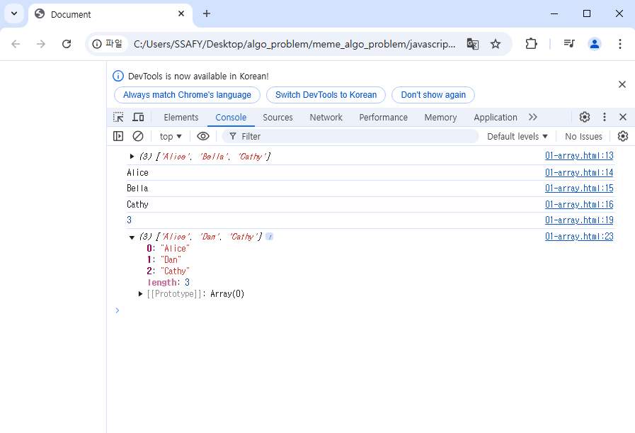


### 배열 메서드

- 주요 메서드
- push/pop
- unshift/shift

```
실습 02
    const names = ['Alice', 'Bella', 'Cathy']

    // pop
    console.log(names.pop()) // Cathy
    console.log(names) // ['Alice', 'Bella']

    // push
    names.push('Dan')
    console.log(names) // ['Alice', 'Bella', 'Dan']

    // shift
    console.log(names.shift()) // Alice
    console.log(names) // ['Bella', 'Dan']

    // unshift
    names.unshift('Eric')
    console.log(names) // ['Eric', 'Bella', 'Dan']
```


## Array helper method
: 배열조작을 보다 쉽게 수행할 수 있는 특별한 메서드 모음

: Array Help Methods
  - ES6에 도입
  - 배열의 각 요소를 순회하며 각 요소에 대해 함수(콜백 함수)를 호출
  - 대표 메서드
    - forEach(), map(), filer(), every(), some(), reduce() 등
  - 메서드 호출 시 인자로 함수(콜백함수)를 받는 것이 특징


### 콜백 함수
: 다른 함수에 인자로 전달되는 함수
-> 외부 함수 내에서 호출되어 일종의 루틴이나 특정 작업을 진행


```
99-callback

map함수가 첫번째 인자로 함수를 받고있다.
여기서의 square를 콜백함수라고 부른다. 

```

```
03

forEach를 map이라고 생각해보자
forEach뒤의 ()안에 인자로 들어간다. 

    numbers.forEach(function(){

    })
numbers의 인자하나하나를 function에 넘겨주는 거다.

function(number)

for each는 numbers를 3번호출한다. 
```

```
    const numbers1 = [1, 2, 3]
    numbers1.forEach(function(number){
      console.log(number)
    })

```
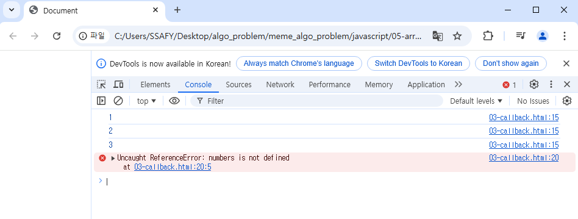
->콘솔 함수가 3번 호출된 것을 확인 할 수 있다. 


```

    // 1
    const numbers1 = [1, 2, 3]
    numbers1.forEach(function(number){
      console.log(number)
    })

    // 2 위아래 똑같은 함수다. 표현만 다를 뿐.
    const numbers2 = [1, 2, 3]
    const callBackFunc = function(number){
      console.log(number)

    }
    numbers2.forEach(callBackFunc)

```
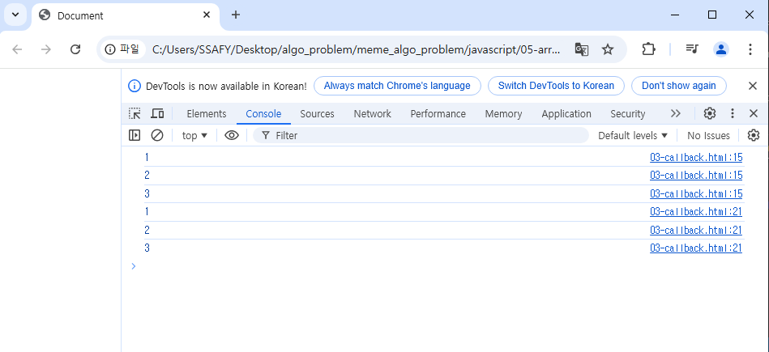

- 주요 Array Helper Method
  forEach : 배열 내의 모든 요소 각각에 대해 함수(콜백함수)

  : 새로운? 를 반환 하진 않는다.

  map


### forEach
forEach(): 메서드 이므로, 앞에 배열이 있을거다,
 배열의 각 요소를 "반복"하며 "모든 "요소에 대해 함수(콜백함수)를 호출

: forEach의 구조
  - 콜백 함수는 3가지 매개변수로 구성
    1. item: 처리할 배열의 요소
    2. index: 처리할 

```
04 
```


```

    // 활용
    names.forEach((name, index, array)=>{
      console.log(name, index, array)
    })
```
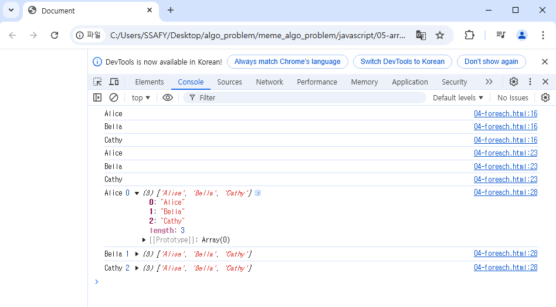


- forEach활용
  :forEach 모든 인자를 활용

### map
: 배열의 모든 요소에 대해 함수를 호출하고, 반환된 호출 결과 값을 모아 새로운 배열을 반환(return이 있다.)

: arr.map(callback(item[, index[, array]]))
  - forEach 의 매개 변수와 동일
  - 반환값:
    - 배열의 각 요소에 대해 실행한 "callback 의 결과를 모은 새로운 배열"
  - > forEach 동작 원리와 같지만, forEach와 달리 새로운 배열을 반환함.

```
실습 05

    // 1.1 for...of
    let result1 = []

    for (const person of persons) {
      result1.push(person.name)
    }
    console.log(result1) // ['Alice', 'Bella']
```

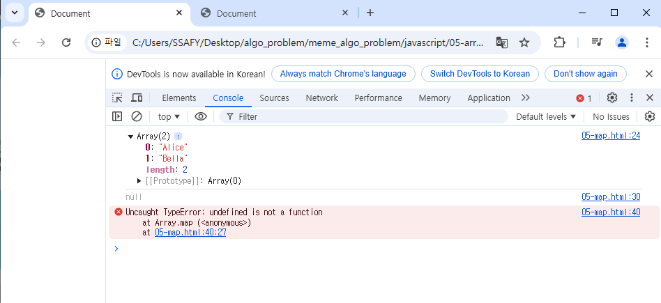

```
// 1. for...of 와 비교
    const persons = [
      { name: 'Alice', age: 20 },
      { name: 'Bella', age: 21 }
    ]

    // 1.1 for...of
    let result1 = []

    for (const person of persons) {
      result1.push(person.name)
    }
    console.log(result1) // ['Alice', 'Bella']

    

    // 1.2 map
    const result2 = persons.map(function (person) {
      return person.name
      // 콜백함수에 return이 있다. return 이 없다면, undefined가 들어갈 수 밖에 없다.

    })
    console.log(result2) // ['Alice', 'Bella']


    // 2. 화살표 함수 표기
    const names = ['Alice', 'Bella', 'Cathy']

    const result3 = names.map(function (name) {
      return name.length
    })

    const result4 = names.map((name) => {
      return name.length
    })

    console.log(result3) // [5, 5, 5]
    console.log(result4) // [5, 5, 5]


    // 3. 커스텀 콜백 함수
    const numbers = [1, 2, 3]
    const myCallBackFunc = function (number) {
      return number * 2

    }

    const doubleNumber = numbers.map(myCallBackFunc)

    console.log(doubleNumber) // [2, 4, 6]

```
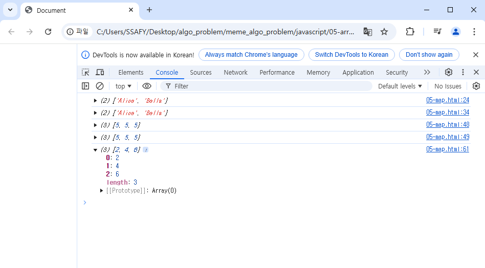

- map 예시
  : 배열을 순회하며 각 객체의 name 속성 값을 추출하기(for ...of )와 비교


### 배열 순회 종합


- 기타 Array Helper Method
  :MDN문서를 참고해 사용해보기
  filter, find, some, every


### 배열 with '전개 구문'
: ...

: 배열 복사.
let parts 

```
07 array with 


```


## 참고

### 콜백 함수의 이점
- 콜백함수 구조를 사용하는 이유
  1. 함수의 재사용성 측면
  2. 비동기적 처리 측면
   : 동기의 반댓말.
   동기는 순차적인 처리(반드시 순서대로 코드 처리함.), 비동기는 병렬적인 처리.

  2. 비동기적 측면
   - setTimeout  함수는 콜백함수르 ㄹ인자로 받아 일정시간이 지나
   - 이때, setTimeout 

```
99번 asyn~~
    console.log('a')

    setTimeout(() => {
      console.log('b')
    }, 3000)

    console.log('c')

```
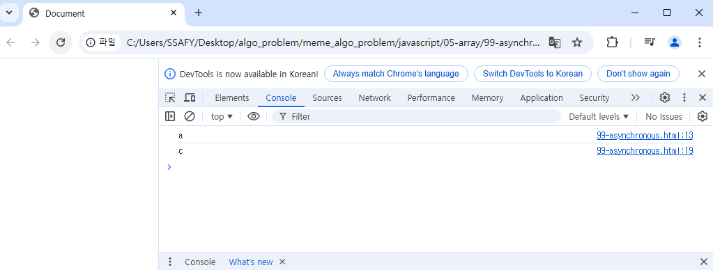
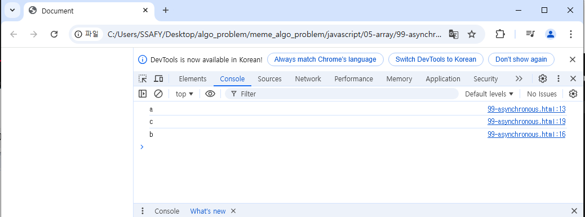


### forEach 에서 break 사용하기
- 대신 some과 every의 특징을 활용해 

```
99 break 

    const array = [1, 2, 3, 4, 5]

    // some
    // - 배열의 요소 중 적어도 하나라도 콜백 함수를 통과하는지 테스트
    // - 콜백 함수가 배열 요소 적어도 하나라도 참이면 true를 반환하고 순회 중지
    // - 그렇지 않으면 false를 반환
    const isEvenNumber = array.some(function (number){
      console.log(number)
      return number % 2 ===0
    })

    console.log(isEvenNumber) // true

    // every
    // - 배열의 모든 요소가 콜백 함수를 통과하는지 테스트
    // - 콜백 함수가 모든 배열 요소에 대해 참이면 true를 반환
    // - 그렇지 않으면 false를 반환하고 순회 중지

    const isAllEvenNumber = array.every(function (number) {
      console.log(number)

      return number % 2 ===0

    })

    console.log(isAllEvenNumber) // false
```
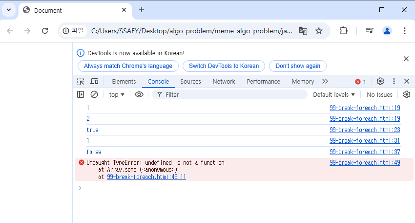


### 배열은 객체다
- 배열은 키와 속성들을 담고 있는 참조 타입의 객체
- 배열의 요소를 대괄호 접근법을 사용해 접근하는 건 객체문법과 같음
- 숫자형 키를 사용함으로써 

```
배열은 객체다
: 콘솔에서 쳐보기


```
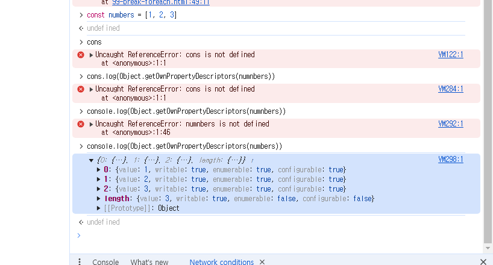

length는 속성으로 존재하므로, 호출하지 않는다.

```
실습 01-05

04
<script>
    const library = {
      books: [
        // 각각의 속성의 값이 배열이다. 
        { id: 1, title: '자바스크립트 완벽 가이드', status: 'available' },
        { id: 2, title: '파이썬 기초', status: 'borrowed' },
        { id: 3, title: 'HTML/CSS 입문', status: 'available' }
      ],
      borrowHistory: [
        { bookId: 2, userId: 'user1', date: '2024-10-20' },
        { bookId: 1, userId: 'user2', date: '2024-10-15' },
        { bookId: 1, userId: 'user2', date: '2024-10-23' }
      ]
    }

    // forEach를 사용하여 다음을 구현하세요:
    // 1. 현재 대출 가능한 도서 목록
    // 2. 특정 사용자(user2)의 대출 이력
    
    // 대출가능 도서 
    const availableBooks = []
    // user2의 대출이력
    const user2History = []

    // 대출 가능 도서 찾기
    // library는 객체이다
    library.books.forEach((book) => {
      if (book.status === 'available') {
        availableBooks.push(book.title)
      }
    })

    console.log(availableBooks)

    // 결과
    // 대출 가능 도서: [ '자바스크립트 완벽 가이드', 'HTML/CSS 입문' ]

    // user2 대출 이력: [
    //   { title: '자바스크립트 완벽 가이드', date: '2024-10-15' },
    //   { title: '자바스크립트 완벽 가이드', date: '2024-10-23' }
    // ]

```
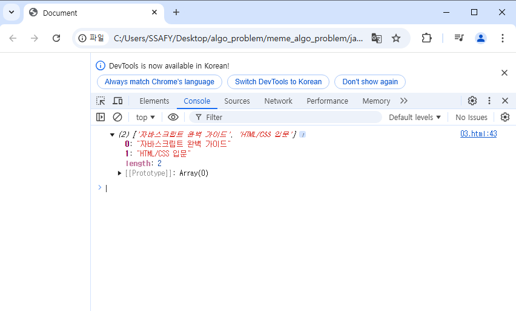

```
실습 03 html

const library = {
      books: [
        // 각각의 속성의 값이 배열이다. 
        { id: 1, title: '자바스크립트 완벽 가이드', status: 'available' },
        { id: 2, title: '파이썬 기초', status: 'borrowed' },
        { id: 3, title: 'HTML/CSS 입문', status: 'available' }
      ],
      borrowHistory: [
        { bookId: 2, userId: 'user1', date: '2024-10-20' },
        { bookId: 1, userId: 'user2', date: '2024-10-15' },
        { bookId: 1, userId: 'user2', date: '2024-10-23' }
      ]
    }

    // forEach를 사용하여 다음을 구현하세요:
    // 1. 현재 대출 가능한 도서 목록
    // 2. 특정 사용자(user2)의 대출 이력
    
    // 대출가능 도서 
    const availableBooks = []
    // user2의 대출이력
    const user2History = []

    // 대출 가능 도서 찾기
    // library는 객체이다
    library.books.forEach((book) => {
      if (book.status === 'available') {
        availableBooks.push(book.title)
      }
    })

    console.log(availableBooks)

    // user2의 대출 이력 찾기
    library.borrowHistory.forEach((history) => {
      // user2의 대출 이력이라면, 
      if (history.userId === 'user2'){
        // 대출 이력의 책변호 통해 책 찾기 
        const book = library.books.find((book) => {
          return book.id === history.bookId
        })
        user2History.push({
          title: book.title,
          date: history.date
        })
      }
    })

    console.log(user2History)


    // 결과
    // 대출 가능 도서: [ '자바스크립트 완벽 가이드', 'HTML/CSS 입문' ]

    // user2 대출 이력: [
    //   { title: '자바스크립트 완벽 가이드', date: '2024-10-15' },
    //   { title: '자바스크립트 완벽 가이드', date: '2024-10-23' }
    // ]


```
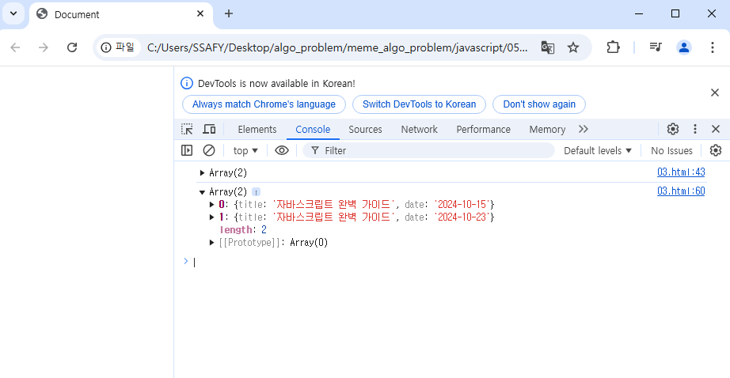


