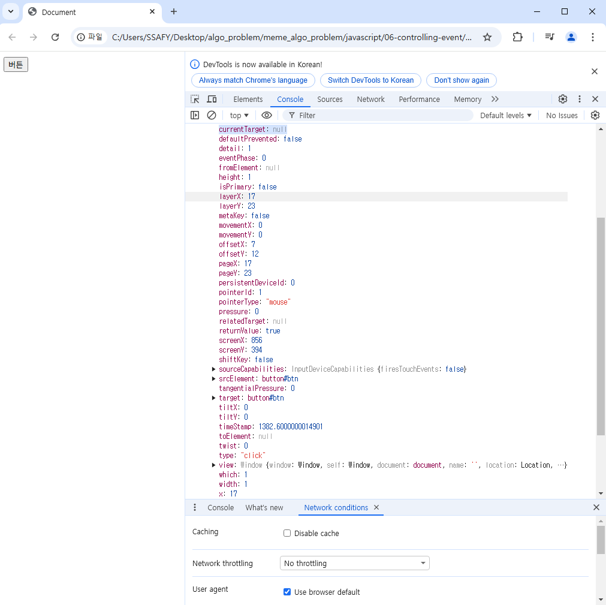
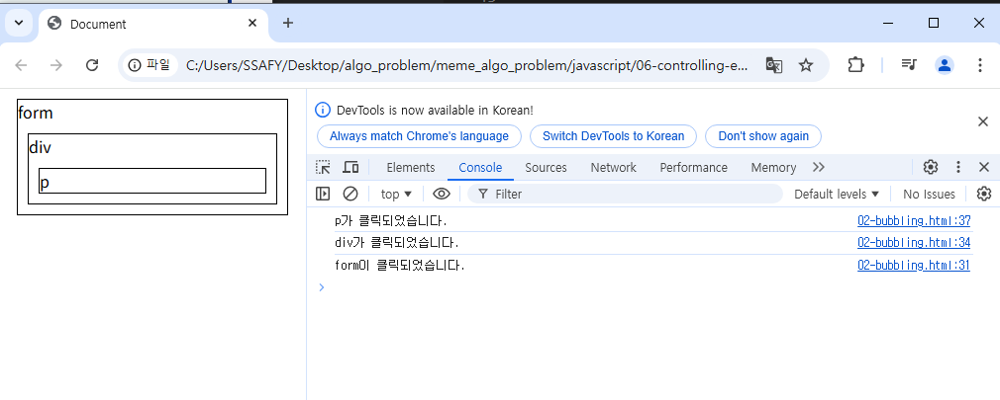
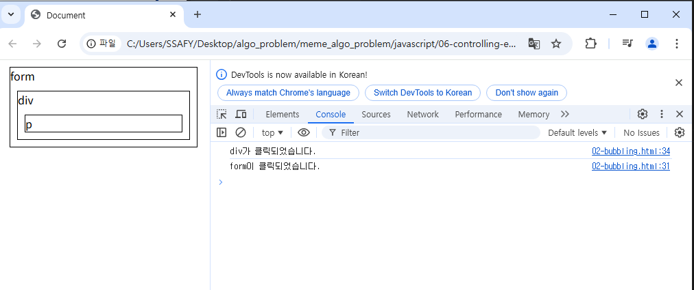
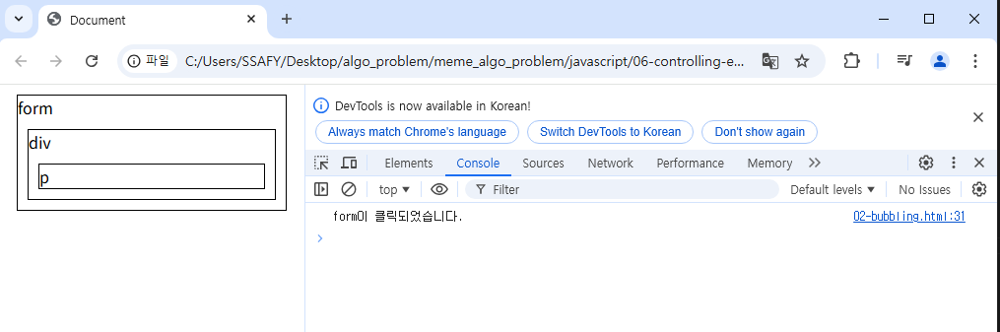
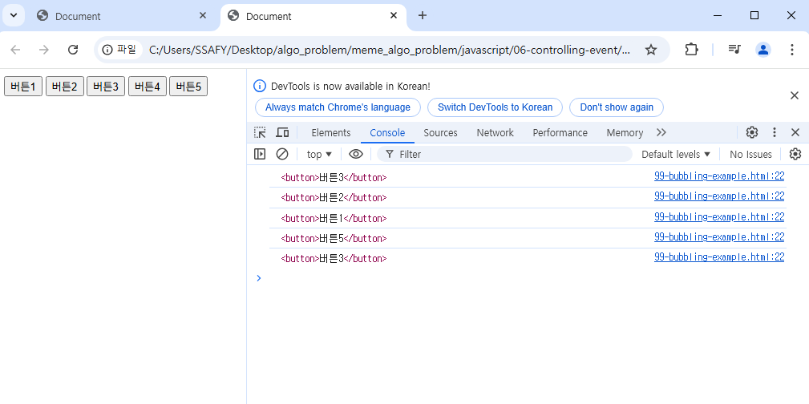
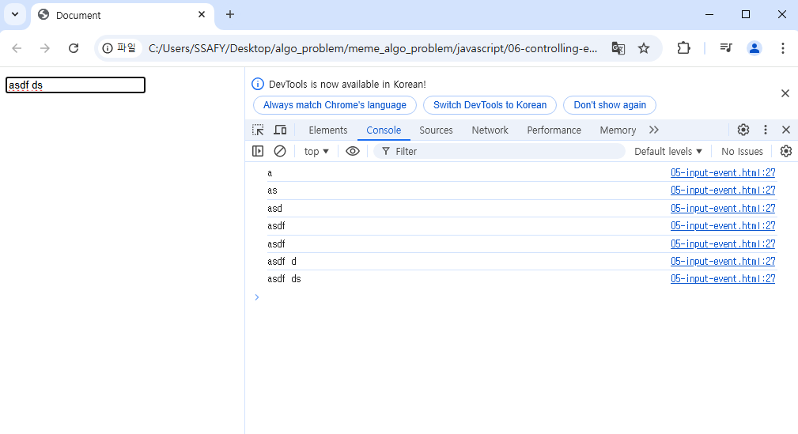
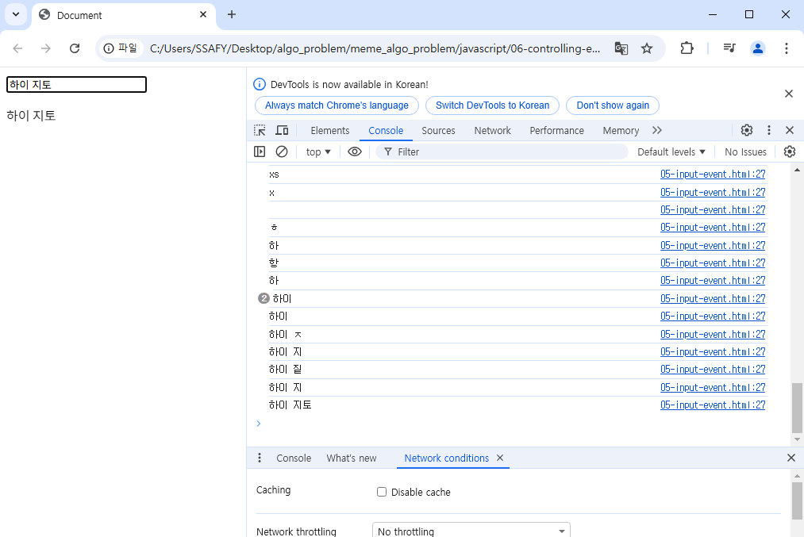

# JavaScript 04
Controlling event

# 목차
## 이벤트
### 이벤트 객체
### event handler

## 버블링
### 캡쳐링과 버블링
### 버블링의 필요성

## event handler 활용
### 이벤트 기본 동작 취소하기

## 참고
### addEventListener와 화살표 함수 관계

----------------------

## 이벤트
- 웹에서의 이벤트
  : 화면을 스크롤하면 페이지 이동하는 것,
   버튼을 클릭했을때 팝업창이 출력되는 것,
   마우스 커서의 ~

### event 객체
: 무언가 일어났다는 신호, 사건
-> 모든 DOM요소는 이러한 event를 만들어냄.

- event object : DOM에서 이벤트가 발생했을때 생성되는 객체
- 이벤트 종류
  : mouse, input, keyboard, touch, ...
  : DOM요소에서 event가 발생하면, 해당 event는 연결된 이벤트 처리기에 의해 처리됨.

### event handler
: 특정 이벤트가 발생했을때 실행되는 함수
-> 사용자의 행동에 어떻게 반응할지를 JavaScript코드로 표현한 것.

: .addEventListener()
대표적인 이벤트 핸들러 중 하나.-> 특정 이벤트를 DOM요소가 수신할 때마다 콜백 함수를 호출

EventTarget.addEventListener(type, handler)
((DOM요소))          ((수신할 이벤트)) ((콜백함수))
: 대상에 특정 Event가 발생하면, 지정한 이벤트를 받아 할 일을 등록한다. 

:.addEventListener의 인자
type: 수신할 이벤트 이름. 문자열로 작성함(ex/ click)
handler: 발생한 이벤트 객체를 수신하는 콜백 함수
: 이벤트 핸들러는 자동으로 event객체를 매개변수로 받음

:addEventListener
버튼을 클릭하면, 버튼 요소 출력하기
-> 버튼에 이벤트 처리기를 부착하여~~

```
실습 01
    // 1. 버튼 선택
    const btn = document.querySelector('#btn')

    // 2. 콜백 함수
    const detectClick = function(event) {
      console.log(event)
      console.log(event.currentTarget)
      console.log(event.target)
      console.log(this)

    }

    // 3. 버튼에 이벤트 핸들러를 부착
    btn.addEventListener('click', detectClick)


```



```
02 실습


```
p를 누르면,



 div를 누르면, 
 


form 을 누르면, 


->> 이것을 버블링 현상이라고 한다. 


## 버블링
: 한 요소에서 이벤트가 발생하면, 이 요소에 할당된 핸들러가 동작하고, 이어서 부모 요소의 핸들러가 동작하는 현상

: 가장 최상단의 조상요소를 만날때까지 이 과정이 반복되면서 요소 각각에ㅐ 할당된 핸들러가 동작

: 이벤트가 제일 깊은 곳에 있는 요소에서 시작해 부모요소를 거슬러 올라가며 발생하는 것이, 마치 물속 거품과 닮았기 때문

: 최하위 <p>요소를 클릭하면, p-> div -> form순서로 3개의 이벤트 핸들러가 모두 순차적으로 동작했던 것

=> 버블링을 통해 target과 current target이 다달라짐,

  - curentTarget 속성
  : 현재 요소 
  :
  :

  - target 속성
  : 이벤트가 발생한 가장 안쪽의 요소(target)를 참조하는 속성
  : 실제 이벤트가 시작된 요소
  : 버블링이 진행되어도 변하지 않음.

```
실습 03
이벤트를 가장 최상위에만 붙여보자.

```
타겟은 바뀜,
커렌트 타겟은 은 이벤트가 부착된 지점

- 우리는 inner을 클릭했는데, outerouter까지 버블링 되면서 document 까지 올라간거다. 


### 캡쳐링과 버블링
- 캡쳐링: 버블링과 반대 현상. 최상위 위에서 부터 찾아냄.
:  table 의 하위요소 td를 클릭하면 이벤트는 먼저 최상위 요소부터 아래로 전파됨(캡쳐링)

: 실제 이벤트가 발생한 지점(event.target)에서 실행된 후 다시 위로 전파(버블링)

-> 캡쳐링은 실제 개발자가 다루는 경우가 거의 없으므로, 버블링에 집중하기 


### 버블링의 필요성
- 버블링이 필요한 이유
  : 만약 다음과 같이 각자다른 동작을 수행하는 버튼이 여러개 있다면?
  -> 각 버튼 마다 다른 이벤트를 핸들링 해야하나?
  => 어떤 버튼이 눌렸는지만 알면된다. 각 버튼에서 발생한 이벤트는 위로 올라간다. div로 묶어서 맨위에서 동작하면 된다.

  - 어떤 버튼이 눌렸는지는... target값을 통해 알수 있다. 
  - (current target은 항상 div)

```
실습 99

    const clickHandler = function (event) {
      console.log(event.target)
    }

    divTag.addEventListener('click', clickHandler)
    를 통해서, 발생한 버튼을 잘 찾아냄

```



- 버블링이 필요한 이유
  : 공통조상에 이벤트 핸들러를 단 하나만 할당하면, 여러버튼 요소에서 발생하는 이벤트를 한꺼번에 다룰 수 있음.
  : 공통 조상에 할당한 핸들러에서 event.target을 이용하면 
  실제 어떤 버튼에서 이벤트가 발생 했는지 알 수 있기 때문.


## event handler 활용
1. 버튼을 클릭하면/ [1]숫자를 1씩 증가해서 [2]출력하기 +DOM
```
실습 04 
    // 1. 초기값 
    let counterNumber = 0

    // 2. 버튼 요소 선택 
    const btn = document.querySelector('#btn')
    
    // 3. 이벤트 핸들러의 콜백 함수
    // const clickHandler = function(event){
      const clickHandler = function(){
// event객체를 안써서 매개변수를 지워도됨.
      // 3.1 초기값을 +1 증가
      counterNumber +=1

      // 3.2  숫자를 콘텐츠로 가지고 있는 span 태그를 선택
      const spanTag = document.querySelector('#counter')

      // 3.3 span 태그의 콘텐츠 값을 conuntNumber값으로 변경
      spanTag.textContent = counterNumber
    }

    // 4. 선택한 버튼에 이벤트 핸들러 부착
    btn.addEventListener('click', clickHandler)

```
: 페이지를 새로고침 할필요없이, 페이지를 있는 그 상태 그대로 조작하는 것.

2. input이벤트 실습
   : 사용자 입력값을 실시간으로 출력하기

```
실습 05


      console.log(event.currentTarget.value)
```


```
    // 1. input 요소를 선택(이벤트가 발생하는 지점)
    const inputTag = document.querySelector('#text-input')
    // console.log로 출력해보자
    // 2. p 요소 선택
    const pTag = document.querySelector('p')

    // 3. 콜백 함수( input 요소에 input이벤트가 발생할때마다 실행!)
    const inputHandler = function(event) {
      // console.log(event)
      //  이벤트 핸들러가 부착된 대상
      // console.log(event.currentTarget)
      // console.log(this)
      console.log(event.currentTarget.value)
      const inputData = event.currentTarget.value

      // 3.2 선택한 p 요소의 텍스트 콘텐츠에 할당
      pTag.textContent = inputData

    }

    //  4. 선택한  input 요소에 이벤트 핸들러 부착
    inputTag.addEventListener('input', inputHandler)
```



3. click & input 이벤트 실습
```
실습 06

```

4. todo 실습
  : 사용자 이벤트를 받고, 클릭이벤트가 발생하면, 
  - 리스트 태그 생성
  - 내용 채우기
  - ul태그에 자식으로 추가하기
```
실습 07
```


5. 로또 번호 생성기 실습
  ```
  실습 08


  ```
https://lodash.com/


6. 버튼을 클릭하면 숫자를 1씩 증가 
7. 


### 이벤트 기본 동작 취소하기

## 참고
### addEventListener와 화살표 함수 관계
