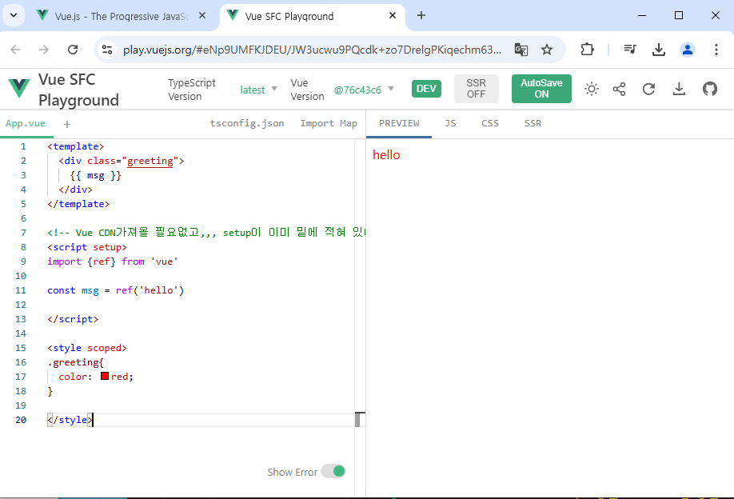

# Vue  04
## Single-File Components

## Single-File Components
- Component
- SFC 구성요소

## SFC build tool
- Vite
- Vue Project
- NPM
- 모듈과 번들러

## Vue Project 구조

## Vue Component 활용

## 추가 주제
- Virtual DOM
- Composition API & Option API

## 참고
- Single Root Element
- CSS scoped
- Scaffolding

---------------------------

## Single-File Components
- Component: 재사용가능한 코드 블록
: 특징
  - UI를 독립적이고 재사용가능한 일부분으로 분할하고, 각부분을 개별적으로 다룰 수 있음.
  -> 자연스럽게 애플리케이션은 중첩된 Component의 트리 형태로 구성됨

- Single-File Components
: 컴포넌트의 템플릿(HTML), 로직(JS) 및 스타일(CSS)을 하나의 파일로 묶어낸 특수한 파일 형식(*.vue파일)
: SFC파일 예시
  - Vue SFC는 HTML, CSS 및 JavaScript를 단일 파일로 합친것
  - <template>, <script> 및 <style>블록은 하나의 파일에서 컴포넌트의 뷰, 로직 및 스타일을 독립적으로 배치

- SFC 구성요소
  : 각 *.vue파일은 세 가지 유형의 최상위 언어 블록 <template>, <script>, <style>으로 구성됨
    -> 언어블록의 작성순서는 상관 없으나, 일반적으로는 template ->script -> style순서로 작성
  : 각 *.vue파일은 최상위 <template>블록을 하나만 포함 할 수 있음. 
  : 각 *.vue파일은 <script setup>블록을 하나만 포함할 수 있음. (일반 <script>제외)
  : 컴포넌트의 setup()함수로 사용되며, 컴포넌트의 각 인스턴스에 대해 실행
  -> 변수 및 함수는 동일한 컴포넌트의 템플릿에서 자동으로 사용 가능

- <style scoped> 블록
  : *.vue파일에는 여러 <style>태그가 포함 될 수 있음
  : scoped가 지정되면, CSS는 현재 컴포넌트에만 적용됨.

- 컴포넌트 사용하기
  : 컴파일러를 통해 컴파일 된 후 빌드되어야 함
  : vue 3 검색-> playground에서 바로 실습이됨.




## SFC build tool

- Vite[veet비트]
: 프론트엔드 개발 도구
-> 빠른 개발환경을 위한 빌드도구와  개발 서버를 제공 
https://vitejs.dev/

- Build
  : 프로젝트의 소스 코드를 최적화 하고 번들링하여 배포할 수 잇는 형식으로 변환하는 과정
  : 개발 중에 사용되는 여러 소스 파일 및 리소스(JavaScript, CSS, 이미지 등)를 최적화된 형태로 조합하여 최종 소프트웨어 제품을 생성하는 것
  :-> Vite 는 이러한 빌드 프로세스를 수행하는 데 사용되는 도구


- Vue Project
: Vite라는 build tool을 통해서 Vue project를 생성해보자.
  - Vue Project생성
    $ npm create vue@latest
```js
$ npm create vue@latest
Need to install the following packages:
create-vue@3.12.0
Ok to proceed? (y) y


> npx
> create-vue


Vue.js - The Progressive JavaScript Framework

√ Project name: ... vue-project
√ Add TypeScript? ... No / Yes
√ Add JSX Support? ... No / Yes
√ Add Vue Router for Single Page Application development? ... No / Yes
√ Add Pinia for state management? ... No / Yes
√ Add Vitest for Unit Testing? ... No / Yes
√ Add an End-to-End Testing Solution? » No
√ Add ESLint for code quality? » No
√ Add Vue DevTools 7 extension for debugging? (experimental) ... No / Yes

Scaffolding project in C:\Users\SSAFY\Desktop\algo_problem\meme_algo_problem\vue\03-single-file-components\vue-project...

Done. Now run:

  cd vue-project
  npm install
  npm run dev
```

- NPM
: Node Package Manager
Node.js(= 자바스크립트의 서버사이드 실행환경)의 기본 패키지 관리자
(파이썬은 pip였다.)
  : Chrome의 V8 JavaScript엔진을 기반으로 하는 Server-Side실행 환경

- Node.js의 영향
: 기존에 브라우저 안에서만 동작할 수 있었던 JavaScript를 브라우저가 아닌 서버 측에서도 실행할 수 있게 함.-> 프론트 엔드와 벡엔드에서 동일한 언어로 개발할 수 있게 됨
: NPM을 활용해 수많은 오픈 소스 패키지와 라이브러리를 제공하여 개발자들이 손쉽게 코드를 공유하고 재사용 할 수 있게 함.


- 모듈과 번들러
  - Module: 프로그램을 구성하는 독립적인 코드 블록(*.js파일)
    : 파이썬의 모듈들은 *.py였다. 

  - Module의 필요성
    : 개발하는 애플리케이션의 크기가 커지고 복잡해지면서 파일하나에 모든 기능을 담기가 어려워짐
    : 따라서 자연스럽게 파일을 여러개로 분리하여 관리를 하게 되었고, 이때 분리된 각 파일이 모듈(module)
    : 복잡하고 깊은 

    : 하지만!!! 애플리케이션이 점점 더 발전함에 따라 처리해야 하는 JavaScript 모듈의 개수도 극적으로 증가
    : 이러한 상황에서 성능 병목현상이 발생하고 모듈간의 의존성(연결성)이 깊어지면서 특정한 곳에서 발생한 문제가 어떤 모듈 간의 문제인지 파악하기 어려워짐
    : 복잡하고 깊은 모듈 간 의존성 문제를 해결하기 위한 도구가 필요-> Bundler

  - node_modules의 의존성 깊이
    : 블랙홀 보다 깊다^^-> 개발자가 손으로 관리할 수 없으므로, 자동으로 설치됨...

  - Bundler: 여러 모듈과 파일을 하나(혹은 여러개)의 번들로 묶어 최적화하여 애플리케이션에서 사용할 수 있게 만들어 주는 도구

  - Bundler의 역할
    - 의존성 관리, 코드 최적화, 리소스 관리
    - Bundler가 하는 작업을 Bundling이라 함
    -> 참고: Vite는 Rollup이라는 Bundler를 사용하며 개발자가 별도로 기타 환경설정에 신경쓰지 않도록 모두 설정해두고 있음.

## Vue Project 구조
- node_modules
  : Node.js프로젝트에서 사용되는 외부패키지들이 저장되는 디렉토리
  : 프로젝트의 의존성 모듈을 저장하고 관리하는 공간
  : 프로젝트가 실행될때 필요한 라이브러리와 패키지들을 포함
  : .gitignore에 작성됨.
  (파이썬에서 venv가 제외되었던 것과 유사함. package.json과 pakage-lock.json을 팀원과 공유한다. )
  ( npm install하면 그냥 그 공간에서 하고 잇다는 것. 활성화 비활성화 없음.)

- pakage-lock.json
  : 패키지들의 실제 설치 버전, 의존성 관계, 하위 패키지 등을 포함하여 패키지 설치에 필요한 모든 정보를 포함
  : 패키지들의 정확한 버전을 보장하여, 여러 개발자가 협업하거나 서버 환경에서 일관성있는 의존성을 유지하는데 도움을 줌
  : npm install명령을 통해 패키지를 설치할때, 명시된 버전과 의존성을 기반으로 설치

- package.json
  : ^가 범위를 표시해줌. 
  : 위의 lock.json보다 좀더 넓은 범위를 표현함

  => 위의 두 파일은 직접설치하지 않는다.

- public 디렉토리
: 주로 다음 정적 파일을 위치 시킴
  - 소스코드에서 참조되지 않는 
  - 항상 같은 이름을 갖는
  - import할 필요 없는
: 항상 root 절대경로를 사용하여 참조
  - public/icon.png는 소스 코드에서 /icon.png로 참조 할 수 있음.

- src 디렉토리
  :*** 프로젝트의 주요 소스 코드를 포함하는 곳
  : 컴포넌트, 스타일, 라우팅 등 프로젝트의 핵심 코드를 관리

- src/assets 
  : 프로젝트 내에서 사용되는 자원
  (이미지, 폰트, 스타일 시트 등)을 관리
  : 컴포넌트 자체에서 참조하는 내부 파일을 저장하는데 사용
  : 컴포넌트가 아닌 곳에서는 public디렉토리에 위치한 파일을 사용

- src/components
: Vue 컴포넌트들을 작성하는 곳

- scr/App.vue
  : Vue 앱의 최상위 Root 컴포넌트
  : 다른 하위 컴포넌트들을 포함
  : 애플리케이션 전체의 레이아웃과 공통적인 요소를 정의

- scr/main.js
  : Vue인스턴스를 생성하고, 애플리케이션을 초기화하는 역할
  : 필요한 라이브러리를 import하고, 전역 설정을 수행

- index.html
: Vue앱의 기본 HTML파일
: 앱의 진입점 (entry point)
: Root 컴포넌트인 App.vue가 해당 페이지에 마운트(mount)됨
-> Vue 앱이 SPA인 이유
: 필요한 스타일 시트. 스크립트 등의 외부 리소스를 로드할 수 있음
(ex bootstrap CDN)

- 기타 설정 파일
  : 
  :

## Vue Component 활용
- 컴포넌트 사용2단계
  1. 컴포넌트 파일 생성 .vue
  2. 컴포넌트 등록(import)


- 사전 준비
1. 초기에 
2. App.vue

```js
<template>
  <h1>App.vue</h1>
  <MyComponent/>
</template>


<script setup>
// import MyComponent from './components/MyComponent.vue'
//  @ -> src를 뜻하는 약어.
import MyComponent from '@/components/MyComponent.vue'

</script>


<style scoped>

</style>

```
- 결과확인: Vue dev tools를 사용해 컴포넌트 관계 형성 확인
- MyComponentItem이라는 것을 MyComponent의 하위 컴포넌트로 해보자!

```js
<template>
  <div>
    <h2>MyComponent</h2>
    <!-- 재사용이 가능하므로 3번써라. 다음에는 v-for를 도입할거다  -->
    <MyComponentItem/>
    <MyComponentItem/>
    <MyComponentItem/>

  </div>
</template>

<script setup>
import MyComponentItem from '@/components/MyComponentItem.vue'

</script>

<style scoped>

</style>

```

```js
<template>
  <div>
    <p>MyComponentItem</p>
  </div>
  <!-- <div>
    <a href="">ssafy</a>
  </div> -->
  <!-- 컴포넌트는 최상위 코드블럭은 한개만. 권장. 
   컴포넌트는 레고블럭이다. div건 header건 1개만 있어야 뜯어쓰기 쉽다.
   동작은 잘된다. ㅅtemplate는 출력되지 않고, 영역만 지정해준다. -->
</template>

<script setup>

</script>

<style scoped>

</style>

```

- 우선순위 B 규칙: 강력히 권장
 : 개발자 경험을 개선하는 것으로 밝혀져..
 : 컴포넌트의 이름
 : 싱글 파일 컴포넌트의 파일명은 항상 파스칼 케이스 이거나, 항상 케밥케이스.
 우리는 파스칼케이스가 자동완성이 잘되서 파스칼케이스로 결정함.

 : 기본 컴포넌트 이름
  - Base, App, V
  BaseButton, AppButton, 

  : 긴밀하게 결합된 컴포넌트 이름
      :  부모 컴포넌트와 긴밀하게 결합된 자식 컴포넌트는 부모 컴포넌트 이름을 접두사로 포함해야 한다. 
      MyComponent, MyComponentItem


- 추가 하위 컴포넌트 등록 후 활용
  : 컴포넌트 재사용성 확인하기

- 컴포넌트 이름 내 단어 순서
: 컴포넌트 이름은 가장 높은 수준의 단어(보통 가장 일반적인 단어)로 시작하고, 설명적인 수정 단어로 끝나야 한다. 

- 셀프 클로징 컴포넌트 
  : 콘텐츠가 없는 컴포넌트는 싱글 파일 컴포넌트, 문자열 템플릿, JSX에서 자체 ㅇㄴㅇㅇㅇ

## 추가 주제
- Virtual DOM
  - 가상의 DOM을 메모리에 저장하고 실제 DOM과 동기화하는 프로그래밍 개념
  - 실제 DOM과 변경사항 비교를 통해 변경된 부분만 실제 DOM에 적용하는 방식
  - 웹 애플리케이션의 성능을 향상시키기 위한 Vue의 내부 렌더링 기술

- 내부 렌더링 과정
템플릿      렌더함수코드          가상 DOM트리      실제 DOM
            컴포넌트 반응형 상태

- Virtual DOM 주의사항
  - 실제 DOM에 직접 접근하지 말 것
    - JavaScript에서 사용하는 DOM 접근 관련 메서드 사용 금지
    - querySelector, createElement, addEventListener 등

    -> Vue의 ref()와 Lifecycle Hooks 함수를 사용해 간접적으로 접근하여 조작할 것.

- 직접 DOm엘리먼트에 접근해야 하는 경우
  : ref 속성을 사용하여 특정 DOM엘리먼트에 직접적인 참조를 얻을 수 있음.


- Composition API & Option API
: Vue2에서 쓰던 문법.
: Vue에서 작성하는 2가지 스타일. vue3는 둘다 가능. vue2는 Option API

  - Composition API
    - import해온 
  - Option API
    - data, methods 및 mounted 같은 객체를 사용하여 컴포넌트의 로직을 정의

- API별 권장 사항
  - Composition API + SFC : 규모가 있는 앱의 전체를 구축하려는 경우

  - Option API : 빌드 도구를 사용하지 않거나 복잡성이 낮은 프로젝트에서 사용하려는 경우.


## 참고
- Single Root Element
  - 모든 컴포넌트에는 최상단 HTML요소가 작성되는 것이 권장
    : 가독성, 스타일링, 명확한 컴포넌트 구조를 위해 각 컴포넌트에는 최상단 HTML요소를 작성해야 함(Single Root Element)


- CSS scoped
  - scoped속성을 사용하면, 해당 CSS는 현재 컴포넌트의 요소에만 적용됨
  - 한가지 예외를 보면,

- scoped 속성 사용을 권장
: 최상위  App 컴포넌트 
: 다음과 같이 App(부모) 컴포넌트에 적용한 스타일에 scoped가 작성 되어있지만, 
MyComponent(자식)의 최상위 요소(div)는 부모와 본인의 CSS모두의 영향을 받기 때문에 
부모 컴포넌트에 지정한 스타일이 적용됨.

- Scaffolding
: 처음에 Vue프로젝트를 만들었을때, 다 no하고, Scaffoding project ~~ 뭐시기 나옴
  - 새로운 프로젝트나 모듈을 시작하기 위해 초기 구조와 기본코드를 자동으로 생성하는 것
  - 
  -

- 관심사항의 분리가 파일 유형의 분리와 동일한 것이 아니다.
  : HTML/CSS/JS를 한 파일에 혼합하는 게 괜찮을까?
  -> 프론트 엔트 앱의 사용목적이 점점 더 복잡해짐에 따라, 단순 파일 유형으로만
  분리하게 될 경우, 프로젝트의 목표를 달성하는데 도움이 되지 않게 됨.

  --------------------------------

  app.vue에서 마운트해오는거다.

  내용을 다 지웠으니, assets의 폴더는 필요없어

  매인.vue를 만들어 줘야지.
  안에 vue3 탭해서 한방에 만든 스니펫.
lang뭐시기 지워주기.

스니펫을 customizing해주기
```
ctrl+shift+p 해서 들어가보기 
+ 기본 구조 있다. 복붙
```
쉅시간에는 그냥 default로 가져가기

대제목
중제목
이미지

template를 작성하자
h1
p
lmg

src에서 시작해보자~~

((우리가 적고 잇는 것은 메인페이지라는 객체하나이다. 뷰객체 하나이고, html이 아니다. ))

-----
app.vue에서 import 하자.

---
매인페이지.뷰에 
</main>으로 감싸주고,.
밑에 style적는 곳에서 
main적어주고 안에 width, margin, tect-align 등을 적어주고,,, 
이 컴포넌트에서 작성한 속성이 다른 하위 컴포넌트에 영항을 주지 않게 하려면
style scoped라고 적어준다. 

app.vue에 적어주는 속성도 main의 모든 요소에도 다 영향을 끼치게 한다. 
scoped를 안적는다면 모든 component에 적용이 가능하다. 

-> 우리 페이지 전체 태마에 영향을 미치고 싶을때는 scoped를 안적으면 된다. 


==========================================
CSS상속은 몸으로 부딪..?

이제 규칙

- CSS 
width: 상속이 될까?=> 안된다. 어떤건 되고, 어떤건 안된다.
크기는 child가 상속받으면 다 쪼그라 들테니 ㅠㅠ

div태그에 width줬다면???


======================================

CSS그리는 가장 좋은 방법: Background color red넣어놓고 구분하면, 어디가 어디인지 잘 알수 있다. 사이 간격이 좁아보이면, padding으로 주면 된다. 