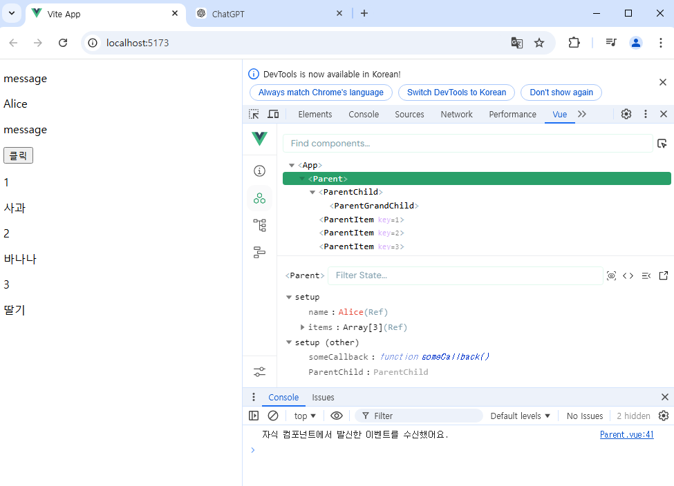

# Vue 05
Component State Flow

## Passing Props
### Props
### Props 선언
### Props 세부사항
### Props 활용

## Component Event
### Emit
### 이벤트 발신 및 수신
### emit 이벤트 선언
### 이벤트 전달
### 이벤트 세부사항
### emit 이벤트 활용

## 참고
### 정적 &동적 props 주의사항
### Props & Emit 객체 선언 문법

-----------------------------------------------------

## Passing Props
- Props
 동일한 데이터, 하지만 다른 컴포넌트

 - 자식은 부모에게 전달할 수 없다. 알림만 가능하다..

 - Props: 부모 컴포넌트로 부터 자식 컴포넌트로 데이터를 전달하는데 사용되는 속성

 - Props의 특징
  : 부모 속성이 업데이트되면 자식으로 전달 되지만, 그 반대는 안됨
  : 즉, 자식 컴포넌트 내부에서 props를 변경하려고 시도해서는 안되며 불가능
  : 또한, 부모 컴포넌트가 업데이트 될때마다 이를 사용하는 자식 컴포넌트의 모든 props가 최신 값으로 업데이트 됨

  -> 부모 컴포넌트에서만 변경하고 이를 내려 받는 자식 컴포넌트는 자연스럽게 갱신

  - One-Way Data Flow
  : 모든 props는 자식속성과 부모속성사이에 하향식 단방향 바인딩을 형성
  (one-way-down binding)

  - 단방향 이유
    : 하위 컴포넌트가 실수로 상위 컴포넌트의 상태를 변경하여 앱에서의 데이터 흐름을 이해하기 어렵게 만드는 것을 방지하기 위함임
    : 데이터의 흐름의 "일관성" 및 "단순화"

- Props선언
: 시작은 항상 부모측에서 -> 자식에게 내려보내기

```js
사전준비
1. Vue 프로젝트 생성
2. 초기 생성된 컴포넌트 모두 삭제(App.vue제외)
3. src/assets 내부 파일 모두 삭제
4. main.js해당 코드 삭제
5. App > Parent > ParentChild컴포넌트 관계 작성
```
- Props 선언
  :Props를 사용하기 위해서는  Props를 선언하는 것이 필요하다.

- Props 작성
 : 부모 컴포넌트 Parent에서 자식 컴포넌트 ParentChild에 보낼 props작성


### Props
### Props 선언
### Props 세부사항
1. Props Name Casing (Props 이름 컨벤션)
  - 자식 컴포넌트 전달 시(케밥케이스)

  - 선언 및 템플릿 참조 시()
2. Static Props와 Dynamic Props

- 다른 디렉티브와 함께 사용
  - v-for와 함께 
  - 

### Props 활용

## Component Events
: 내려주는건 된다. 올려주는건 안되. 그런데 알려준다

### Emit
  - Component Events
    : 부모는 자식에게 데이터를 전달(Pass Props)하며, 자식은 자신에게 일어난 일을 부모에게 알림(Emit event)
    -> 부모가 props데이터를 변경하도록 소리쳐야 한다. 

  - $emit()
    : 자식 컴포넌트가 이벤트를 발생시켜 부모 컴포넌트로 데이터를 전달하는 역할의 메서드
    * $표기는 Vue인스턴스의 내부 변수들을 가리킴
    * Life cycle hooks, 인스턴스 메서드 등 내부 특정 속성에 접근할때 사용

```js
// emit 메서드 구조
// 처음인자느 이벤트, 두번째는 추가인자...arg

```
### 이벤트 발신 및 수신
  - emit을 사용하여 템플릿 표현식에서 직접 사용자 정의 이벤트를 발신
  - 그런다음 부모는 v-on을 사용하여 수신할 수 있음.
```js
// 실습: ParentChild에서 Parent로 소리쳐 보자.

// 1. ParentChild 에서 
    <button @click="$emit('someEvent')">클릭</button>

// 2. Parent에서 
    @some-event="someCallback"

    // 밑에서 
    const someCallback = function(){
  console.log("자식 컴포넌트에서 발신한 이벤트를 수신했어요.")
}
```

: parent에서 출력됨을 알수 잇다. 




### emit 이벤트 선언
```js
// emit 이벤트 선언 (배열방식, 객체방식)
// 배열방식(객체방식은 번거로워서 )
const emit = defineEmits(['someEvent'])
const buttonClick = function () {
  emit('someEvent')
}

-------

    <button @click="buttonClick">클릭</button>

```


### 이벤트 전달
- 이벤트 인자
: 이벤트 발신시 추가 인자를 전달하여
- ParentChild에서 이벤트를 발신하여 
```js
const emit = defineEmits(['someEvent', 'emitArgs'])


// emitArgs를 호출할 메서드 만들기
const emitArgs = function () {
  emit('emitArgs', 1, 2, 3)
}

    <button @click="emitArgs">추가 인자 전달</button>
---------------------

저것을 Parent에게 소리치고 있으니까, 

// Parent에서
      @emit-args="getNumbers"

// 아래쪽에서 
const getNumbers = function (...args) {
  console.log(args)
  console.log(`자식 컴포넌트로 부터 데이터 ${args}를 받았습니다.`)
}
```

### 이벤트 세부사항
- Event Name Casing
  : 선언 및 발신 시(-> camelCase)

  : 부모 컴포넌트에서 수신 시(-> kebab-case)


### emit 이벤트 활용
- emit 이벤트 실습
- 최하단 컴포넌트 ParentGrandChild에서 Parent컴포넌트의 name변수 요청하기
  : 단계 점프 불가,. 소리치고(emit), 소리치고(emit)

- emit 이벤트 실습 구현
```js
//  1. ParentGrandChild에서 emit이벤트를 만들기
// emit 객체 만들고
const emit = defineEmits(['updateName'])
// 위에꺼를 호출할 함수 하나 만들고
const updateName = function () {
  emit('updateName')
}
// 소리치기 위한 트리거인 버튼을 위에서 만들자 

    <button @click="updateName">이름 변경!</button>
    // parentchild로 가자
    <ParentGrandChild 
      :my-msg="myMsg"
      @update-name=""
//아래로 가서 새로운 emit event를 만들기
const emit = defineEmits(['someEvent', 'emitArgs', 'updateName'])


// Parent에서 
      @update-name="updateName"

//아래에서
const updateName = function () {
  name.value = 'Bella'
}
```


## 참고


### 정적 &동적 props 주의사항
- 첫번째는 정적 props로 문자열 "1"을 전달
- 


### Props & Emit 객체 선언 문법
- Props선언 시 "객체 선언 문법"을 권장하는 이유
  : 컴포넌트를 가독성이 좋게 문서화하는 데 도움이 되며,
  다른 개발자가 잘못된 유형을 전달할때에 브라우저 콘솔에 경고를 출력하도록 함
  : 추가로 props에 대한 유효성 검사로써 활용 가능
  + 공식문서: 프롭에 대한 유효성 검사를 하는 방법
  (지금단계에서는 이름?정도.)

- emit은 우리가 배열선언 문법으로 씀.
: emit 이벤트도 "객체 선언 문법"으로 작성 가능
  - emit 이벤트 또한 객체 구문으로 선언 된 경우, 유효성 검사를 할 수 있음.


### 주의사항
메서드랑 에밋이벤트이름이랑 일치시켜야 할까? -> 달라도 상관없당
중간단계의 이름도 달라도 상관없지만, 중간단계이므로.. 같게 썻다.

** emit 이벤트에 들어가 있는거만 같으면 된다!!


### 
우리가 다루는 데이터가 어디에 위치를 해야,
간단하게 공통되는 부모가 될지를 잘 고려해서,
프로젝트를 해라!!

-> 너무 복잡한 수정이 필요할때, 멀리서 있는 중앙저장소에서 할수도 있다.
물론, 트리구조가 너무 복잡하지 않을때는 굳이 중앙저장소를 쓸필요는 없다.

=> 2~3단계정도면 할만하다. 

