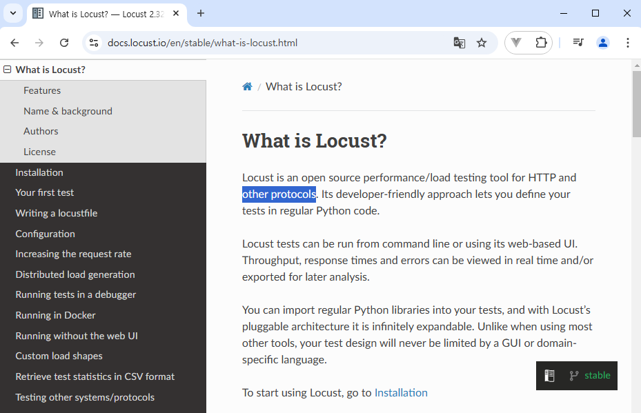
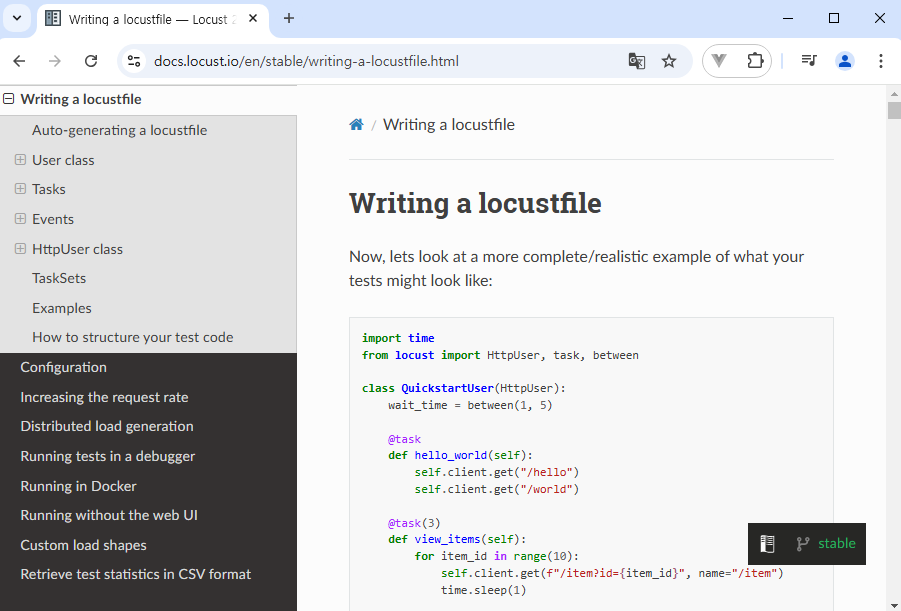
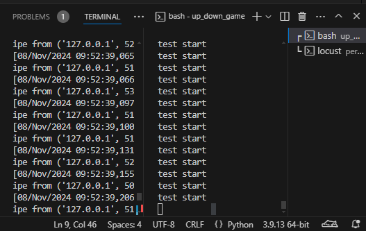
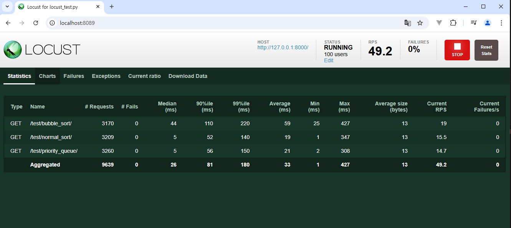
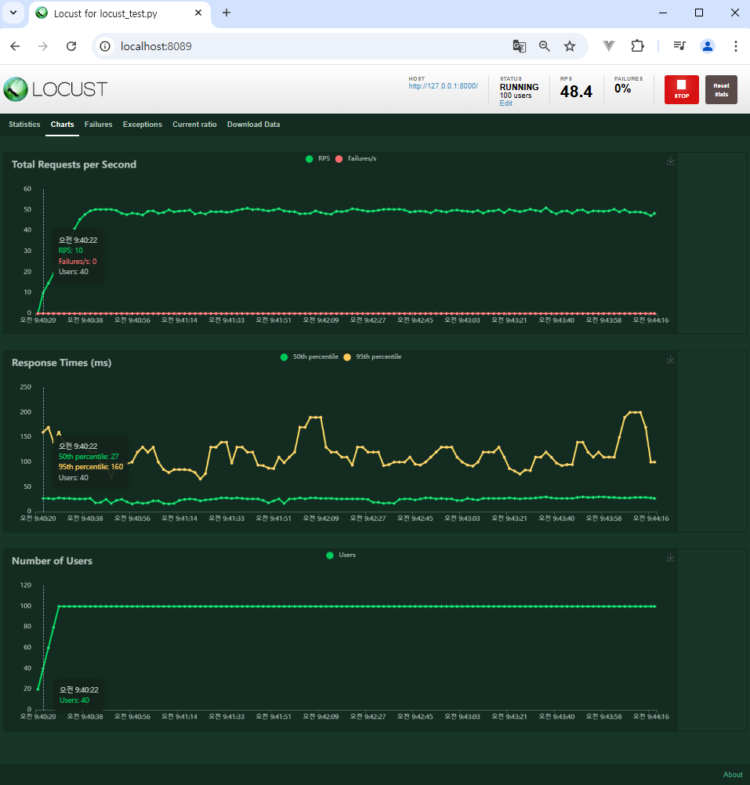
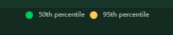
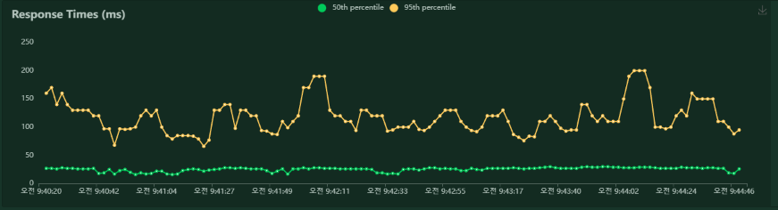
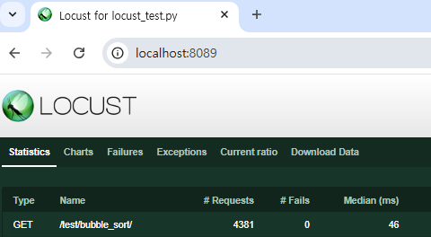
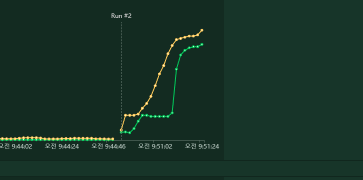

# 버전 1(금융)
테스트 & 성능 테스트 개념
실습: 정렬 알고리즘 성능 측정

# 버전 2
비동기 통신을 이용한 웹사이트 구현
실습: 업다우 게임 구현

-----------

## 버전1 금융 상품 비교 앱
- Django에서 알고리즘 구현 및 성능 측정
  - 목표
  - 테스트 & 성능 테스트 개념

- 목표: 이번 프로젝트에서는 Django 에서 요구사항에 따라 알고리즘을 구현해 보고,
구현한 알고리즘의 성능(시간, 공간)을 측정합니다. 

- Locust라는 툴을 이용하면 사진과 같이 성능 테스트를 할 수 있음.
(장고위에서 알고리즘을 구현하면, 이런 것이 가능하다.)

- 진행순서
  1. 테스트 & 성능 테스트 개념
  2. Locust 세팅
  3. 정렬 알고리즘 성능 측정 실습

- 테스트란?
  : 원하는 기능이 모두 구현되었는지 확인하고, 숨겨져 있는 결함을 찾는 활동
  : 여러가지 도구들을 활용하여 버그를 찾아내고, 신뢰성 보안 성능 등을 검증하는 중요한 단계
  -> 프로젝트시에 우리는 테스트를 하고 있는가?
  ->> 구현하고, 동작을 확인하고 눈으로 보는 것은, 일종의 테스트라고 할수 있다.

  ->> 테스트 종류는 많다.
  ->> 상황에 맞게

- 필수적인 테스트는?
  - 유닛 테스트
    : 내가 개발한 개별 함수또는 기능(이)가 잘 동작하는가?

  - 회귀 테스트
    : 기존 코드들은 버그가 없는가?

  - 통합테스트 
    : 여러 시스템을 붙였을 때, 잘돌아가는가?

- 성능테스트
: 핵심적인 테스트 중 하나
: 특정상황에서 시스템이 어느 정도 수준을 보이는가? 혹은 어떻게 대처를 하는가를 테스트 하는 과정.
: 목적
  - 여러 테스트를 통해 성능 저하가 발생하는 요인을 발견하고 제거
  - 시장에 출시되기전에 발생할 수 있는 위험과 개선사항을 파악
  - 안정적이고 신뢰할 수 있는 제품을 빠르게 만들기 위함

: 성능테스트의 종류도 많습니다.
: 그 중, 프로젝트에서는 핵심인 부하테스트와 스트레스 테스트.

- 부하 테스트(Load Testing)
  - 시스템에 """임계점의 부하가 계속될때""" 문제가 없는가?
  - 목적: 시스템의 신뢰도와 성능을 측정
    ex)""임계점에 해당하는 인원이 30시간동안 계속""해서 사용 -> 서비스
    (임계점: 사용자 혹은 요청에 점점 늘어나다가, 응답시간이 급격히 느려지는 시점)

- 스트레스 테스트(Stress Testing):: 위의 부하테스트의 ""임계점을 찾는 것""
  - 시스템에 과부하가 오면 어떻게 동작할까?
  - 목적: 장애 조치와 복구 절차가 효과적이고 효율적인지 확인
    ex)임계점 이상의 인원 -> 서비스가 어떻게 대처하는가?

- 부하테스트 vs 스트레스 테스트
테스트 방법: 
    - 부하:임계점까지의 가상 유저수를 유지하며 모니터링
    - 스트레스: 중단점 이상 까지 가상 유저를 점진적으로 증가

=====================
# API성능 테스트

## Locust
  - 오픈소스 부하 테스트 도구
  - 변역하면 메뚜기, 테스트 중 메뚜기 떼가 웹 사이트를 공격한다는 의미로 착안된 이름
  - 내가 만든 서버에 수많은
https://docs.locust.io/en/stable/




:HttpUser
:task: 이걸 붙이면, 가상유저가 아래 메서드를 계속(반복적으로) 실행
(반복사이의 시간은 wait_time이 적혀 있다.)
:between

```js
// performance test
가상환경 세팅
활성화

locust -f locust_test.py

주소는  
http://0.0.0.0:8089대신, 
http://localhost:8089/로 바꿔줘야한다. 
```

median 에서 Max까지는 서버의 응답시간들 
중앙값, ile..., 평균, 최대, 최소값



50: 중앙값
95: 95번째로 늦게 응답받은 시간
즉,


50명은 굉장히 안정적인 서비스고, 

95번째 부터는 굉장히 불안정하게 가고 있다.


- 버블소트는 중앙값이 굉장히 뒤로 밀려 있으므로, 느린것을 알수 잇다.




: 병목현상

- stopped누르고나면, 
Broken pipe from ('127.0.0.1', 51137)     
: 로커스트와 장고가 주고받는 pipe가 부러졋다= 응답을 못줘요

; 장고 1000명,,,? 안되나...

- 테스트 주의사항
  - 지금 하는 테스트는 정석적인 방법이 아니다
    - 정석:  서버에 배포된 API 또는 프로그램에 부하테스틑 해야한다,
  - 하지만, 지금 현재 PC 의ㅐ 

- 정렬 알고리즘 구현하기
  - 대상
    1. 파이썬 내장 정렬함수-  O()


- 테스트 결과 예시

- 테스트 결론
  - 직접 구현한 우선순위 큐보다 파이썬의 내장함수가 안정적이고 빠릅니다.
    - 병목현상이 발생하지 않음
    - 응답 시간이 최고/최악 모두 빠르다
  - 알고리즘에 따라 서버 성능이 크게 좌우될 수 있습니다.
  - 테스트 결과가 보여주는 내용은 작성한 결론 외에도 수 많은 정보를 내포함
    - 추가적으로 많은 학습이 필요함

- 요약
  - 테스트 및 성능 테스트의 개념을 알아보고, Locust 를 활용한 부하 테스트를 해보았다
  - 스트레스 테스트 등의 다른 테스트는 명확한 목표를 적하고 진행해야 함
    - 개선사항의 방향을 찾기 위해 테스트를 진행
    - ex) 우리 서버는 반드시 0.8초 이내에 모든 응답을 주어야 한다.,
  - 여러번 테스트를 해보아야 정확한 결과를 받을 수 있음
    - 최대 부하 지점(임계점)의 부하를 지속하여 서버를 테스트 한다.== 부하테스트
    - 과부하가 오는 시점(중단점)을 찾아 지속적 혹은 반복적으로 서버를 테스트한다. == 스트레스 테스트

- 도전 과제
  - 목표: Django Rest Framework 를 활용하여 요구사항에 맞는 결과를 반환하도록 구성
        : 요구사항에 맞는 알고리즘 구현 및 성능 측정
  - 특징: Pandas 라이브러리를 활용한 데이터 처리
        : Locust를 활용한 알고리즘 성능 측정

# 버전 2 영화
## 비동기 통신을 이용한 웹 사이트 구현

1. 화면을 내가 들어 갔을때, 정답이 우선 생성 되어야 함
2. 정답인가요? 확인 할 때마다 시도횟수가 +1
3. 