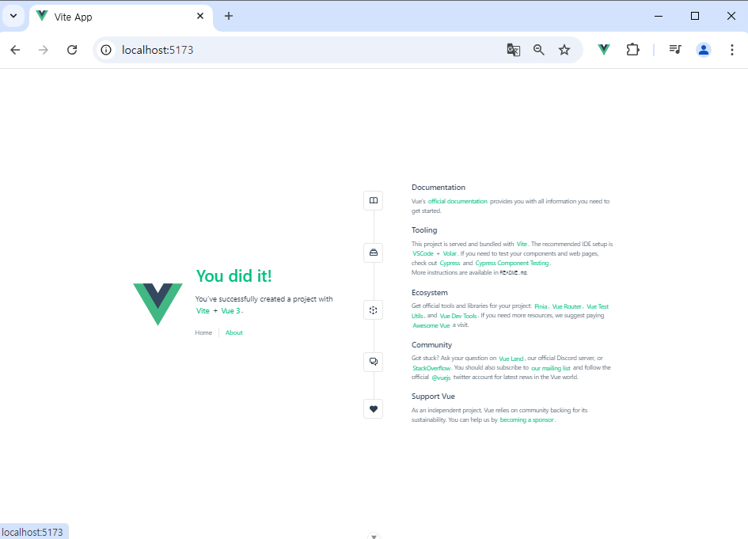
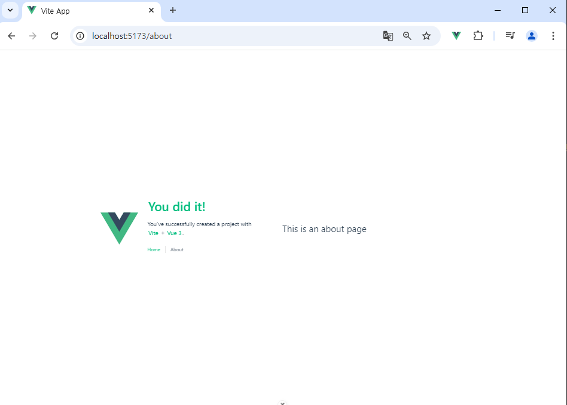
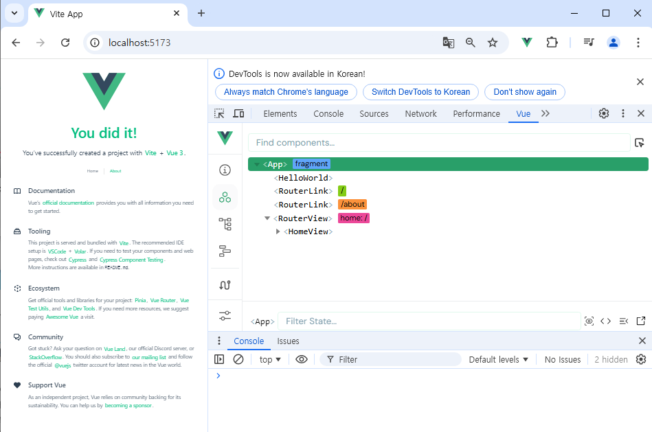
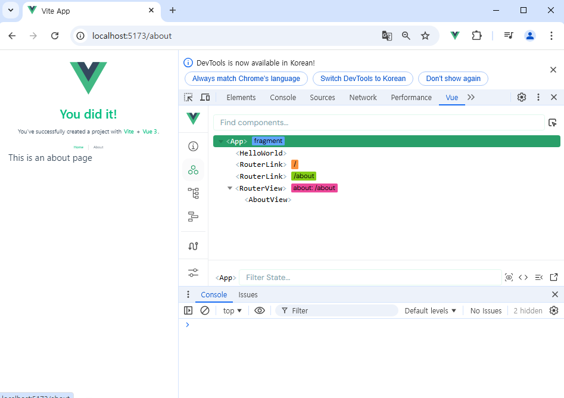
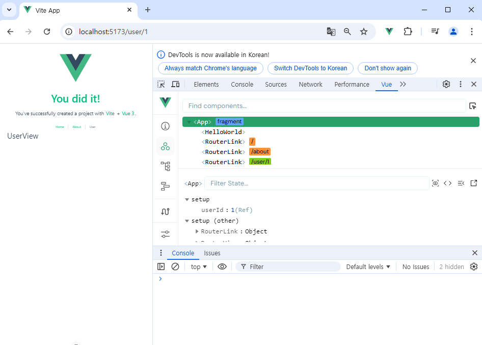
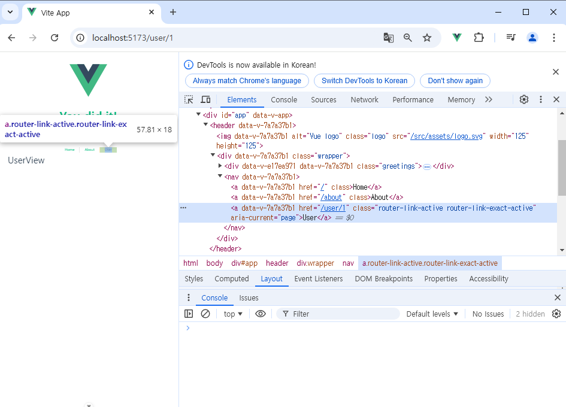
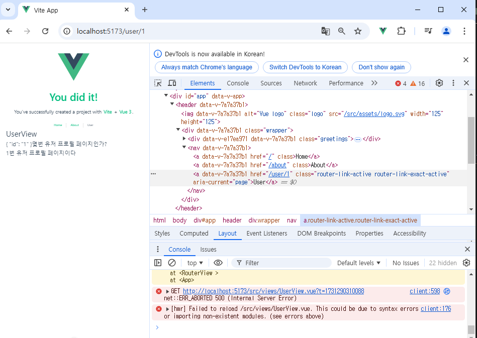

# Vue 06
## Vue Router

## Routing

## Vue Router
- Basic Routing
- Named Routes
- Dynamic Route Matching
- Nested Routes
- Programmatic Navigation

## Navigation Guard
- Globally Guard
- Per-route Guard
- In-component Guard

## 참고
- Lazy Loading Routes

=============================


## Routing
: 네트워크에서 경로를 선택하는 프로세스
-> 퉵 애플리케이션에서 다른 페이지 간의 전환과 경로를 관리하는 기술

:SSR에서의 Routing
  - SSR에서 routing은 서버 측에서 수행
  - 서버에서 사용자가 방문한 URL 경로를 기반으로 응답을 전송
  - 링크를 클릭하면 브라우저는 서버로부터 HTML응답을 수신하고 새HTML로 전체 페이지를 다시로드

: CSR에서의 Routing
  - CSR에서 routing은 클라이언트 측에서 수행
  - 클라이언트 측 JavaScript가 새 데이터를 동적으로 가져와 전체 페이지를 다시 로드하지 않음.

:SSR에서 Routing이 없다면,
  - 유저가 URL을 통한 페이지의 변화를 감지할 수 없음
  - 페이지가 무엇을 렌더링 중인지에 대한 상태를 알 수 없음
    - URL이 1개 이기 때문에 새로고침 시 처음 페이지로 되돌아감
    - 링크를 공유할 시 첫 페이지만 공유가능
  - 브라우저의 뒤로가기 기능을 사용할 수 없음.
=>>> 페이지는 1개 이지만, 주소에 따라 여러 컴포넌트를 새로 렌더링 하여 
마치 여러 페이지를 사용하는 것 처럼 보이도록 해야함.
=>>> 라우팅을 도입하겠다!!

## Vue Router: 
Vue의 공식 라우터. 이것을 도입하자.
npm create vue@latest

에서 (4번째인 라우터 설정)하나를 yes해보자

cd vue-project/

npm install






-> 하나의 페이지에서 새로그리는 모습이 보이고, url도 새로생긴다. 

: vue프로젝트 구조 변화
  - 1. App.vue 코드 변화
  - 2. router 폴더 신규 생성
  - 3. views 폴더 신규 생성

:RouterLink
  - 페이지를 다시 로드 하지 않고, URL을 변경하여 URL생성 및 관련 로직을 처리
  - HTML의 <a>태그를 렌더링

:RouterView
  - RouterLink URL에 해당하는 컴포넌트를 표시
  - 원하는 곳에 배치하여 컴포넌트를 레이아웃에 표시 할 수 있음.

:RouterLink 와 :RouterView

: Router의 index.js는 장고의 url.py를 닮음

: views
  - RouterView 위치에 렌더링 할 컴포넌트를 배치
  - 기존 components 폴더와 기능적으로 다른 것은 없으며,
  단순 "분류의 의미"로 구성됨
  (기능적으로 다른 부분은 없다. 기능적으로 아무 차이 없다.)

  -> 일반 컴포넌트와 구분하기 위해 컴포넌트의 이름을 View로 끝나도록 작성하는 것을 권장

- Basic Routing
  - 라우팅 기본
    1. index.js에 라우터 관련 설정 작성(주소, 이름, 컴포넌트)
    2. RouterLink의 'to'속성으로 index.js에서 정의한 주소 값(path)을 사용
    3. RouterLink 클릭시 경로와 일치하는 컴포넌트가 RouterView에서 렌더링 됨


- Named Routes
  : 경로 이름을 지정하는 라우팅

  :Named Routes의 장점

- Dynamic Route Matching
: URL의 일부를 변수로 사용하여 경로를 동적으로 매칭(주소의 일부분을 변수화 시키자.)
: 주어진 패턴 경로를 동일한 컴포넌트에 매핑해야하는 경우에 활용
: 예를 들어 모든 사용자의 ID를 활용하여 프로필 페이지 URL을 설계한다면?
 -> 일정한 패턴의 URL작성을 반복해야 함.

  - views 폴더 내 UserView 컴포넌트 작성
  - 매개변수는 콜론(':')으로 표기
  -> UserView 컴포넌트 라우트 등록




```js
<template>
  <div>
    <h1>UserView</h1>
    <h2>{{ $route.params }}몇번 유저 프로필 페이지인가?</h2>
    <h2>{{ $route.params.id }}번 유저 프로필 페이지이다</h2>
  </div>
</template>

<script setup>

</script>

<style scoped>

</style>
```



```js
<template>
  <div>
    <h1>UserView</h1>

    <h2>{{ userId }}번 유저 프로필 페이지</h2>
<!-- 위의 직적쓰는건 권장하지 않음,
 스크립트에서 라우터 객체로 접근한다음, 거기서 라우터 객체를 반응형 변수로 담아서
 그 반응형 변수를 출력하는 것이 깔끔ㅎ다. -->
  </div>
</template>

<script setup>
import { useRoute } from 'vue-router';
import {ref} from 'vue'

const route = useRoute()
const userId = ref(route.params.id)


</script>

<style scoped>

</style>
```


- Nested Routes
: 중첩된 라우터
  - 애플리케이션의 UI 는 여러 레벨 깊이로 중첩된 컴포넌트로 구성되기도 함
  - 이 경우 url을 중첩된 컴포넌트의 구조에 따라 변경되도록 이 관걔를 표현 할 수 있음.

- children옵션은 중첩된 라우터에 컴포넌트를 등록


- Programmatic Navigation


## Navigation Guard
: Vue router를 통해 특정 URL에 접근할 때, 
다른 URL로 redirect를 하거나 취소하여 내비게이션을 보호
-> 라우트 전환 전/후 자동으로 실행되는 Hook
.. 비로그인 사용자는 메인 페이지로 못가개, 로그인사용자에게는 로그인페이지로 못가게...
등등 ~ 할때에 대한 타이밍이 있다. => 라우트 전후~~

- Navigation Guard종류 3기지
1. 전역가드
2. 라우터 가드
3. 컴포넌트 가드 

- Globally Guard
  : 애플리케이션 전역에서 모든 라우트 전환에 적용되는 가드
  : 작성위치 index.js(항상호출되므로 가장 최상단 위치)
  : router.beforeEach()
      : 다른 URL로 이동하기 직전에 실행되는 함수


- Per-route Guard
  : 특정 라우트에만 적용되는 가드
  : index.js의 각 routes
  : router.beforeEnter()
      : 특정 route에 진입했을때만 실행되는 함수
      -> 단순히 URL의 매개변수나 쿼리 값이 변경될때는 실행되지 않
      다른 URL에서 탐색해 올때만 실행됨.
      : 이미 로그인 한 상태라면, LoginView진입을 막고 HomeView로 이동시키기
      -> 전역 가드 beforeEach 관련 코드는 주석 처리 후 진행

- In-component Guard
  : 컴포넌트 내에서만 적용되는 가드
  : 하나의 컴포넌트안에서의 변화
  : user/1 -> user/2

  ->> 이건 자동호출이다. 

  : onBeforeRouteLeaave()

  : onBeforeRouteUpdate()


## 참고
- Lazy Loading Routes