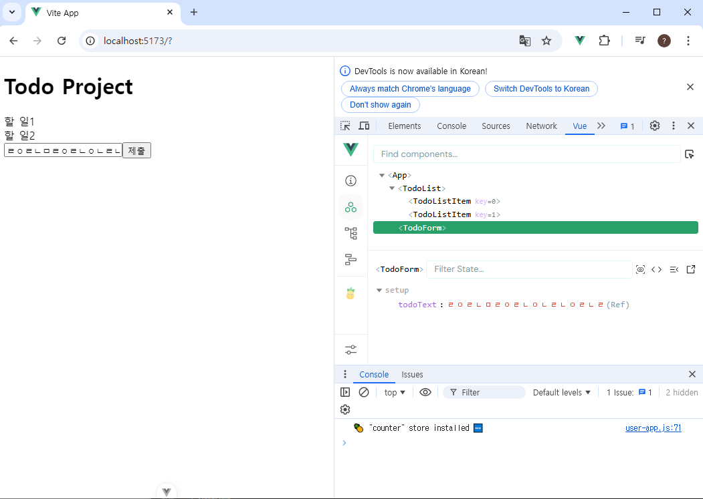

# 뷰07
## State Management

## State Management

## Statemanegement library (Pinia)
### Pinia
### Pinia 구조
### Pinia 구성 요소 활용

## Pinia 실습
### Read Todo
### Create Todo
### Delete Todo
### Update Todo
### Counting Todo
### Local Storage

## 참고
### Pinia 활용 시점

=======================

## State Management
 - State Management
  : 상태 관리
    : Vue 컴포넌트는 이미 반응형 상태를 관리하고 있음
    -> 상태 === 데이터

 - 컴포넌트 구조의 단순화
  - 상태(State) : 앱 구동에 필요한 기본 데이터
 const count = ref(0)

  - 뷰(View) : 상태를 선언적으로 매핑하여 시각화
  - 기능(Action) : 뷰에서 사용자 입력에 대해 반응적으로 상태를 변경할 수 있게 정의된 동작
  -> '단방향 데이터 흐름'의 간단한 표현

 - 상태 관리의 단순성이 무너지는 시점
  : 여러 컴포넌트가 상태를 공유할때 
      1. 여러 뷰가 동일한 상태에 종속되는 경우
        - 공유 상태를 공통 조상 컴포넌트로 끌어올린 다음 props로 전달하는 것
        - 하지만 계층 구조가 깊어질 경우 비효율적, 관리가 어려워짐

      2. 서로 다른 뷰의 기능이 동일한 상태를 변경시켜야 하는 경우
        - 발신(emit)된 이벤트를 통해 상태의 여러 복사본을 변경 및 동기화 하는 것
        - 마찬가지로 관리의 패턴이 깨지기 쉽고, 유지 관리할 수 없는 코드가 됨.

  => 해결책
    - 각 컴포넌트의 공유 상태를 추출하여 전역에서 참조할 수 잇는 저장소에서 관리
    - 각 컴포넌트의 공유 상태를 추출하여, 전역에서 참조할 수 있는 저장소에서 관리
    - 컴포넌트 트리는 하나의 큰 View가 되고 모든 컴포넌트는 트리 계층 구조에 관계 없이 상태에 접근하거나 기능을 사용할 수 잇음
    ->> Vue의 공식 상태 관리 라이브러리 === "Pinia"


## Statemanegement library (Pinia)


### Pinia
: Vue 공식 상태 관리 라이브러리
- Pinia 설치
  - Vite프로젝트 빌드 시 Pinia 라이브러리 추가
  - stores 폴더 신규 생성

### Pinia 구조
  1. store
  2. state
  3. getters
  4. actions
  5. plugin

  1. store
    - 중앙 저장소, 여러개 작성가능.
    - 모든 컴포넌트가 공유하는 상태, 기능 등이 작성됨.
    -> defineStore() 반환값의 이름은 use와 store를 사용하는 것을 권장
    -> defineStore() 의 첫번째 인자는 애플리케이션 전체에 걸쳐 사용하는 store의 고유 ID

  2. state
    - 반응형 상태(데이터)
    - ref() === state

  3. getters
    - 계산된 값
    - computed() === getters
    
  4. actions
    - 메서드
    - function() === actions

Setup Stores의 반환값
 - Pinia의 상태들을 사용하려면 반드시 반환해야 함
 -> store에서는 공유하지 않는  private한 상태 속성을 가지지 않음
 ((누구나 공유받을 수 있는 상태는 중앙저장소에 담기. 그 컴포넌트안에
 쓰이는 자료나 주소는  그 컴포넌트 안에 둬라.))

  5. plugin(별도의 설치를 한 후에 쓸 수 있다.)
    - 애플리케이션의 상태 관리에 필요한 추가 기능을 제공하거나 확장하는 도구나 모듈
    - 애플리케이션의 상태 관리를 더욱 간편하고 유연하게 만들어 주며 
    패키지 매니저로 설치 이후 별도 설정을 통해 추가 됨

->> 정리
  - Pinia는 store라는 저장소를 가짐(여러 Store작성 가능)
  - store는 state, getter, actions로 이루어지며,
   각 ref(), computed(), function()과 동일함.


### Pinia 구성 요소 활용
- State: 각 컴포넌트 깊이에 관계 없이 
store 인스턴스로 state에 접근하여 직접 읽고 쓸 수 있음
- 만약 store에 state를 정의하지 않았다면, 컴포넌트에서 새로 추가할 수 없음.(중앙저장소에 미리 setting을 해야한다.)

```js
//실습: App.vue에서 중앙저장소에 접근을 해보자
// 걍 가져와서 바로 씀
import { useCounterStore } from '@/stores/counter'

//  2. 중앙저장소를 활용해 인스턴스 생성
const store = useCounterStore()

//  3. 중앙저장소에 상태를 참조
console.log(store.count)

```
- Actions
  - store의 모든 actions 또한 직접 접근 및 호출 할 수 있음.
  - getters와 달리 state 조작, 비동기 API호출 이나 다른 로직을 진행 할 수 있음.

```js
// action호출
store.increment()
```


- 버튼을 통해서 호출한다고 하면,


## Pinia 실습
- Pinia를 활용한 Todo프로젝트 구현
  - Todo CRUD구현
  - Todo 개수 계산
    - 완료된 Todo 개수

- 컴포넌트 구성
- 프로젝트 초기 설정
1. 필요없는 파일 제거 및 임포트 지우기
2. TodoListItem컴포넌트 작성


### Read Todo
// counter.js에서, 
- store에 임시 todos목록 state를 정의
- 각각의 todo가 객체 형태로 되어있고, 각각의 todo는 id속성, text속성 isDone이 있다. 
1. 중앙저장소 store에 id를 위한 변수 하나 만들기
let id =>이건 반응형 변수가 아님
const todos = 배열하나 만들기

return에 todos를 해줘야, 중앙저장소에서 쓰는 todos를 
다른 컴포넌트에서 접근해서 활용을 할 수 있게 해준다.

// TodoListComponent에서

```js
<template>
  <div>
    <!-- TodoListItem을 반복돌면서,
      나오는 각각의 todo를 prop데이터로 내려주겠다. -->
    <TodoListItem 
      v-for="todo in store.todos"
      :key="todo.id"
      :todo="todo"
    />
  </div>
</template>

<script setup>
import TodoListItem from '@/components/TodoListItem.vue'
// 1. 중앙저장소에 있는 값을쓰기 위해 중앙 저장소를 가져오기
import { useCounterStore } from '@/stores/counter'

//  2. 가져온 중앙저장소로 store인스턴스 하나를 만들어야 함
const store = useCounterStore()
// console.log(store.todos)

</script>

<style scoped>

</style>
```

- 내려받는 쪽인 TodoListItem을 봐라.
```js
<template>
  <div>
    <!-- 3. 그리고 나서 todo를 한번 출력해보자 -->
    {{ todo.text }}
    <!-- todo는 자료 많아서, 필요한 것만 뽑아내서 출력하기 위해
     todo.text라고 씀 -->
  </div>
</template>

<script setup>
// 1.일단 정의한번 해주고
defineProps({
  // 2.각각의 todo가 객체 형태로 내려오게끔.
  todo: Object
})
</script>

<style scoped>

</style>
```

- Todos에 대한 액션을 먼저정의 해야한다.
1. counter.js에서 
```js
const addTodo = function name(params) {

}

2. 
<template>
  <div>
    <!-- TodoForm -->
    <form>
      <input type="text" v-model="todoText">
      <input type="submit">
    </form>
  </div>
</template>

<script setup>
import { ref } from 'vue'

const todoText = ref('')
 위에 input으로 text를 입력 받으므로, 
// 그것을 활용하여 

</script>

<style scoped>

</style>
```



-> 양방향 바인딩 까지 체크함. 
### Create Todo

### Delete Todo
### Update Todo
### Counting Todo
### Local Storage

## 참고
### Pinia 활용 시점
