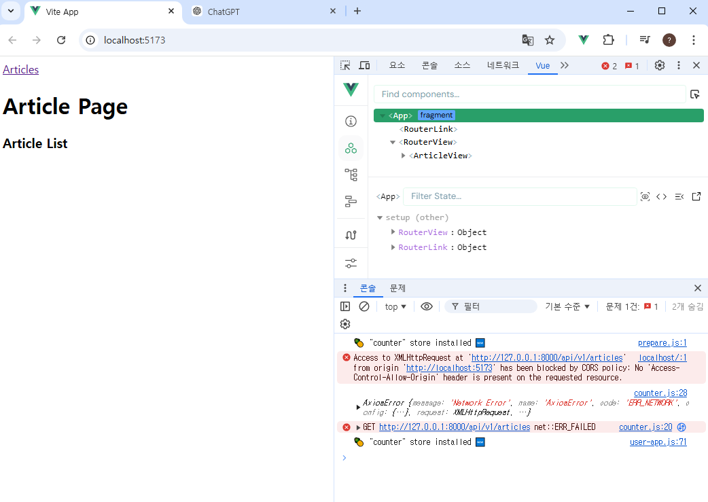

R# Vue 08
Vue with DRF1
## 프로젝트 개요
- DRF 프로젝트 안내
- Vue 프로젝트 안내

## 메인 페이지 구현
- 게시글 목록 출력
- DRF와의 요청과 응답

## CORS Policy
- CORS Policy
- CORS Headers 설정

## Article CR구현
- 전체 게시글 조회
- 단일 게시글 조회
- 게시글 작성

## 프로젝트 개요

1. Vue with DRF1
  - Vue와  DRF간 기본 요청과 응답

2. Vue with DRF2
  - Vue와 DRF에서의 인증 시스템

## DRF프로젝트 안내
- 스켈레톤 프로젝트 django-pjt제공
- 외부 패키지 및 라이브러리는 requirements.txt에 작성되어 있음
->DRF프로젝트는 주석을 해제하며 진행

1. django프로젝트에서 가상환경 만들고 마이그레이트 런서버하고 포스트맨으로 확인
(vue를 아직안만들어서 포스트맨으로 확인하자)

2. vue는 직접 코드를 작성하면서 만들어보자. 
: 뷰 프로젝트는 
컴포넌트 구조가 총5가지가 라우터와 직접적으로 연결될 거다.
ArticleView DetailView Createview SignView LoginView

: 프로젝트 구조
- 컴포넌트 미리 작성, 초기 세팅 되어있다.

- 시작하기 전에...
  - 무결점의 프로젝트를 만드는 것이 아님
  - ""프론트와 백의 요청과 응답"", 그과정에서 등장하는 새로운 개념과 문제를 해결하면서 하나의 웹을 구현하는 것에 집중

실습
1. 게시글 목록 출력.

2. DRF로부터 응답 데이터 받기
- 이제는 임시 데이터가 아닌, DRF서버에 요청하여 데이터를 응답 받아 store에 저장후 출력
=> 근데 에러가남

## CORS Policy
- CORS Policy
  - SOP :동일 출처 정책
  - 어떤 출처(Origin)에서 불러온 문서나 스크립트가 다른 출처에서 가져온 리소스와 상호작용하는 것을 제한하는 보안 방식

  -> 다른 곳에서 가져온 자료는 일단 막는다
  -> 웹 애플리케이션의 도메인이 다른 도메인 리소스에 접근하는 것을 제어하여 사용자의 개인 정보와 데이터의 보안을 보호하고, 잠재적인 보안 위협을 방지
  -> 잠재적으로 해로울 수 잇는 문서를 분리함으로써 공격받을 수 있는 경로를 줄임

  - URL 의 Protocol, Host, Port를 모두 포함하여 출처 라고 함.

  - CORS policy 의 등장
    - 기본적으로 웹 브라우저는 같은 출처에서만 요청하는 것을 허용하며,
    다른 출처로의 요청은 보안상의 이유로 차단됨.
    - 하지만, 현대 웹 애플리케이션은 다양한 출처로부터 리소스를 요청하는 경우가 많기 때문에 CORS정책이 필요하게 되었음.

  - CORS: 교차 출처 리소스 공유 
    - 특정 출처에서 실행중인 웹 애플리케이션이 다른출처의 자원에 접근할 수 있는 권한을 부여 하도록 브라우저에 알려주는 체제
    - 서버에서 설정되며, 브라우저가 해당 정책을 확인하여 요청이 허용되는지 여부를 결정
    - > 다른 출처의 리소스를 불러오려면 그 다른 출처에서 올바른 CORS header를 포함한 응답을 반환해야함.

  - CORS 적용방법
    :

  - 다른 자원에 있는 주소에 접근할 수 있으려면, CORS Header를 포함하여 응답을 해줘야함. => 결론: 서버에서 CORS Header를 만들어야 한다. 

- CORS Headers 설정
:django-
:pip install django-cors-headers
  : 우리는 사전에 설치되어있음.

## Article CR구현
- 전체 게시글 조회
- 단일 게시글 조회
- 게시글 작성
  1. 라우터에서 import createView부분 주석 해제하기
  2. 아래에 path 부분 {}도 주석해제 해주기
  3. create에 대한 링크는 ArticleView에 두기
    밑에서 import 라우터링크

    <ArricleList />위에 <RouterLink />적기
      <RouterLink :to=""/></RouterLink>적기