# Vue09 Vue with DRF02

## 인증 with DRF
- 인증
- 인증 정책 설정
- Token 인증 설정
- Dj-Rest-Auth 라이브러리
- Token 발급 및 허용

## 권한 with DRF
- 권한 정책 설정
- IsAuthenticated 설정

## 인증 with Vue
- 회원가입
- 로그인
- 요청과 토큰
- 인증 여부 확인

## 참고
- 기타 기능 구현
- Django Signals
- 환경 변수
- Vue 참고 자료

================================

## 인증 with DRF
- 인증
  : 수신된 요청을 해당 요청의 사용자 또는 자격증명과 연결하는 메커니즘
  -> 누구인지를 확인하는 과정

  - 권한: 요청에 대한 접근 허용 또는 거부 여부를 결정

  - 인증과 권한
  : 인증이 먼저 진행 -> 이후 권한을 부여하는 것.
    - 순서상 인증이 먼저 진행되며


  - DRF에서의 인증
    : 인증은 항상  View 함수 시작시, 권한 및 제한 

  - 승인되지 않은 응답 및 금지된 응답
    : 인증되지 않은 요청이 권한을 거부하는 경우, 해당되는 두가지
     오류

    1. 401
    2. 403 : 누구인지는 안다.

- 인증 정책 설정
  - 방법2가지
    1. 전역 설정
    2. View 함수 별 설정

     1. 전역 설정: 모든 뷰 함수가 이런 설정을 가질 것이다를 작성.
      : 프로젝트 전체에 적용되는 기본 인증 방식을 정의
      : DERAULT_AUTHETICATION_CLASSES를 사용
      :
      :사용 예시
      -> settings.py에서 한다.
     2. View 함수 별 설정 : 이것이 1보다 우선순위가 높음.
      : authentication_class 데코레이터를 사용
      : 개별 view에 지정하여 재정의
      : 사용예시

  - DRF가 제공하는 인증 체계
    1. BasicAuthentication
    2. TokenAuthentication**-> 토큰: 일종의 신분증
      - 토큰 기반의 HTTP인증 체계
      - 기본 데스크콥 및 모바일 클라이언트 와 같은 클라이언트-서버에 적합
    3. SessionAuthentication
    4. RemoteUSerAuethentication

    -> 우리는 토큰 방식을 사용할거다.

- Token 인증 설정
  - TokenAuthentication 적용과정
    1. 인증 클래스 설정
```js
REST_FRAMEWORK = {
    # Authentication
    'DEFAULT_AUTHENTICATION_CLASSES': [
        'rest_framework.authentication.TokenAuthentication',
    ],
```

    2. INSTALLED_APPS 추가

```js
'rest_framework.authtoken',

```

    3. Migrate 진행
    python manage.py migrate


    4. 토큰 생성 코드 작성
    : 자동화 되는, 자동적으로 토큰이 부여되는 곳 signal.py 

```js
from django.db.models.signals import post_save
from django.dispatch import receiver
from rest_framework.authtoken.models import Token
from django.conf import settings


@receiver(post_save, sender=settings.AUTH_USER_MODEL)
def create_auth_token(sender, instance=None, created=False, **kwargs):
    if created:
        Token.objects.create(user=instance)

```

  - 토큰 인증 방식 과정
    1. 사용자로그인
    2. 사용자 확인
    3.


- Dj-Rest-Auth 라이브러리
  : 추가적인 인증에 대한 라이브러리.
  : 인증에 통합된 라이브러리
  : 회원가입, 인증(소셜미디어인증), 등

  - Dj-Rest-Auth 설치 및 적용
    - 설치
    pip install 
    - 설치 이후 앱등록
```js
    'dj_rest_auth',

```
    - 추가 URL 주석 해제
```js
    path('accounts/', include('dj_rest_auth.urls')),

```
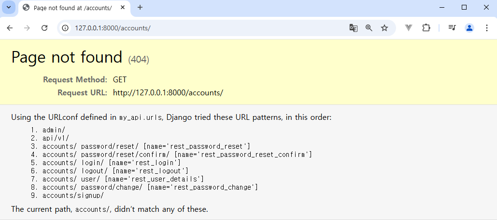
: account다음의 수많은 주소들...


  - Dj-Rest-Auth의 Registration (등록) 기능 추가 설정
    1. 패키지 추가 설치(사전에 설치되어 있음)
      pip install 'dj-rest-auth[with-social]'
    2. 추가 App 등록
```js
    'django.contrib.sites',
    'allauth',
    'allauth.account',
    'allauth.socialaccount',
    'dj_rest_auth.registration',
```

```js
SITE_ID = 1

```
-> 장고를 통해 배포를 진행할때, 
그 때 도메인의 유일한 값에 대한 pk값을 설정하는 것.
-> 하나의 장고서버로 여러 도메인 주소를 가지게 되면, 그 도메인 마다
고유한 사이트 아이디 값이 있어야 한다. 그것을 대비하는 것.


```js
    'allauth.account.middleware.AccountMiddleware',


```


```js
    path('accounts/signup/', include('dj_rest_auth.registration.urls')),

```

=> python manage.py migrate해주기

    3. 추가 URL 등록
    4. Migrate


- Token 발급 및 허용
  - Token 발급
    : 회원가입 및 로그인을 진행하여 토큰 발급 테스트하기
    : 라이브러리 설치로 인해 추가 된 URL 목록 확인
    
    : 회원가입 진행(DRF하단의 회원가입 form사용)
    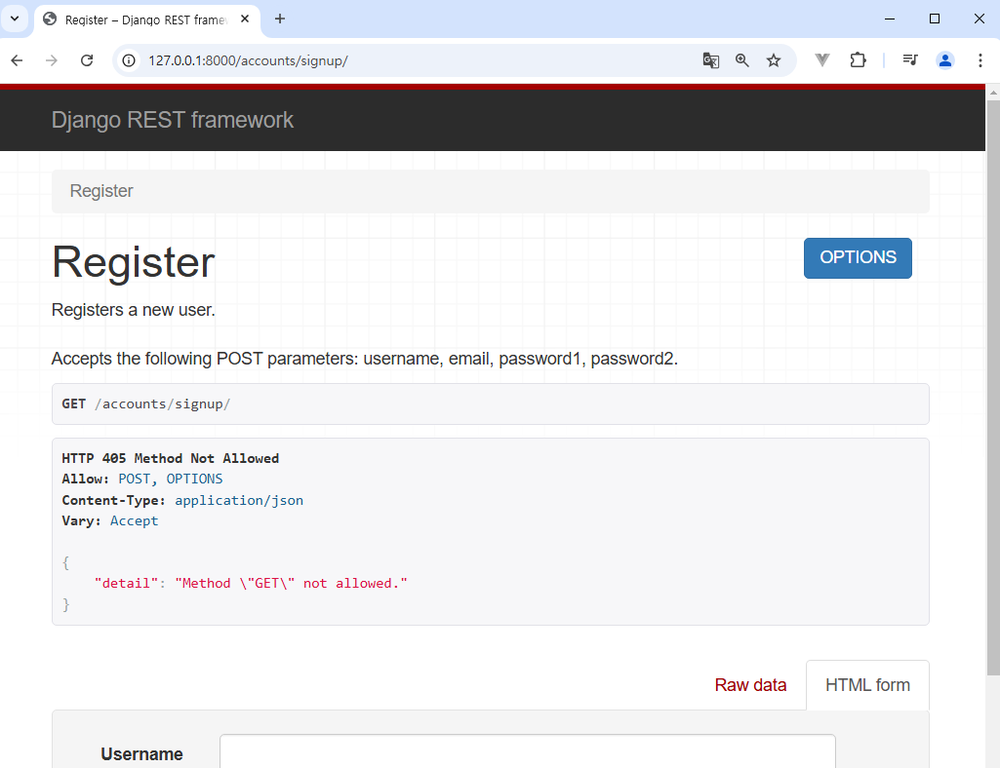

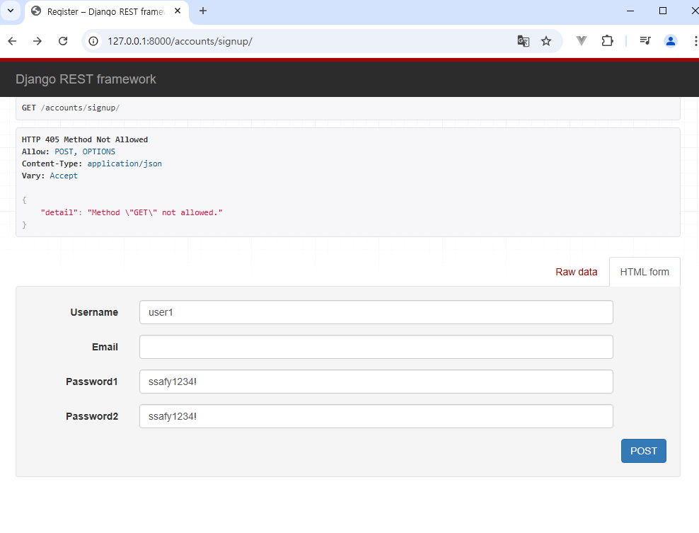
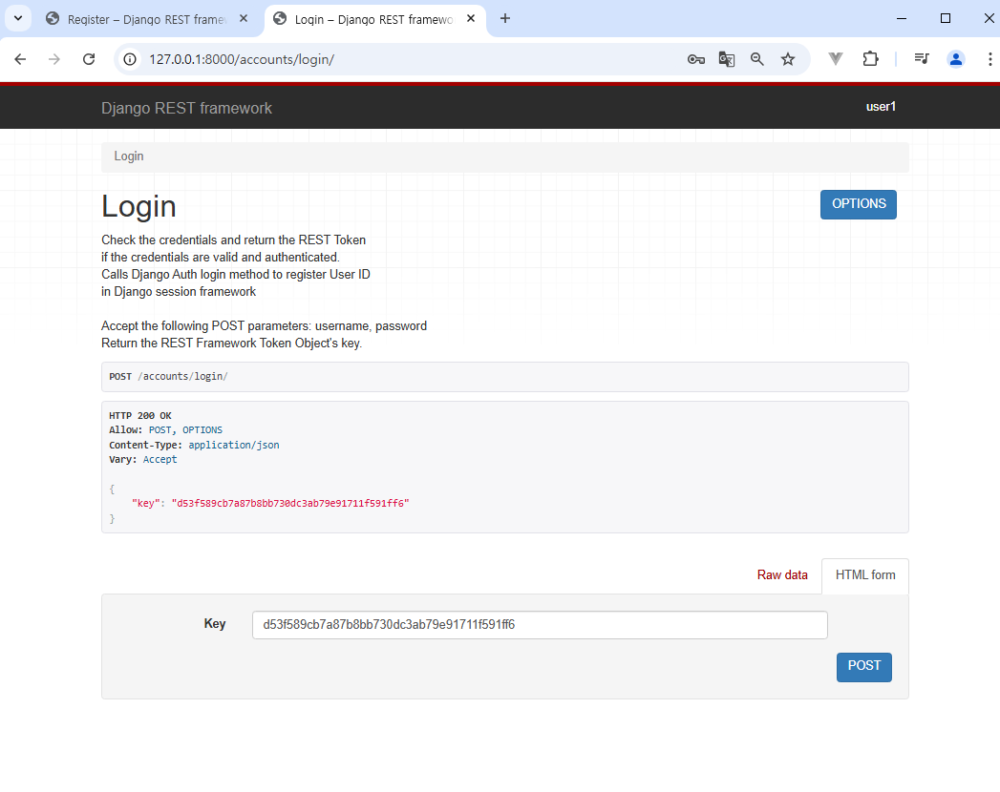

: 로그인을하든, 회원가입을 하든,
토큰으로(json데이터) 응답 값이 있다.
그렇다는 것은, 우리가 프론트엔드에서 이응답값을 받아서, 
키 속성에 토큰 값을 어딘가에 저장을 해놔야 한다는 것이다.

    : 로그인 성공 후 DRF로 부터 발급 받은 Token 확인
    -> 이제 이 Token 을 Vue에서 별도로 저장하여 매 요청마다 함께 보내야함.
      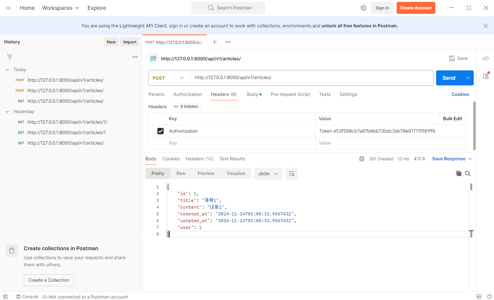
  - Token 데이터 확인

-> 발급 받은 Token을 인증이 필요한 요청마다 함께 보내야 함.


## 권한 with DRF
- 권한 정책 설정
  1. 전역 설정: settings.py에서 진행한다
    - 프로젝트 전체에 적용되는 기본 권한 방식을 정의
    - DEFAULT_PERMISSION_CLASSES를 사용
    - 기본값: rest_framework.pervissions.AllowAny
    - 사용 예시
```js
     'DEFAULT_PERMISSION_CLASSES': [
         'rest_framework.permissions.AllowAny',
     ],
```
  2. View함수 별 설정
    - permission_classes 데코레이터를 사용
    - 개별 view에 지정하여 재정의
    - 사용예시
    - DRF가 제공하는 권한 정책
      1. IsAuthenticated
      2. IsAdminUser
      3. IsAuthenticatedOrReadOnly
      4. ...

1. IsAuthenticated
- 인증되지 않은 사용자에 대한 권한을 거부하고, 그렇지 않은 경우 권한을 허용
-> 등록된 사용자만 API에 액세스 할 수 있도록 하려는 경우에 적합
- IsAuthenticated 설정

```js
    'DEFAULT_PERMISSION_CLASSES': [
        'rest_framework.permissions.AllowAny',
    ],
```


```js
// views.py
from rest_framework.decorators import permission_classes
from rest_framework.permissions import IsAuthenticated
```

```js
// 16번째 줄에
@permission_classes([IsAuthenticated])
적어주기

```

IsAdminUser로 바꿔주고,
POSTMAN에서 get방식으로 해보자
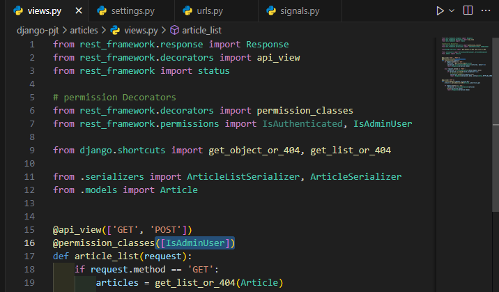
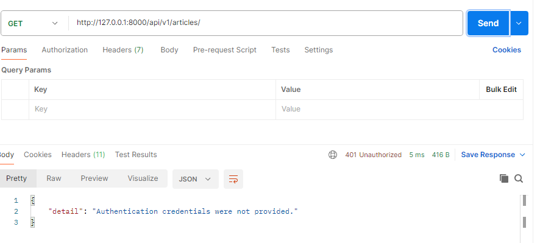
: 401에러가 뜬다.: 나는 너가 누구인지 모른다. 라는 에러이다.

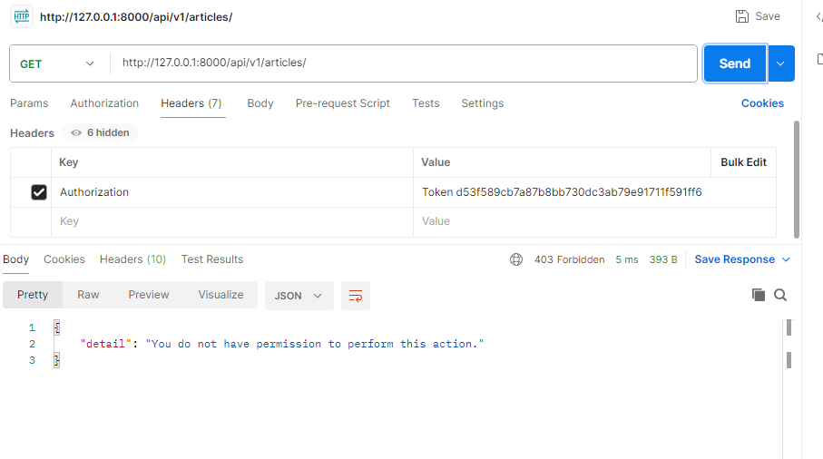
: 너는 권한이 없어.
이건 admin유저만 접근 할 수 있는 view함수야!


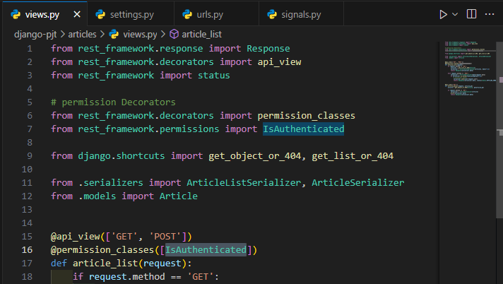
IsAuthenticated로 바꿔주면, 다시 살아난다. 

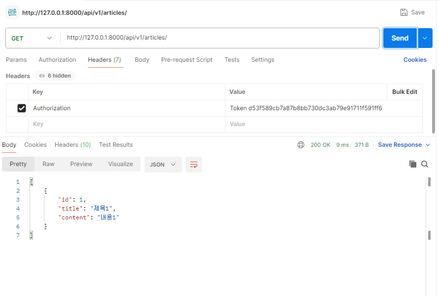

========== 여기서 부터는 vue


## 인증 with Vue
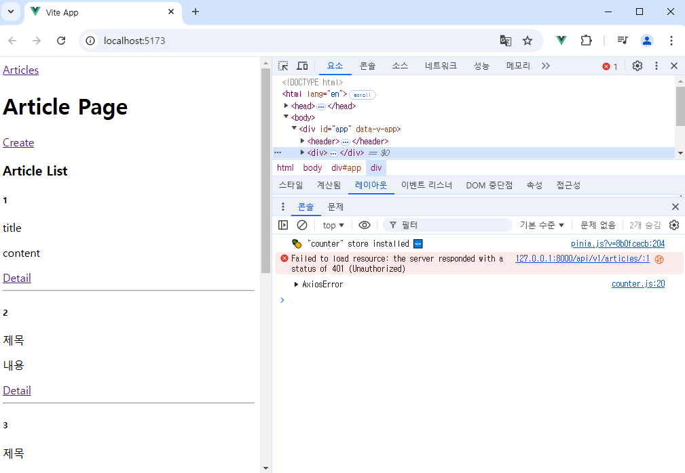
=> method 와 url만 가지고는 전체게시글 조회를 할 수 없다.
토큰을 보내주지 않으면, 더 이상 게시글을 조회할 수 없다.

```js
    axios({
      method: 'get',
      url: `${API_URL}/api/v1/articles/`
    })
```
-> 이 부분을 채워나가야 한다.


- 회원가입
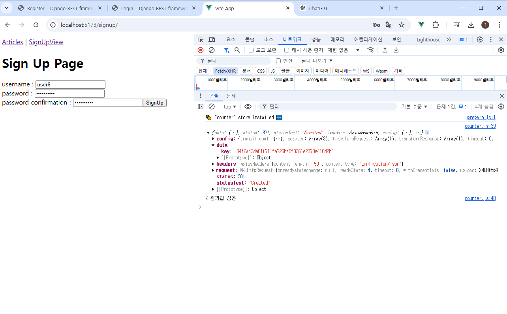
회원가입이기 때문에 완전 새로운 아이디랑 비밀번호 넣어줘야함
안그러면 계속 axios에러난다.

- 로그인
  : 로그인 로직 구현
    
    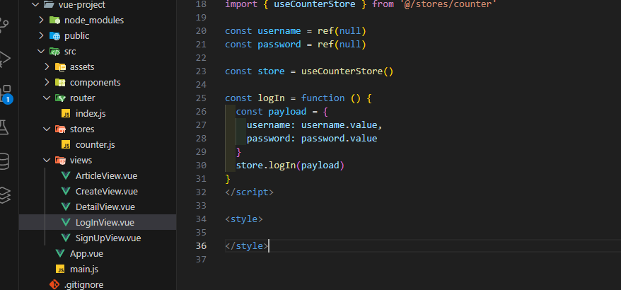
  : 잘못호출하면 에러남...


- 요청과 토큰
  - 토큰 저장 로직 구현
    : 반응형 변수 token 선언 및 토큰 저장


```js
const token = ref(null)


    .then((res) => {
  token.value = res.data.key
  // console.log(res.data)
  // console.log('로그인 성공')
})
```
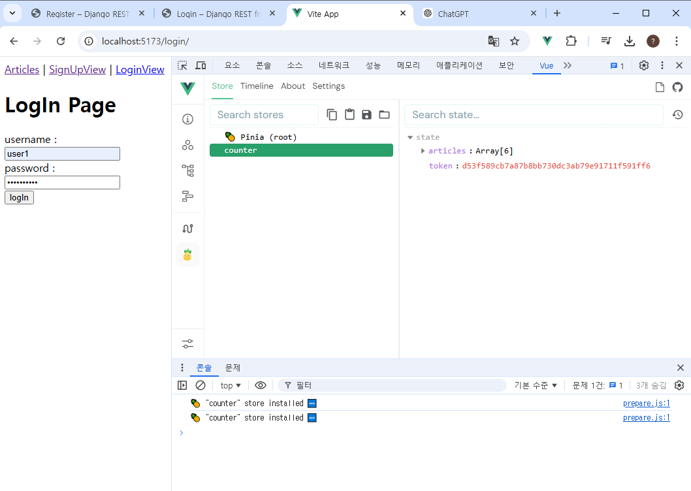
-> 중앙저장소에 토큰이 저장이됨. 이제 메모장이 없음..

- 토큰이 필요한 요청
  1. 게시글 전체 목록 조회 시
```js
// counter.js
  // DRF로 전체 게시글 요청을 보내고 응답을 받아 articles에 저장하는 함수
  // 헤더를 작성해주자.
  const getArticles = function () {
    axios({
      method: 'get',
      url: `${API_URL}/api/v1/articles/`,
      headers: {
        Authorization:`Token ${token.value}`
      }
```
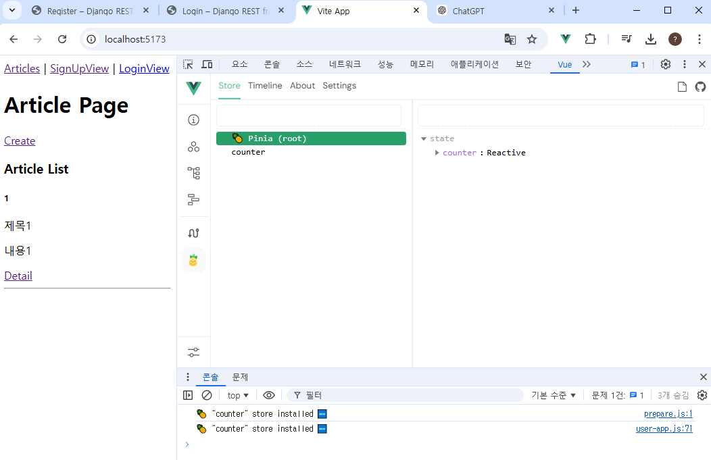

  2. 게시글 작성 시: 이걸 아직 안해줘서, 게시글을 작성하면 401이 온다. 
```js
// CreateView에서 DRF로 게시글 생성 요청을 보내는 함수

// DRF로 게시글 생성 요청을 보내는 함수
const createArticle = function () {
  axios({
    method: 'post',
    url: `${store.API_URL}/api/v1/articles/`,
    data: {
      title: title.value,
      content: content.value
    },
    headers: {
        Authorization:`Token ${store.token}`
      }
  })

```

- 인증 여부 확인
: 네비게이션 가드
전역/ 특정 컴포넌트/ 컴포넌트 내부


## 참고
- 기타 기능 구현
- Django Signals
- 환경 변수
- Vue 참고 자료
