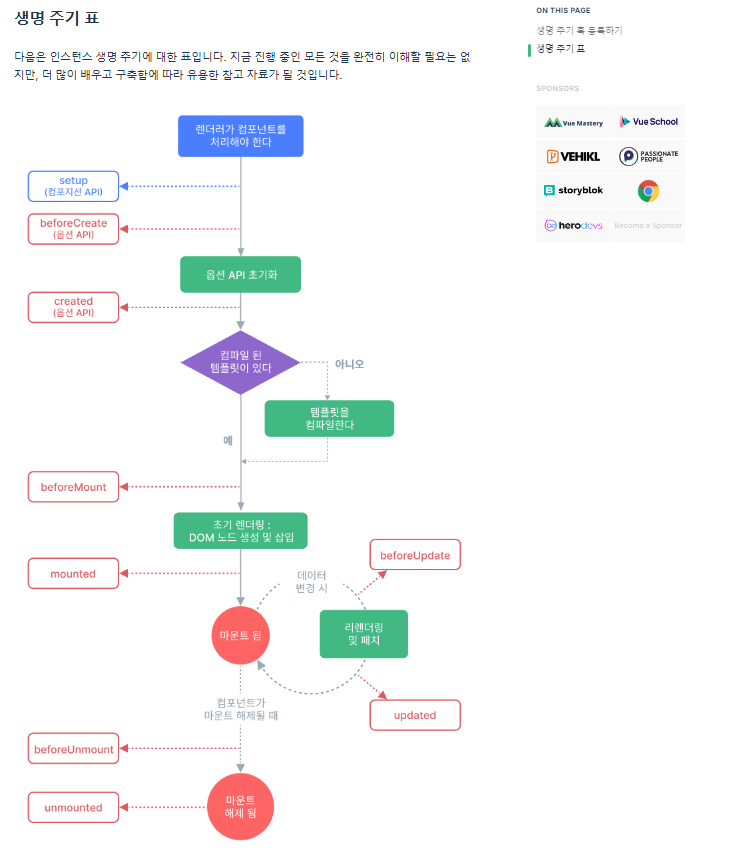

# 09 PJT

## Vue를 사용한 쇼핑몰 장바구니 기능 구현

## 목표
## [실습] 쇼핑몰 장바구니 기능 구현

## 목표
: 백엔드 없이 프론트만으로 쇼핑몰을 구현

: 쇼핑몰의 장바구니 기능도 구현

### 이번 프로젝트를 하기 위해 알아야 할 핵심 지식
- Vue
- Fake Store API(json place holder도 있음)
  - 쇼핑몰 구현을 위해 개발용으로 제공되 는 Fake API

- 진행순서
  - 함께 개발하는 것
    - 쇼핑몰 장바구니 기능을 구현합니다
    - 데이터는 Fake Store API를 활용하여 가져옵니다.

- 쇼핑몰 장바구니 기능 구현
  - 쇼핑몰 데이터
    - Fake Store API란?
    - Fake Store API

  - 우리가 구현할 페이지: Vue+ 여러개 페이지이므로Router + 여러개 컴포넌트에서 동일한 데이터를 쓰는데(동기화) 이것은 Pinia, props/emit이 있다. => props/emit 이 있는데, 왜 pinia를 만들었을까?
  => 언제 pinia를 적용해야할까? => 컴포넌트의 구조가 깊을때.
((멀리멀리를 연결하고자 할때.))
((확실하게 쓸필요가 있을때만, 고려해라.))=> 코드의 가독성이 힘들고, 변경 추적이 힘들때만 pinia를 고려해라.


    - 상품 목록 페이지
      : Card형태로 상품정보를 출력합니다
      : 버튼 종류
        - 상세페이지로 이동
        - 장바구니에 추가
      : 장바구니에 담은 상품목록은 Local Storage에 저장합니다. 

  - Pinia+ Local storage를 쓸때?

[실습시작]
1. 뷰프로젝트 생성
  - 타임 스크립트 : 왜쓸까?
    : 자바 스크립트의 상위레벨. js+타입선언
    : 개발자들의 실수를 줄여주는 것이 목적이다.
    : 필수가 아니다.
    : 단점: 런타임의 타입검증이 불가능.

      - 런타임과 컴파일?
      : 코드를 쳤을때는 틀린것을 잘잡아줌.
      : 외부(aPI)등으로 가져올때는 런타임 타입 검증이 불가해서, 추가 라이브러리들이 있어야 한다.

2. 기본설정들 삭제

3. 컴포넌트가 좀만 많아지면 힘들어 지기 때문에,
왠만하면 views쪽에는 page를 넣어주고, 
** 해당 페이지 내부의 컴포넌트들(페이지 내부 요소)을((폴더로 구분지어주고))
 컴포넌츠에 폴더에 넣어주자.


: 틀이 만들어지고 나서 OnMounted이므로, 외부 API데이터를 받아오는 경우에 
사용한다. 

...

: counter.js를 cart.js로 바꾼다

: 전역변수
-> 어떤걸 전역변수로 빼줬었나?
-> 어떤 데이터를 store에 넣고? => 여러개의 컴포넌트가 사용하는 변수(상태, 데이터) => 이런 것만 전역변수로 빼내주면 된다.
  - 쇼핑몰의 장바구니는 여러군데에서 모두 활용하기 때문에,
    데이터를 둘다 cart.js에 선언을 해주면 된다. 
```js
  let products = ref([]);
  let carts = ref([]);

  // 데이터 다운로드
  const getProducts = () => {
    // 이건 외부로 부터 데이터를 가져와야 하니까, 우리가 아까 다운받은 axios가 필요하므로
    // 위에 import axios 해주자. axios를 호출하는 방법은.get이 있고, method로 호출해 주는 방법이 있다.
      // axios({method})
      axios.get('https://fakestoreapi.com/products')
      //axios는 자바스크립트의 promise객체로 만들어 져 있다.
      //promise객체는 비동기 같은 거 처리할때, 성공과 실패로 나눠서 처리한다.
      // 성공했을땐, .then으로넘어가고, 실패했을때는 .catch로 넘어간다.
      .then((respose) => {
        console.log("response = ", respose);
      }).catch((error) => {
        console.log("error = ", error);
      })
      
  }
```
위에서 잘만든 것을 HomeView에서 가져다가 쓰면된다.

```

```

    - 상품 상세 페이지
      : 
    - 장바구니 페이지


- 화면예시


=======================
- 참고사이트

https://ko.vuejs.org/guide/essentials/lifecycle
: 생명주기표


https://www.npmjs.com/package/pinia-plugin-persistedstate


import piniaPluginPersistedstate from 'pinia-plugin-persistedstate'